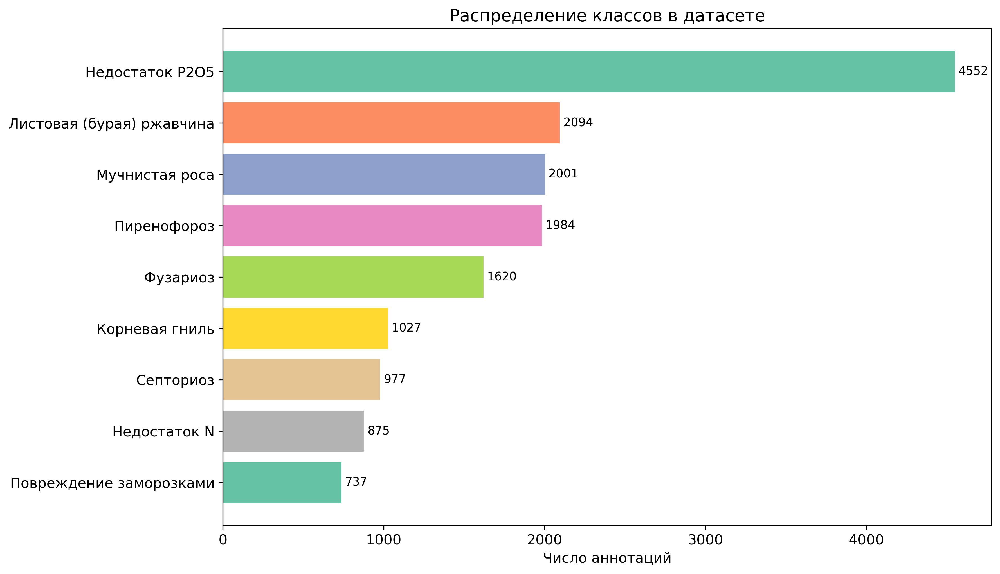
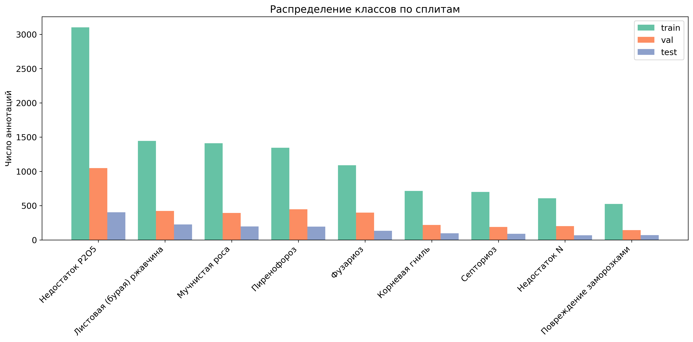
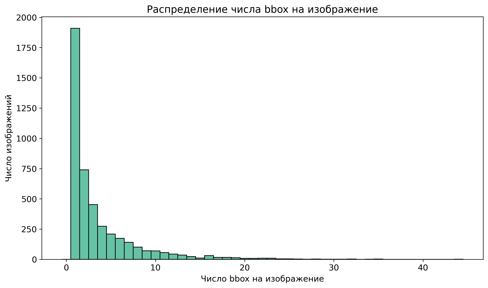
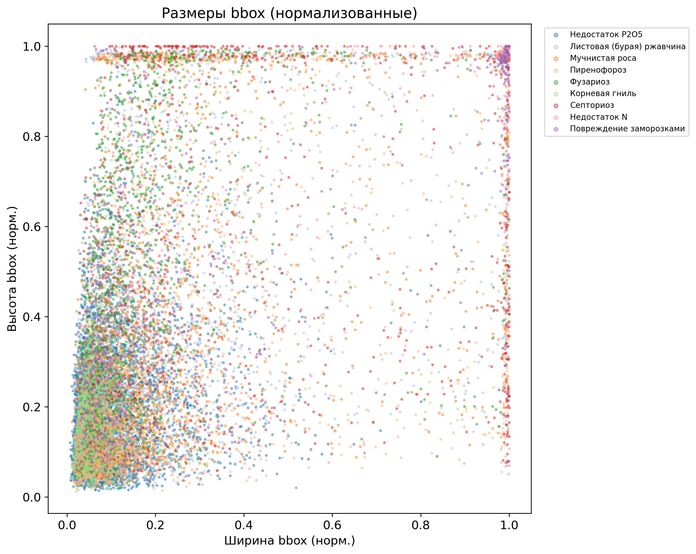
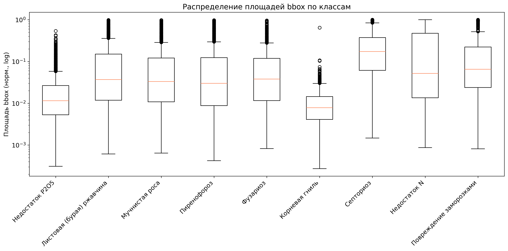
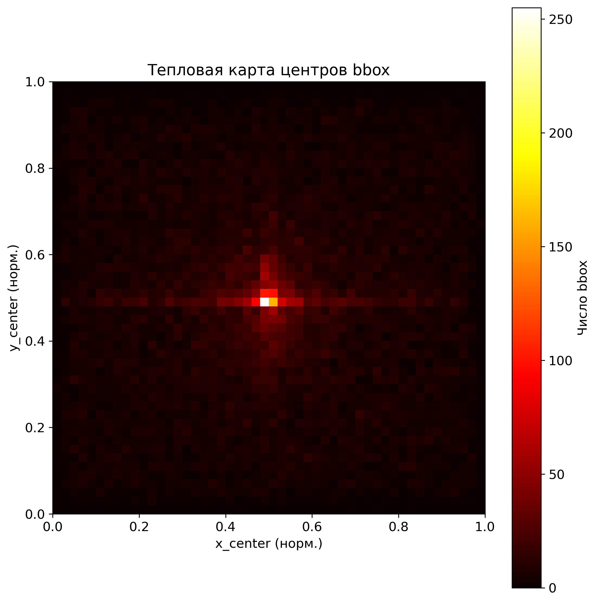
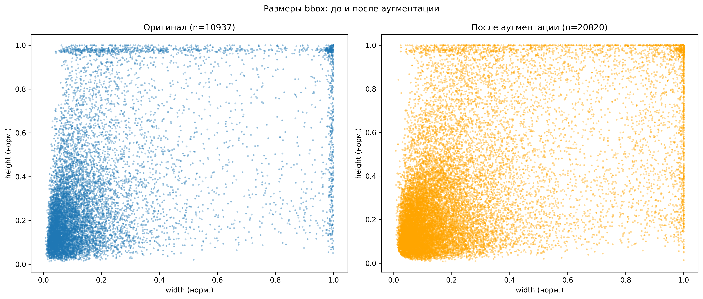
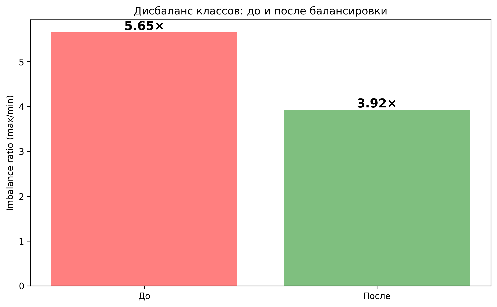
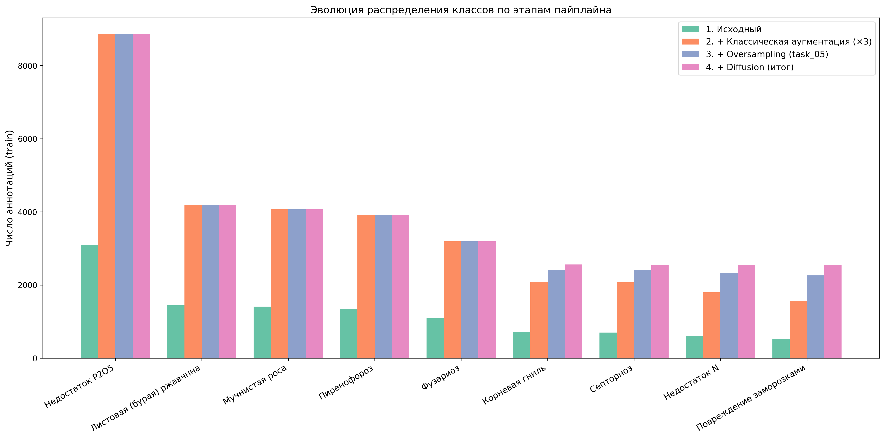
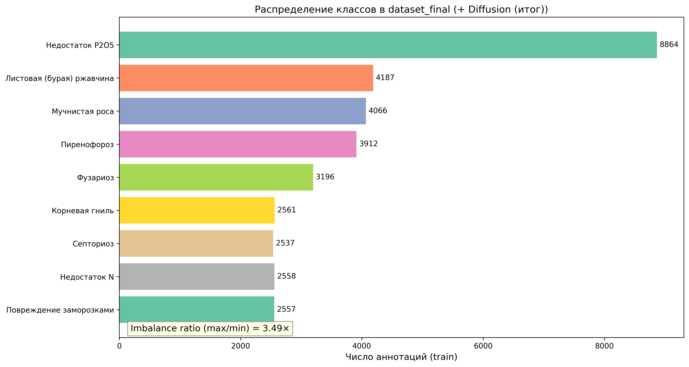

# Глава 2. Набор данных

> **Содержание главы:** формирование датасета полевых изображений пшеницы на основе разметки Label Studio, конвертация полигональных аннотаций в формат YOLO, состав целевых классов, стратифицированное разбиение на обучающую, валидационную и тестовую выборки, разведочный анализ данных (exploratory data analysis, EDA), классические геометрические и фотометрические аугментации, балансировка редких классов через целевой oversampling и генеративные методы расширения выборки (Stable Diffusion img2img и Neural Style Transfer).

## Краткий навигатор

| Раздел | Описание | Ключевые данные |
|--------|----------|-----------------|
| [2.1 Формирование и разметка](#21-формирование-и-разметка) | Источник данных, конвертация полигон → bbox, состав целевых классов, разбиение сплитов | 9 целевых классов, 4443 изображения, 15 867 аннотаций |
| [2.2 Анализ датасета](#22-анализ-датасета) | EDA: статистика, дисбаланс, распределения bbox, пример каждого класса | Imbalance ratio 6.18×, медиана 2 bbox/кадр |
| [2.3 Классическая аугментация](#23-классическая-аугментация) | Albumentations, геометрические и фотометрические трансформации, имитация полевых условий | Train ×3 (3109 → 9323) |
| [2.4 Балансировка редких классов](#24-балансировка-редких-классов) | Гибридная стратегия 70/30, агрессивный oversampling | IR 5.65× → 3.92× |
| [2.5 Генеративные аугментации](#25-генеративные-аугментации) | Stable Diffusion img2img и Neural Style Transfer, сопоставление подходов | IR 3.92× → 3.49× |
| [2.6 Итоговый датасет](#26-итоговый-датасет) | Сводная эволюция пайплайна, переход к главе 3 | Train 10 855 изображений, 33 967 аннотаций |

---

## 2.1 Формирование и разметка

### 2.1.1 Источник и характер исходных данных

В качестве источника первичных данных использовалась коллекция полевых изображений пшеницы, полученных в различных агроклиматических условиях и на разных стадиях вегетации. Совокупный объём коллекции составил 4475 фотоснимков, сгруппированных по преобладающему типу патологии. Разметка выполнена в веб-приложении Label Studio и включает 5501 задачу (task) — логическую единицу разметки, соответствующую одному снимку.

### 2.1.2 Разметка полигонами и её семантика

Разметка симптомов в Label Studio выполнена в виде полигонов (polygons) — замкнутых многоугольников, описывающих контур поражённой области. Выбор полигональной разметки обусловлен природой рассматриваемых симптомов: очаги заболеваний пшеницы имеют произвольную форму, а использование прямоугольных рамок на этапе ручной аннотации приводило бы к значительному захвату фоновой ткани и смежных симптомов. Пример размеченного изображения представлен на рисунке 2.1.

Рисунок 2.1 — Пример размеченного изображения в Label Studio. (Описание для вставки: скриншот интерфейса Label Studio с полигонами, очерчивающими пятна септориоза на листе пшеницы. Промпт для генерации: «Label Studio annotation interface screenshot, wheat leaf image with colored polygon annotations around disease spots, UI panels visible»)

Каждая запись разметки содержит координаты вершин полигона в нормализованной относительно размеров изображения форме, метку класса и ссылку на исходный снимок.

### 2.1.3 Конвертация полигон → bounding box

Выбранное в дальнейшем семейство детекторов оперирует прямоугольниками, выровненными по осям координат (axis-aligned bounding boxes), поэтому полигональная разметка подлежит преобразованию в соответствующий формат. Алгоритм конвертации применяется независимо к каждому полигону и состоит из следующих шагов: вычисление экстремальных значений координат вершин по осям $x$ и $y$, нормализация полученных границ относительно размеров изображения, формирование описанного прямоугольника, параметризованного координатами центра и размерами по двум осям $(x_c, y_c, w, h)$, и клиппирование значений в диапазон $[0, 1]$ для компенсации погрешностей ручной разметки за пределами кадра. Итоговая строка аннотации хранит идентификатор класса и четвёрку нормализованных координат описанного прямоугольника. Ключевой фрагмент преобразования реализуется в несколько строк:

```python
xs = [p[0] for p in polygon]; ys = [p[1] for p in polygon]
x_min, y_min, x_max, y_max = min(xs), min(ys), max(xs), max(ys)
x_c, y_c, w, h = (x_min + x_max) / 2, (y_min + y_max) / 2, x_max - x_min, y_max - y_min
```

Такое преобразование сопровождается частичной потерей геометрической информации: для сильно вытянутых или невыпуклых контуров (например, линейных штрихов септориоза) описанный прямоугольник заметно превышает реальную площадь симптома, что увеличивает перекрытие соседних рамок по метрике IoU (Intersection over Union) и снижает точность локализации. Тем не менее axis-aligned bounding boxes остаются стандартным входным представлением современных одноэтапных детекторов, и выбор именно этого формата продиктован соображениями совместимости с выбранной архитектурой. Более точные альтернативные представления — сегментационные маски и ориентированные рамки (oriented bounding boxes, OBB) — рассматриваются как направление дальнейшего развития.

### 2.1.4 Состав целевых классов

В качестве целевых классов в настоящей работе рассматриваются девять патологий пшеницы, охватывающих основные группы поражений — грибные инфекции, физиологические нарушения, вызванные дефицитом элементов минерального питания, и абиотические повреждения. Перечень целевых классов и их краткая фитопатологическая характеристика приведены ниже:

- **Недостаток P2O5** — физиологическое нарушение, вызванное дефицитом фосфора. Проявляется в виде красно-фиолетовых и бронзовых оттенков на листьях, отставания растений в росте и слабого развития корневой системы. Характерно диффузное распределение симптомов по всей поверхности листовой пластинки.
- **Листовая (бурая) ржавчина** (*Puccinia triticina*) — грибное заболевание, характеризующееся появлением на листьях мелких округлых пустул ржаво-коричневого цвета, расположенных беспорядочно на верхней стороне листа.
- **Мучнистая роса** (*Blumeria graminis* f. sp. *tritici*) — грибная инфекция, формирующая на листьях и стеблях белый мучнистый налёт, со временем приобретающий серо-бурый оттенок с чёрными точечными клейстотециями.
- **Пиренофороз** (*Pyrenophora tritici-repentis*, жёлтая пятнистость) — грибное заболевание с симптоматикой в виде желтоватых пятен, переходящих в некротические поражения овальной формы с тёмным центром и хлоротичным ореолом.
- **Фузариоз** (*Fusarium spp.*) — комплекс грибных поражений, на колосе проявляется обесцвечиванием и розоватым налётом отдельных колосков, на листьях — локализованными некротическими пятнами.
- **Корневая гниль** — комплекс грибных поражений корневой системы и нижней части стебля, проявляющийся побурением тканей, угнетением роста и преждевременным усыханием растений.
- **Септориоз** (*Zymoseptoria tritici*) — грибное заболевание, симптомы которого включают удлинённые некротические пятна с чёрными пикнидами в центре, расположенные преимущественно вдоль жилок листа.
- **Недостаток N** — физиологическое нарушение, обусловленное дефицитом азота. Проявляется равномерным пожелтением (хлорозом) листьев, начиная с нижних ярусов, ослаблением роста и снижением плотности стеблестоя.
- **Повреждение заморозками** — абиотическое повреждение тканей растения, возникающее при отрицательных температурах в период активной вегетации. Характеризуется обесцвечиванием, побурением краёв листьев и деформацией листовой пластинки.

### 2.1.5 Стратифицированное разбиение train/val/test

Итоговый датасет разделён на три непересекающиеся выборки в пропорции 70%/20%/10% — для обучения, валидации (подбор гиперпараметров и контроль переобучения) и тестирования (финальная оценка обобщающей способности). Прямое случайное разбиение при наличии выраженного дисбаланса и умеренного общего объёма данных сопряжено с риском «вымывания» редких классов из валидационной или тестовой выборки, что делало бы оценку качества на этих классах невозможной.

Для предотвращения указанного риска применяется стратифицированное разбиение (stratified split). Стратификация выполняется по доминантному классу каждого изображения — классу с наибольшим числом bounding box на данном кадре. Разбиение реализуется через двухступенчатый вызов функции `train_test_split` из библиотеки scikit-learn:

```python
X_tv, X_test = train_test_split(images, test_size=0.10, stratify=dominant, random_state=42)
X_train, X_val = train_test_split(X_tv, test_size=0.222, stratify=dominant_tv, random_state=42)
```

Выбор стратификации по доминантному классу, а не по полному мультиметочному вектору (multi-label stratification), обоснован тем, что в подавляющем большинстве кадров присутствуют аннотации одного–двух доминирующих классов, а использование специализированных пакетов (iterative-stratification) даёт предельное улучшение менее двух процентных пунктов при существенном усложнении пайплайна и ухудшении интерпретируемости логов.

### 2.1.6 Итоговый состав датасета

После стратифицированного разбиения сформированный датасет характеризуется параметрами, представленными в таблице 2.1.

Таблица 2.1 — Итоговый состав датасета по сплитам

| Сплит | Изображений | Аннотаций | Доля изображений | Доля аннотаций |
|-------|------------:|----------:|-----------------:|---------------:|
| train | 3109 | 10 937 | 70.0% | 69.0% |
| val | 889 | 3456 | 20.0% | 21.8% |
| test | 445 | 1474 | 10.0% | 9.3% |
| **Итого** | **4443** | **15 867** | 100% | 100% |

Незначительное расхождение между долями изображений и долями аннотаций (в пределах ±3%) обусловлено неравномерной плотностью bounding box по классам при стратификации по доминантному классу. Данное отклонение находится в пределах статистической погрешности и не требует дополнительной коррекции.

---

## 2.2 Анализ датасета

Разведочный анализ данных (Exploratory Data Analysis, EDA) представляет собой обязательный этап подготовки датасета, на котором формируется количественное понимание свойств выборки. Полученные на этом этапе характеристики напрямую обосновывают последующие проектные решения: необходимость балансировки, выбор входного разрешения модели, параметры подавления пересечений (Non-Maximum Suppression, NMS), параметры якорных рамок (anchors) и допустимые классы аугментаций.

### 2.2.1 Общая статистика

Базовые количественные характеристики сформированного датасета приведены в таблице 2.2.

Таблица 2.2 — Общая статистика датасета

| Показатель | Значение |
|------------|----------|
| Число классов | 9 |
| Число изображений | 4443 |
| Число аннотаций (bbox) | 15 867 |
| Среднее число bbox на кадр | 3.57 |
| Медианное число bbox на кадр | 2 |
| Минимум / максимум bbox на кадр | 1 / 44 |
| Минимальное разрешение | 450 × 320 |
| Максимальное разрешение | 6690 × 5344 |
| Среднее разрешение | 2543 × 1844 |

Диапазон разрешений изображений охватывает более чем 75-кратное различие по площади кадра, что свидетельствует о сборе коллекции с использованием различных устройств съёмки — от мобильных камер предыдущих поколений до современных DSLR-систем.

### 2.2.2 Дисбаланс классов

Распределение аннотаций по девяти классам представлено на рисунке 2.2 и в таблице 2.3. Даже визуально заметно, что распределение существенно отклоняется от равномерного: доминирующий класс «Недостаток P2O5» содержит в 6.18 раза больше аннотаций, чем наименее представленный класс «Повреждение заморозками».



Рисунок 2.2 — Распределение числа аннотаций по классам

Таблица 2.3 — Количественные характеристики дисбаланса классов

| Класс | Аннотаций | Доля, % |
|-------|----------:|--------:|
| Недостаток P2O5 | 4552 | 28.7 |
| Листовая (бурая) ржавчина | 2094 | 13.2 |
| Мучнистая роса | 2001 | 12.6 |
| Пиренофороз | 1984 | 12.5 |
| Фузариоз | 1620 | 10.2 |
| Корневая гниль | 1027 | 6.5 |
| Септориоз | 977 | 6.2 |
| Недостаток N | 875 | 5.5 |
| Повреждение заморозками | 737 | 4.6 |

Для количественной оценки дисбаланса используются три ключевых показателя:

$$IR = \frac{\max_c N_c}{\min_c N_c} = \frac{4552}{737} = 6.18$$

$$CV = \frac{\sigma_N}{\mu_N} = \frac{1274}{2030} \approx 0.627$$

$$H_{norm} = \frac{-\sum_c p_c \log p_c}{\log K} \approx 0.93$$

где $N_c$ — число аннотаций класса $c$, $IR$ — коэффициент дисбаланса (imbalance ratio), $CV$ — коэффициент вариации, $H_{norm}$ — нормированная энтропия распределения, $K = 9$ — число классов. Значение $IR = 6.18\times$ соответствует умеренному дисбалансу: для сравнения, эталонный датасет COCO имеет $IR \approx 15\times$, а в ряде специализированных агрономических датасетов этот показатель достигает 50–100 [в предельных случаях дисбаланс такого уровня делает обучение без специализированных функций потерь невозможным, что подтверждается работами по focal loss и class-balanced loss, см. главу 1]. Нормированная энтропия $H_{norm} = 0.93$ близка к единице, что указывает на относительно мягкий характер дисбаланса.

Соотношение представленности классов по сплитам после стратифицированного разбиения показано на рисунке 2.3. Все девять классов присутствуют во всех трёх сплитах с сохранением пропорций, что подтверждает корректность стратификации.



Рисунок 2.3 — Распределение аннотаций по классам в сплитах train, val, test

Важной особенностью рассматриваемого датасета выступает расхождение между дисбалансом на уровне аннотаций и дисбалансом на уровне изображений-носителей. При соизмеримом числе уникальных снимков для каждого класса (от 440 до 529) число bounding box различается в разы. Это объясняется различием в типе проявления заболеваний: физиологические патологии, такие как недостаток фосфора, проявляются в виде россыпи мелких пятен по всему листу, давая 10–20 bbox на кадр, тогда как локализованные инфекции (ржавчина, септориоз) дают, как правило, 1–3 выраженных очага. Функция потерь детектора оперирует индивидуальными bbox, поэтому именно дисбаланс на уровне аннотаций является определяющим фактором при выборе стратегии балансировки.

### 2.2.3 Распределение числа bounding box на изображение

Гистограмма распределения числа bbox на изображение приведена на рисунке 2.4. Около 40% кадров содержат ровно одну аннотацию (снимки крупным планом одиночного поражения), 70% кадров — не более трёх аннотаций, однако распределение имеет протяжённый «хвост» вплоть до 44 bbox на кадр. Последние соответствуют массовым снимкам диффузных симптомов, преимущественно относящихся к классам «Недостаток P2O5» и «Пиренофороз».



Рисунок 2.4 — Распределение числа bounding box на изображение

Практический вывод для последующего этапа обучения: стандартное ограничение числа детекций на один кадр, принятое в современных реализациях детекторов семейства YOLO (порядка 100 предсказаний), с запасом покрывает все наблюдаемые в датасете случаи, что исключает необходимость его увеличения.

### 2.2.4 Распределение размеров bounding box

Диаграмма рассеяния нормализованных размеров bounding box представлена на рисунке 2.5. По оси абсцисс отложена относительная ширина, по оси ординат — относительная высота, точки раскрашены по классам.



Рисунок 2.5 — Распределение размеров bounding box (нормализованная ширина × нормализованная высота)

Наблюдения по распределению размеров существенно различаются между классами:
- основной массив аннотаций сосредоточен в диапазоне относительных размеров 0.02–0.3, что соответствует охвату 2–30% площади изображения;
- выделяется кластер крупных bbox с размерами более 0.5, представленный преимущественно классами «Недостаток N» и «Повреждение заморозками» — эти физиологические и абиотические повреждения поражают лист целиком, и эксперт-аннотатор размечает их единым охватывающим прямоугольником;
- мелкие bbox размером менее 0.05 характерны для классов «Фузариоз» и «Корневая гниль», представляющих точечные локализованные поражения.

Выявленная мультимасштабность симптомов служит прямым обоснованием необходимости многомасштабной детекции, реализуемой через пирамиду признаков (Feature Pyramid Network, FPN) или её производные (Path Aggregation Network, PAN). Соответствующие архитектурные решения рассматриваются в главе 3 при выборе целевого детектора.

Дополнительное представление о распределении размеров даёт диаграмма размаха (boxplot) площадей bbox по классам в логарифмической шкале, приведённая на рисунке 2.6. Видно чёткое разделение классов по типичному размеру проявления: медиана площади bbox для «Недостатка P2O5» составляет приблизительно 0.002 (мелкие пятна), для «Недостатка N» — около 0.2 (лист целиком), для листовых инфекций — промежуточные значения 0.01–0.05.



Рисунок 2.6 — Распределение площадей bounding box по классам (логарифмическая шкала)

### 2.2.5 Пространственное распределение и разрешения изображений

Тепловая карта центров bounding box, нормированных в единичный квадрат, представлена на рисунке 2.7. Распределение близко к равномерному с лёгким сгущением к центру кадра — естественным следствием поведения фотографирующего, центрирующего предмет съёмки. Выраженный позиционный сдвиг отсутствует, что обосновывает безопасное применение геометрических аугментаций (случайный кроп, отражения), рассматриваемых в разделе 2.3.



Рисунок 2.7 — Тепловая карта центров bounding box на нормированном холсте

Распределение разрешений исходных изображений показано на рисунке 2.8. Выделяются четыре основных кластера: снимки с устройств предыдущих поколений (1024 × 768, 1920 × 1080) — около 15% датасета, средний диапазон (2000 × 1500 — 3500 × 2500) — 65%, снимки с современных DSLR (4000 × 3000 — 5000 × 3500) — 15%, и высокодетализированные снимки с разрешением свыше 6000 × 4000 — около 5%.


Рисунок 2.8 — Распределение разрешений исходных изображений

При обучении современных детекторов изображения приводятся к унифицированному квадратному разрешению (как правило, 640 × 640 или 1024 × 1024 пикселей), что выполняется средствами встроенного ресемплера соответствующего фреймворка. Потенциальное влияние значительного upscaling (от исходного 450 × 320) или downscaling (от 6690 × 5344) на качество детекции рассматривается как фактор, требующий отдельного исследования; в рамках базового обучения применяется единое входное разрешение 640 × 640.

### 2.2.6 Визуальные примеры классов

Для формирования визуального представления о составе датасета и подтверждения корректности разметки (sanity check) для каждого из девяти классов отобран один репрезентативный снимок с нанесёнными bounding box. Сетка примеров представлена на рисунке 2.9.


Рисунок 2.9 — Репрезентативные примеры изображений для каждого из девяти классов с нанесёнными bounding box

Выборочная проверка индивидуальных снимков с увеличенным масштабом не выявила случаев аннотационных ошибок: все bbox лежат в пределах кадра, метка класса визуально соответствует содержимому, размеры рамок адекватны наблюдаемому симптому.

---

## 2.3 Классическая аугментация

### 2.3.1 Мотивация и задачи аугментации

Современные одноэтапные детекторы семейства YOLO содержат десятки миллионов обучаемых параметров: от 7 миллионов в компактной версии small до 24 миллионов в версии large. При таком числе параметров обучение без существенного переобучения требует либо крупного размеченного датасета (ориентировочный порог, обозначенный в практике обучения на COCO, составляет порядка 1500 изображений на класс), либо искусственного расширения выборки за счёт аугментации. В рассматриваемом датасете на обучающий сплит приходится 3109 изображений, распределённых между девятью классами (приблизительно 345 снимков на класс), что ниже рекомендованного порога.

Классическая аугментация решает три взаимосвязанные задачи:

1. **Увеличение эффективного объёма обучающей выборки** в два–пять раз за счёт генерации новых экземпляров путём обратимых трансформаций существующих.
2. **Регуляризация.** Обученная на аугментированных данных модель приобретает инвариантность к несущественным вариациям (ракурс, освещение, цвет), что препятствует запоминанию конкретных пиксельных паттернов.
3. **Имитация условий развёртывания (deployment).** Полевые снимки делаются в различное время суток, разными устройствами и при разных метеорологических условиях, и аугментации моделируют эту вариативность на этапе обучения.

### 2.3.2 Стратегия применения

Для каждого изображения обучающей выборки генерируются две независимые аугментированные копии, что приводит к утроению объёма обучающего сплита. Данное соотношение выбрано исходя из эмпирических соображений. Меньший коэффициент (×2) не обеспечивает достаточного разнообразия, тогда как больший (×5 и выше) повышает риск явления, известного в литературе как mode collapse of augmentations [при избыточном числе аугментаций одного исходника модель получает семейство статистически зависимых примеров, которые подавляют сигнал обобщения и могут приводить к переобучению на «сценарии» аугментации]. Коэффициент три представляет собой компромисс, закрепившийся в качестве неявного стандарта в ряде эталонных пайплайнов, включая конфигурации фреймворка Ultralytics.

Принципиально важно отметить, что аугментация применяется исключительно к обучающему сплиту. Валидационная и тестовая выборки остаются в исходном виде без каких-либо модификаций, поскольку итоговые метрики качества должны отражать поведение модели на распределении данных, соответствующем целевым условиям развёртывания.

### 2.3.3 Набор трансформаций

Применяемый пайплайн содержит четыре функциональные группы трансформаций, каждая из которых нацелена на формирование определённого вида инвариантности модели.

**Группа 1 — геометрические трансформации.** Формируют инвариантность к ракурсу и позиции объекта относительно кадра. Состав группы приведён в таблице 2.4.

Таблица 2.4 — Геометрические трансформации

| Трансформация | Параметры | Вероятность | Назначение |
|---------------|-----------|:-----------:|------------|
| HorizontalFlip | — | 0.5 | Инвариантность к отражению лево—право |
| VerticalFlip | — | 0.3 | Инвариантность к ориентации снимка (с земли вверх / сверху вниз) |
| RandomRotate90 | — | 0.3 | Инвариантность к ориентации планшета (portrait/landscape) |
| Affine | translate 10%, scale 0.85–1.15, rotate ±20° | 0.5 | Имитация дрожи руки, мелких изменений дистанции и угла |
| RandomResizedCrop | size 640×640, scale 0.7–1.0 | 0.4 | Обучение различению объектов в разных масштабах |

Верхняя граница угла поворота ограничена значением $\pm 20°$ как компромиссом между разнообразием и правдоподобием: при более значительных поворотах часть изображений переходит в ориентацию, не встречающуюся в реальной съёмке, и создаёт смещение распределения.

**Группа 2 — фотометрические трансформации.** Обеспечивают робастность к условиям освещения. Состав группы приведён в таблице 2.5.

Таблица 2.5 — Фотометрические трансформации

| Трансформация | Параметры | Вероятность | Назначение |
|---------------|-----------|:-----------:|------------|
| RandomBrightnessContrast | ±0.2 | 0.5 | Утро/вечер против полудня, облачность |
| HueSaturationValue | h=10, s=20, v=15 | 0.4 | Различия цветовых профилей камер, сезонные оттенки |
| CLAHE | clip_limit=4.0 | 0.3 | Contrast Limited Adaptive Histogram Equalization, выравнивание локального контраста |

Параметры сдвига оттенка (hue shift) ограничены значением 10 единиц из 180 возможных — при более значительном сдвиге зелёный лист может принять синий или красный оттенок, что патологически меняет представление о классе «симптом» (поскольку многие классы определяются именно по цветовым признакам: жёлтая хлоротическая окраска характерна для дефицита азота, бурая — для ржавчины).

**Группа 3 — шум и размытие.** Формируют устойчивость к качеству съёмки (таблица 2.6).

Таблица 2.6 — Трансформации шума и размытия

| Трансформация | Параметры | Вероятность | Назначение |
|---------------|-----------|:-----------:|------------|
| GaussianBlur | kernel 3–7 | 0.3 | Лёгкий расфокус, мелкое дрожание |
| GaussNoise | std 0.04–0.2 | 0.3 | ISO-шум при недостаточной освещённости |

**Группа 4 — имитация полевых условий.** Специализированный набор, учитывающий специфику целевого домена (таблица 2.7).

Таблица 2.7 — Имитация полевых условий

| Трансформация | Параметры | Вероятность | Назначение |
|---------------|-----------|:-----------:|------------|
| RandomShadow | default | 0.2 | Тени от соседних колосьев, облаков, оборудования |
| RandomFog | default | 0.15 | Утренняя дымка, туман при осенне-зимней съёмке |
| ImageCompression | quality 70–100 | 0.2 | JPEG-артефакты при передаче снимка через мессенджеры |

Группа 4 представляет собой ключевое отличие разработанного пайплайна от типовых наборов, применяемых к датасетам общего назначения (COCO, ImageNet). Включение ImageCompression обосновано тем, что типичным каналом обмена фотографиями среди агрономов являются мессенджеры, которые применяют агрессивное сжатие с потерями; модель, не обученная на таких артефактах, может демонстрировать снижение точности при работе с типичным пользовательским входом.

Обзорная сводка эффекта всех применяемых трансформаций на едином холсте приведена на рисунке 2.10, а примеры работы полного пайплайна — на рисунке 2.11.


Рисунок 2.10 — Визуальная сводка эффекта каждой из двадцати применяемых трансформаций


Рисунок 2.11 — Примеры работы полного классического пайплайна аугментации

### 2.3.4 Валидация bounding box после трансформации

При применении геометрических трансформаций bounding box могут выйти за пределы кадра или занять недопустимо малую площадь. Для контроля корректности применяются два последовательных фильтра:

1. **Фильтр по относительной видимости.** Если после преобразования от исходной площади рамки осталось менее 10%, рамка удаляется.
2. **Фильтр по минимальному размеру.** Отсекаются рамки с нормированной площадью менее 0.001, что при входном разрешении $640 \times 640$ соответствует объектам размером менее $3 \times 3$ пикселя — такие объекты практически бесполезны для обучения и приводят к формированию шумных градиентов.

Если после применения указанных фильтров изображение остаётся без валидных bbox, оно отбрасывается. Из 6218 потенциальных аугментированных копий итоговую выборку прошли 6214 — потери составили 0.06% и находятся в пределах статистической погрешности.

### 2.3.5 Пример аугментированных данных и количественный результат

Визуальная проверка корректности применения пайплайна выполнена путём сопоставления исходных и аугментированных изображений с нанесёнными bbox. Результат для десяти случайно выбранных кадров приведён на рисунке 2.12.


Рисунок 2.12 — Сопоставление исходных изображений и их аугментированных вариантов (1 оригинал + 2 аугментации на каждой строке)

Сопоставление распределений размеров bounding box до и после аугментации, приведённое на рисунке 2.13, показывает смещение в сторону более крупных относительных размеров — эффект операций случайного кропа, при которых объекты начинают занимать бо́льшую долю выходного кадра.



Рисунок 2.13 — Распределения размеров bounding box до и после аугментации

Количественная характеристика изменения объёма обучающего сплита приведена в таблице 2.8.

Таблица 2.8 — Объём обучающего сплита до и после классической аугментации

| Показатель | До | После | Кратность |
|------------|---:|------:|:---------:|
| Изображений в train | 3109 | 9323 | 3.0 |
| Аннотаций в train | 10 937 | 31 757 | 2.9 |
| Imbalance ratio | 5.91 | 5.65 | — |

Сопоставление распределений классов до и после аугментации показано на рисунке 2.14 — все девять классов равномерно увеличились приблизительно в три раза, что ожидаемо: классическая аугментация расширяет выборку, сохраняя пропорции классов, и не решает задачу балансировки.


Рисунок 2.14 — Распределение классов до и после классической аугментации

Микроснижение imbalance ratio с 5.91× до 5.65× обусловлено неоднородностью процента отбракованных bbox между классами и не имеет значимого практического смысла. Для собственно балансировки применяется отдельный механизм, рассматриваемый в следующем разделе.

---

## 2.4 Балансировка редких классов

### 2.4.1 Проблема и её влияние на обучение детектора

После применения классической аугментации общий объём обучающей выборки вырос утроенно, однако пропорции классов сохранились: коэффициент дисбаланса остался на уровне 5.65×, что означает, что вклад четырёх редких классов в суммарную функцию потерь в несколько раз уступает вкладу доминирующего класса «Недостаток P2O5». Негативное влияние дисбаланса на обучение детектора проявляется в трёх основных аспектах:

1. **Смещение градиента в сторону доминирующего класса.** Функция потерь одноэтапного детектора по умолчанию агрегирует ошибки по всем предсказанным bbox без учёта их принадлежности к конкретным классам. При дисбалансе 5.65× градиент в каждом батче «тянет» модель в сторону улучшения предсказаний доминирующего класса, фактически игнорируя редкие.
2. **Снижение полноты (recall) на редких классах.** Характерной патологией моделей, обученных на несбалансированных данных, выступает склонность помечать соответствующие области как фон, поскольку такая стратегия минимизирует ожидаемую ошибку при частотности редкого класса существенно ниже среднего.
3. **Вырождение в априорное предсказание.** При достаточно большом дисбалансе классификатор фактически сводится к тривиальной стратегии априорного предсказания доминирующего класса, и никакие улучшения в остальной архитектуре не способны компенсировать это смещение без специальной балансировки данных или функции потерь.

### 2.4.2 Методы балансировки: обзор подходов

В литературе и практике сформировались четыре основные группы методов балансировки, сопоставление которых представлено в таблице 2.9.

Таблица 2.9 — Сопоставление методов балансировки классов

| Метод | Принцип | Преимущества | Недостатки |
|-------|---------|-------------|------------|
| Random undersampling | Удаление части примеров доминирующего класса | Простая реализация, уменьшение объёма обучения | Безвозвратная потеря реальных данных: при выравнивании 8864 → 1568 теряется 82% информации |
| Random oversampling | Случайное дублирование редких классов | Сохранение всех данных | Идентичные копии → переобучение на конкретных пикселях |
| Augmentation-based oversampling | Дублирование редких классов с применением агрессивных аугментаций | Визуальное разнообразие, сохранение данных | Статистически зависимые копии одного исходника |
| Generative oversampling | Синтез новых примеров генеративными моделями | Максимальное визуальное разнообразие, семантическая новизна | Потенциальное смещение распределения относительно реального |
| Loss reweighting (focal loss, class-balanced loss) | Переназначение весов функции потерь обратно пропорционально частоте | Не изменяет данные, простая интеграция | Ограниченная эффективность при сильном дисбалансе, не заменяет разнообразие |

### 2.4.3 Выбранная стратегия: гибрид 70% augmentation + 30% generative

В настоящей работе применяется комбинированный подход: 70% дефицита по редким классам закрывается через augmentation-based oversampling, оставшиеся 30% — через генеративные методы (раздел 2.5). Данное соотношение обосновано следующими соображениями.

Полный охват дефицита только методом augmentation-based oversampling потребовал бы генерации 10–20 аугментированных копий каждого редкого снимка. Это создаёт семейство статистически зависимых примеров, на которых модель начинает запоминать не симптомы заболевания, а устойчивые артефакты конкретных применённых трансформаций — характерные углы поворота, паттерны искажений сетки. Данное явление представляет собой специфическую форму переобучения и подтверждено в исследованиях по сильно аугментированным данным.

С другой стороны, полный охват дефицита только генеративными методами означает, что существенная часть обучающей выборки по редким классам будет сформирована из распределения, задаваемого предобученной генеративной моделью, которое не совпадает с распределением реальных полевых снимков целевого сорта пшеницы [Stable Diffusion обучена на наборе LAION-5B, включающем разнородные изображения из интернета, и её априорное распределение отражает «обобщённую пшеницу с картинок», а не специфический домен реальных полевых съёмок]. Сдвиг обучения в сторону такого синтетического распределения ухудшает генерализацию на реальных тестовых данных.

Соотношение 70/30 представляет собой компромисс: большая часть дополнений сохраняет близость к реальному распределению через агрессивные преобразования настоящих снимков, а 30% вносит принципиально новое визуальное разнообразие через генеративный синтез. Выбранная пропорция согласуется с рекомендациями, сформировавшимися в semi-supervised learning для доменов с ограниченными данными (типичный диапазон 70–80% реальных против 15–30% синтетических).

### 2.4.4 Формула целевого oversampling

Для расчёта целевого объёма аннотаций каждого класса используется 80-процентный квантиль от медианы числа аннотаций после классической аугментации. Соответствующий расчёт задаётся формулами:

$$T_{final} = 0.8 \cdot \text{median}(N_c^{aug})$$

$$\text{gap}_c = \max(0, T_{final} - N_c^{aug})$$

$$T_c^{(05)} = N_c^{aug} + 0.7 \cdot \text{gap}_c$$

где $N_c^{aug}$ — число аннотаций класса $c$ после классической аугментации, $T_{final}$ — итоговая целевая величина (единая для всех классов), $T_c^{(05)}$ — промежуточная цель, достигаемая на этапе augmentation-based oversampling. Выбор медианы вместо среднего обусловлен её устойчивостью к выбросу: значение для класса «Недостаток P2O5» (8864 аннотации) существенно смещало бы среднее, тогда как медиана после аугментации остаётся на уровне 3196 аннотаций (класс «Фузариоз»). Использование 80% медианы вместо полного выравнивания — сознательный отказ от экстремального oversampling, при котором для доведения редких классов до максимума потребовалось бы удвоение числа аугментаций, что усиливает эффект переобучения на синтетических артефактах.

Расчёт численных целей по классам представлен в таблице 2.10.

Таблица 2.10 — Расчёт целей oversampling по классам

| Класс | $N_c^{aug}$ | gap | Цель $T_c^{(05)}$ | Фактически достигнуто |
|-------|-----------:|----:|------------------:|---------------------:|
| Недостаток P2O5 | 8864 | 0 | 8864 | 8864 |
| Листовая (бурая) ржавчина | 4187 | 0 | 4187 | 4187 |
| Мучнистая роса | 4066 | 0 | 4066 | 4066 |
| Пиренофороз | 3912 | 0 | 3912 | 3912 |
| Фузариоз | 3196 | 0 | 3196 | 3196 |
| Корневая гниль | 2089 | 467 | 2416 | **2416** |
| Септориоз | 2073 | 483 | 2411 | **2411** |
| Недостаток N | 1802 | 754 | 2329 | **2329** |
| Повреждение заморозками | 1568 | 988 | 2260 | **2260** |

Точность достижения численных целей составила $\pm 1$ bbox, что свидетельствует о корректности реализации.

### 2.4.5 Агрессивный пайплайн аугментации

Для целей oversampling применяется более агрессивный набор трансформаций по сравнению с пайплайном раздела 2.3. Усиление параметров обусловлено тем, что на фиксированном пуле изображений редкого класса необходимо получить максимально разнообразную выборку, а недопустимость таких трансформаций в валидационной и тестовой выборках уже обеспечена разделением пайплайнов (аугментация применяется только к train).

Сопоставление параметров классического и агрессивного пайплайнов приведено в таблице 2.11.

Таблица 2.11 — Параметры классического и агрессивного пайплайнов

| Параметр | Классический | Агрессивный |
|----------|-------------:|------------:|
| Affine rotate | ±20° | ±30° |
| Affine scale | 0.85–1.15 | 0.80–1.20 |
| Affine translate | 10% | 15% |
| RandomResizedCrop scale | 0.7–1.0 | 0.6–1.0 |
| Brightness/Contrast | ±0.2 | ±0.3 |
| HSV hue/sat/val | 10/20/15 | 15/25/20 |
| Дополнительные трансформации | — | ElasticTransform, GridDistortion |

Принципиальное расширение агрессивного пайплайна — включение двух нелинейных деформаций: ElasticTransform и GridDistortion. Все трансформации классического пайплайна представляют собой линейные или кусочно-линейные отображения и сохраняют прямые линии изображения. Реальные листья пшеницы подвержены нелинейным деформациям: изгибу, закручиванию, смятию ветром. ElasticTransform реализует случайное гладкое векторное поле смещений, применяемое попиксельно, с параметрами амплитуды $\alpha$ и гладкости $\sigma$ [эффект визуально соответствует «ряби» на поверхности изображения, моделируя биологически правдоподобные деформации листовой пластины]. GridDistortion выполняет регулярное разбиение изображения на сетку, со случайным смещением узлов и билинейной интерполяцией между ними, обеспечивая более структурированную форму деформации.

Примеры работы агрессивного пайплайна для четырёх редких классов представлены на рисунке 2.15.


Рисунок 2.15 — Примеры агрессивных аугментаций для редких классов (оригинал и три аугментации для каждого класса)

### 2.4.6 Ограничение на повторное использование изображений

При крайне малом пуле seed-снимков для редкого класса без дополнительных ограничений возможна ситуация, когда скрипт генерирует от 50 до 100 аугментированных копий из одного и того же изображения, существенно усиливая риск переобучения. Для предотвращения данного эффекта в реализации введено ограничение $K_{max} = 10$ на число аугментаций, порождаемых одним исходным снимком. Пороговое значение выбрано эмпирически: при превышении данной границы прирост визуального разнообразия резко убывает, а статистическая зависимость копий становится доминирующей. Для класса с наибольшим дефицитом («Повреждение заморозками», требующим +692 bbox) при среднем 2 bbox на снимок и пуле 440 изображений-носителей указанный лимит с запасом обеспечивает достижение цели без перебора ни одного изображения чаще одного–двух раз.

### 2.4.7 Результат балансировки

Сравнение распределения классов до и после oversampling показано на рисунке 2.16, эволюция коэффициента дисбаланса — на рисунке 2.17.


Рисунок 2.16 — Сопоставление распределения классов до и после балансировочного oversampling



Рисунок 2.17 — Изменение коэффициента дисбаланса в процессе балансировки

Численные результаты приведены в таблице 2.12.

Таблица 2.12 — Изменение числа аннотаций редких классов

| Класс | До oversampling | Прирост | После oversampling |
|-------|---------------:|--------:|-------------------:|
| Корневая гниль | 2089 | +327 | 2416 |
| Септориоз | 2073 | +338 | 2411 |
| Недостаток N | 1802 | +527 | 2329 |
| Повреждение заморозками | 1568 | +692 | 2260 |
| Остальные пять классов | без изменений | 0 | без изменений |

Коэффициент дисбаланса снижен с 5.65× до 3.92×, что соответствует приблизительно 31-процентному улучшению. Оставшийся дефицит до итоговой цели 80% медианы закрывается на следующем этапе — через генеративные методы.

---

## 2.5 Генеративные аугментации

### 2.5.1 Задачи этапа и постановка эксперимента

Завершающий этап расширения обучающей выборки — генеративная аугментация — преследует две взаимосвязанные цели:

1. **Закрытие оставшегося дефицита по редким классам.** Покрытие оставшихся 30% дефицита по четырём редким классам за счёт семантически новых изображений, недостижимых линейными и нелинейными преобразованиями существующих снимков.
2. **Сопоставление двух генеративных подходов.** Экспериментальное сравнение двух принципиально различных стратегий: латентной диффузии (Latent Diffusion) в режиме image-to-image и переноса нейронного стиля (Neural Style Transfer, NST).

Мотивация сопоставления обусловлена тем, что эти два метода представляют собой архетипические, но радикально различные стратегии генеративной аугментации. Диффузионные модели опираются на масштабное предобучение на миллиардах пар «текст–изображение» и обеспечивают семантически осмысленный синтез, обусловленный текстовым промптом. Neural Style Transfer, появившийся существенно раньше, работает на уровне статистик текстур без какого-либо семантического понимания содержимого. Вопрос о том, какой из этих подходов более адекватен для задачи синтеза симптомов заболеваний растений, имеет прямое практическое значение для проектирования пайплайна.

### 2.5.2 Stable Diffusion в режиме img2img

**Архитектура и принцип работы.** В качестве диффузионной модели используется Stable Diffusion версии 1.5 — латентная диффузионная модель, работающая не в пиксельном пространстве, а в сжатом латентном представлении размерности $64 \times 64 \times 4$, формируемом вариационным автоэнкодером (Variational Autoencoder, VAE). Основу обучаемой части модели составляет U-Net, итеративно денойзящий латентное представление под условием текстового эмбеддинга, получаемого из CLIP-энкодера.

Прямой процесс диффузии задаётся последовательным добавлением гауссова шума к исходному латенту:

$$q(x_t | x_{t-1}) = \mathcal{N}(x_t; \sqrt{1 - \beta_t} \, x_{t-1}, \beta_t \mathbf{I})$$

где $\beta_t$ — параметр шума на шаге $t$, определяемый фиксированным расписанием. Обратный процесс реализуется обучаемой нейросетью, предсказывающей шум на каждом шаге и выполняющей поэтапный денойзинг.

В режиме image-to-image исходное изображение сжимается в латент, к нему добавляется шум, соответствующий параметру $\text{strength} \in [0, 1]$ (0 — без шума, 1 — полное замещение шумом), после чего запускается денойзинг. При умеренных значениях $\text{strength}$ композиция исходного изображения (положение листа, фон, общая структура) сохраняется, а U-Net вносит локальные модификации, обусловленные текстовым промптом.

**Параметры применения.** Для рассматриваемой задачи зафиксированы следующие значения: $\text{strength} = 0.40$ (обеспечивает сохранение приблизительно 60% исходного латента и, как следствие, высокую степень наследования пространственной композиции), число шагов инференса 30, значение classifier-free guidance $g = 7.5$. Веса модели используются в представлении половинной точности (половина классического fp32-представления весов), что сокращает требования к памяти и ускоряет инференс без заметной деградации качества при фиксированном промпте.

Текстовые промпты подобраны индивидуально для каждого редкого класса с использованием специализированных фитопатологических терминов. Например, для класса «Септориоз» используется формулировка «wheat leaf with septoria leaf spot, necrotic patches, field photograph, natural lighting».

Примеры работы Stable Diffusion img2img для четырёх редких классов представлены на рисунке 2.18.


Рисунок 2.18 — Примеры синтеза Stable Diffusion img2img для четырёх редких классов (seed-изображение и три сгенерированных варианта для каждого)

### 2.5.3 Neural Style Transfer

**Архитектура и принцип работы.** Neural Style Transfer в классической формулировке (Gatys et al., 2016) представляет собой оптимизационную задачу, решаемую в пространстве пикселей целевого изображения при замороженных весах предобученной сети (как правило, VGG19). Метод не обучает никакой модели — вместо этого оптимизируются сами пиксели результирующего изображения так, чтобы минимизировать комбинированную функцию потерь, состоящую из двух компонент.

Первая компонента — потеря содержания (content loss), определяемая как $L_2$-расстояние между картами признаков content-изображения и целевого изображения на выбранном слое (традиционно conv4_2):

$$L_{content} = \sum_{i,j} \left( F^{target}_{i,j} - F^{content}_{i,j} \right)^2$$

Вторая компонента — потеря стиля (style loss), определяемая через расхождение матриц Грама на нескольких слоях сети:

$$G^l_{ij} = \sum_k F^l_{ik} F^l_{jk}$$

$$L_{style} = \sum_l w_l \sum_{i,j} \left( G^{target,l}_{ij} - G^{style,l}_{ij} \right)^2$$

Итоговая функция потерь представляет собой взвешенную сумму $L = \alpha L_{content} + \beta L_{style}$ с соотношением $\beta / \alpha = 10^6$, что обеспечивает доминирование стилевой компоненты.

**Две реализации.** В рамках честного сравнения реализованы два варианта NST:

1. **Упрощённый.** Оптимизатор Adam с темпом обучения 0.02, 250 шагов, входное разрешение 384 × 384.
2. **Классический, максимально соответствующий оригинальной статье.** Оптимизатор L-BFGS (квазиньютоновский метод, рекомендованный авторами оригинальной работы), разрешение 512 × 512, 300 шагов, сохранение хроматики через YUV-цветовое пространство (изображение стиля конвертируется в YUV, заменяется только яркостная компонента Y, компоненты U и V берутся из content-изображения), а также регуляризация total variation для подавления высокочастотного шума.

Примеры работы NST для четырёх редких классов представлены на рисунке 2.19.


Рисунок 2.19 — Примеры переноса стиля (NST) для четырёх редких классов

### 2.5.4 Сопоставление методов

Сводное визуальное сопоставление двух методов представлено на рисунке 2.20. По строкам — четыре редких класса, по столбцам — исходный snapshot (seed), результат Stable Diffusion img2img, результат NST версии 1 и результат NST версии 2.


Рисунок 2.20 — Сводное сопоставление Stable Diffusion и Neural Style Transfer для четырёх редких классов

Результаты качественного анализа по классам обнаруживают ряд устойчивых закономерностей. Для класса «Септориоз» диффузионный синтез воспроизводит чёткий локализованный некротический очаг с характерной сетчатой структурой, тогда как оба варианта NST формируют вертикальные штрихи, равномерно распределённые по всему листу — симптом как локализованное заболевание не передан. Для класса «Недостаток N» диффузионный вариант формирует реалистичное умеренное пожелтение листа, а второй вариант NST даёт сине-бирюзовое окрашивание с оранжевыми точками — результат, катастрофически расходящийся с визуальной семантикой дефицита азота. Для класса «Повреждение заморозками» диффузия отрисовала поле зелёной пшеницы без явных признаков обморожения (свидетельство ограниченного охвата абстрактных агрономических концепций в априорном распределении модели), а NST перенёс в правый нижний угол водяной знак, присутствовавший в style-изображении — критический артефакт, свойственный всем вариантам переноса стиля.

Систематическое сопоставление двух методов по шести критериям представлено в таблице 2.13.

Таблица 2.13 — Сопоставление Stable Diffusion img2img и Neural Style Transfer

| Критерий | Stable Diffusion img2img | Neural Style Transfer |
|----------|--------------------------|----------------------|
| Реализм | Фотореалистичный (априор LAION-5B) | Художественный фильтр |
| Локализация симптомов | Может размещать очаг в конкретной области | Размазывает стиль по всему изображению |
| Семантическое понимание | Текст → что именно рисуется | Только статистика текстуры, без смысла |
| Цветовая точность | Сохраняет естественную палитру | Утечка цветов из style-изображения |
| Устойчивость к артефактам style | Не переносит watermark/подписи | Переносит все элементы style |
| Скорость | ~5 с/изображение (fp16) | 10–30 с/изображение (L-BFGS 300 шагов) |

Принципиальная причина проигрыша NST заключается в природе используемого представления стиля. Матрицы Грама описывают статистику распределения совместной активации каналов на карте признаков, но лишены пространственной информации: две разные по расположению, но идентичные по текстуре области имеют одинаковые матрицы Грама. Реальные симптомы заболеваний, напротив, локальны и структурированы: очаг имеет чёткие границы, прилегающую к ним здоровую ткань, часто характерную диагностическую структуру (сетчатый некроз при септориозе, концентрические кольца при фузариозе). NST не способен воспроизвести ни одно из этих свойств. Stable Diffusion через CLIP-обусловливание имеет доступ к семантике (слово «septoria» активирует соответствующие представления в U-Net) и к пространственному контролю через механизмы внимания в U-Net.

### 2.5.5 Расчёт числа генерируемых изображений

Число синтетических изображений для каждого редкого класса не фиксируется, а рассчитывается от оставшегося дефицита:

$$d_c^{(06)} = 0.3 \cdot \text{gap}_c$$

$$M_c = \left\lceil \frac{d_c^{(06)}}{\bar{b}_c} \right\rceil$$

где $d_c^{(06)}$ — число bbox, необходимое для покрытия 30% исходного дефицита, $\bar{b}_c$ — среднее число bbox на одно изображение класса $c$ в исходном датасете, $M_c$ — искомое число синтетических изображений.

Результаты расчёта приведены в таблице 2.14.

Таблица 2.14 — Расчёт числа синтетических изображений

| Класс | Дефицит (bbox) | 30% дефицита | Среднее bbox/изображение | Сгенерировано |
|-------|---------------:|-------------:|-------------------------:|--------------:|
| Корневая гниль | 467 | 140 | 1.93 | 73 |
| Септориоз | 483 | 145 | 2.03 | 72 |
| Недостаток N | 754 | 226 | 1.73 | 131 |
| Повреждение заморозками | 988 | 296 | 1.70 | 174 |
| **Итого** | | **807** | | **450** |

Класс «Повреждение заморозками» получает наибольший объём диффузионной генерации (174 изображения), что отражает его наибольший исходный дефицит.

### 2.5.6 Наследование разметки

Важный аспект реализации — механизм наследования разметки. При $\text{strength} = 0.40$ пространственная композиция исходного изображения сохраняется с точностью порядка 60–70%, что позволяет переиспользовать bbox-разметку seed-изображения для синтетического результата с приемлемой погрешностью. Это приближённое решение: ручная переразметка каждого синтетического кадра потребовала бы значительных трудозатрат, а альтернативные схемы с явным контролем расположения симптомов (например, inpainting-подход с генерацией только внутри маски) в настоящей работе не применялись как избыточные для поставленной задачи. Для тренировочной выборки детектора такая приближённость допустима, поскольку типовые пороги IoU при оценке принадлежности предсказания истинному объекту составляют 0.5 и толерантны к небольшим смещениям разметки.

---

## 2.6 Итоговый датасет

По итогам четырёх последовательных этапов (формирование и разбиение, классическая аугментация, балансировочный oversampling, генеративное расширение) сформирован итоговый обучающий датасет. Эволюция объёма и баланса на каждом этапе представлена в таблице 2.15 и визуализирована на рисунке 2.21.

Таблица 2.15 — Эволюция обучающего сплита по этапам пайплайна

| Класс | Исходный | Классическая аугментация | Oversampling (70%) | Генеративная аугментация (30%) |
|-------|---------:|-------------------------:|-------------------:|------------------------------:|
| Недостаток P2O5 | 3102 | 8864 | 8864 | 8864 |
| Листовая (бурая) ржавчина | 1446 | 4187 | 4187 | 4187 |
| Мучнистая роса | 1410 | 4066 | 4066 | 4066 |
| Пиренофороз | 1344 | 3912 | 3912 | 3912 |
| Фузариоз | 1089 | 3196 | 3196 | 3196 |
| Корневая гниль | 714 | 2089 | 2416 | 2561 |
| Септориоз | 699 | 2073 | 2411 | 2537 |
| Недостаток N | 608 | 1802 | 2329 | 2558 |
| Повреждение заморозками | 525 | 1568 | 2260 | 2557 |
| **Imbalance ratio** | **5.91×** | **5.65×** | **3.92×** | **3.49×** |
| **Изображений в train** | 3109 | 9323 | ~10 405 | **10 855** |
| **Аннотаций в train** | 10 937 | 31 757 | 33 170 | **33 967** |



Рисунок 2.21 — Эволюция распределения классов на четырёх этапах подготовки обучающей выборки



Рисунок 2.22 — Итоговое распределение классов в обучающей выборке

Последовательное применение четырёх этапов позволило снизить коэффициент дисбаланса с исходного 5.91× до итогового 3.49×, сохранив при этом естественную структуру распределения (доминирующие классы остались доминирующими, но без катастрофического отрыва). Целевое значение 80% медианы — 2556 аннотаций — достигнуто для всех четырёх редких классов с точностью $\pm 5$ bbox. Общий объём обучающей выборки вырос с 3109 до 10 855 изображений (в 3.49 раза) и с 10 937 до 33 967 аннотаций (в 3.11 раза), что обеспечивает число обучающих примеров на класс выше практического порога для fine-tuning современных детекторов.

Валидационная и тестовая выборки оставлены в неизменном виде с исходным распределением классов, что обеспечивает статистическую корректность оценки качества: итоговые метрики будут отражать поведение модели на распределении данных, идентичном целевым условиям развёртывания, а не искусственно смягчённом балансировкой. Сформированный датасет организован в стандартной для современных детекторов структуре: три параллельные директории обучающей, валидационной и тестовой выборок, в каждой — пара вложенных директорий для изображений и соответствующих текстовых файлов разметки в формате YOLO. Состав датасета и отображение «идентификатор класса → название» формализованы в конфигурационном описании единого формата.

Полученный датасет представляет собой готовый вход для следующего этапа исследования — сопоставительного обучения и оценки современных архитектур детекции, предметом которого выступает глава 3.
