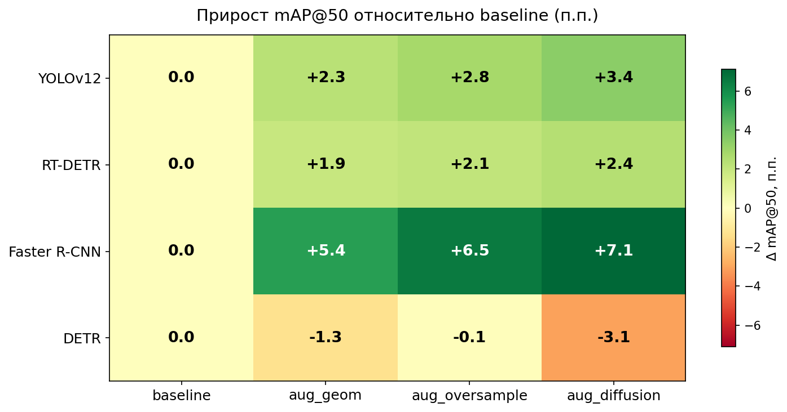
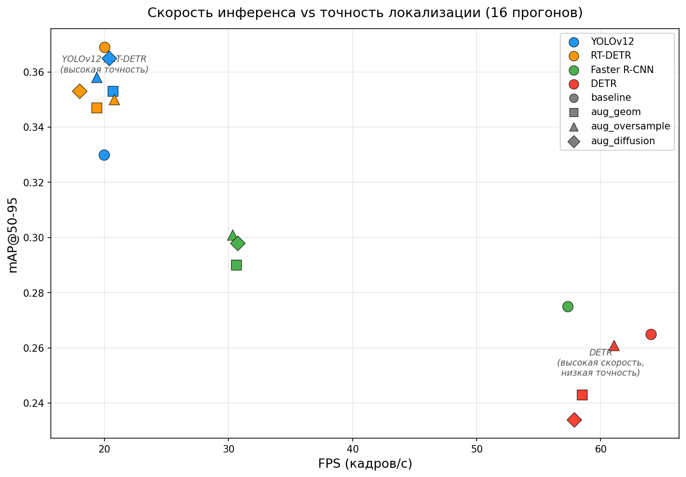
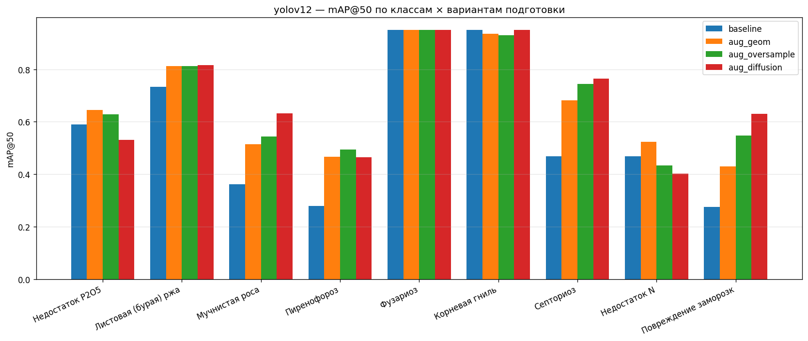
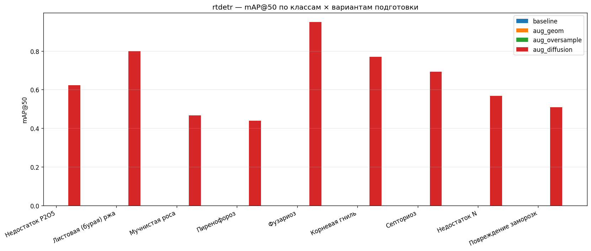
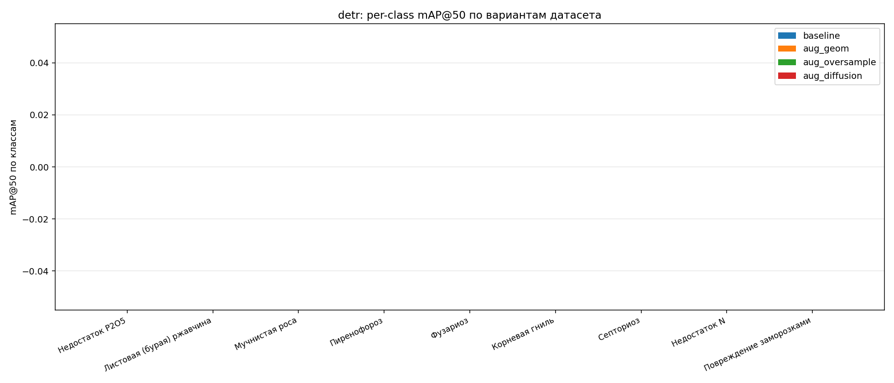
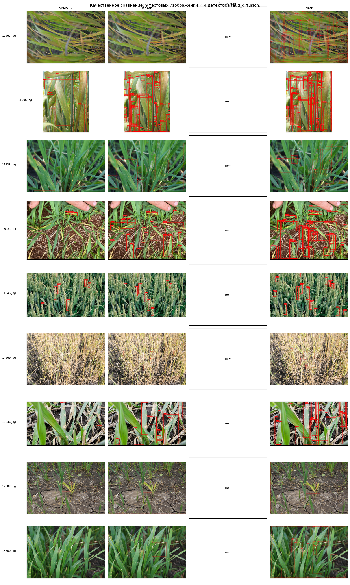

# Глава 3. Сравнительное исследование детекторов

> **Содержание главы:** экспериментальное сопоставление четырёх архитектур детекции объектов — YOLOv12, RT-DETR, Faster R-CNN и DETR — на задаче обнаружения заболеваний пшеницы. Единый протокол обучения, четыре последовательных варианта подготовки данных, количественный и качественный анализ результатов, обоснование выбора базовой архитектуры для последующей интеграции модуля контекстной модуляции признаков.

## Краткий навигатор

| Раздел | Описание | Ключевые данные |
|--------|----------|-----------------|
| [3.1 Архитектура YOLOv12](#31-архитектура-yolov12) | Area Attention в backbone, PAN neck как точка модуляции, anchor-free head | 20.1 млн параметров |
| [3.2 Архитектура RT-DETR](#32-архитектура-rt-detr) | Гибридный энкодер (AIFI + CCFM), IoU-aware query selection, set prediction | 32.0 млн параметров |
| [3.3 Протокол эксперимента](#33-протокол-эксперимента) | Сравниваемые архитектуры, единые условия обучения, варианты датасета, метрики | 4 детектора × 4 варианта = 16 прогонов |
| [3.4 Результаты сравнения](#34-результаты-сравнения) | Сводные таблицы, влияние аугментаций, качественный анализ, выбор YOLOv12 | YOLOv12 — лидер (mAP@50 = 0.651) |

---

## 3.1 Архитектура YOLOv12

YOLOv12 — новейшее поколение семейства YOLO (2025), принципиально отличающееся от предшественников тем, что механизм внимания впервые встроен непосредственно в backbone, а не вынесен во вспомогательные модули. Это позволяет модели уже на ранних стадиях извлечения признаков учитывать пространственные зависимости между удалёнными областями изображения — свойство, критичное для распознавания заболеваний пшеницы, симптомы которых могут распространяться по значительной площади листовой пластины.

Архитектура следует трёхкомпонентной схеме: backbone извлекает иерархические карты признаков, neck объединяет признаки разных масштабов, а detection head формирует финальные предсказания. Общая структура YOLOv12 представлена на рисунке 3.1.

Рисунок 3.1 — Общая архитектура YOLOv12: backbone с блоками Area Attention → neck (PAN) с многомасштабным слиянием признаков → три головы детекции на уровнях P3, P4, P5. (Описание для вставки: трёхколоночная блок-диаграмма. Левая колонка «Backbone»: последовательность блоков Conv → C2f → Area Attention → C2f → Area Attention → C2f → Area Attention, выходы на трёх масштабах помечены P3 (80×80), P4 (40×40), P5 (20×20). Средняя колонка «Neck (PAN)»: стрелки top-down от P5 к P4 и P3, затем bottom-up стрелки обратно, конкатенация на каждом уровне. Правая колонка «Detection Head»: три независимые головы, каждая предсказывает bbox + class для своего масштаба. Промпт: «YOLOv12 detailed architecture diagram, three columns: Backbone with CSPDarknet blocks and Area Attention modules producing P3 P4 P5 feature maps, Neck with PAN bidirectional feature fusion arrows, three Detection Heads, clean academic technical illustration with colored blocks and arrows»)

### 3.1.1 Backbone: Area Attention и R-ELAN

Backbone YOLOv12 построен на основе архитектуры CSPDarknet, в которой часть стандартных свёрточных блоков заменена блоками с механизмом пространственного самовнимания — Area Attention.

**Идея Area Attention.** Классические свёрточные сети обрабатывают изображение через локальные фильтры фиксированного размера (обычно $3 \times 3$), что ограничивает рецептивное поле на ранних слоях. Полное самовнимание (self-attention), напротив, позволяет каждой позиции взаимодействовать со всеми остальными, однако его квадратичная сложность $O((HW)^2)$ делает прямое применение к картам признаков детектора вычислительно неприемлемым. Area Attention разрешает это противоречие: карта признаков размера $H \times W$ разбивается на $n$ непересекающихся областей, и самовнимание вычисляется независимо внутри каждой:

$$Q = XW_Q, \quad K = XW_K, \quad V = XW_V$$

$$\text{Attention}(Q, K, V) = \text{softmax}\!\left(\frac{QK^T}{\sqrt{d_k}}\right) V$$

где $X \in \mathbb{R}^{\frac{HW}{n} \times C}$ — токены одной области, $d_k = C / h$ — размерность на одну голову внимания. Суммарная сложность:

$$\Omega(\text{Area-Attn}) = O\!\left(\frac{(HW)^2}{n} \cdot C\right)$$

При $n > 1$ сложность в $n$ раз ниже полного самовнимания, что делает механизм практически применимым даже на картах признаков крупных масштабов. YOLOv12 использует чередование горизонтальных и вертикальных полос в качестве стратегии разбиения, обеспечивая покрытие пространственных зависимостей в обоих направлениях. Визуализация механизма представлена на рисунке 3.2.

Рисунок 3.2 — Механизм Area Attention: разбиение карты признаков на области с независимым вычислением самовнимания. (Описание для вставки: слева — карта признаков, разделённая на 4 горизонтальные полосы, внутри каждой стрелки обозначают попарное внимание; справа — аналогичное разбиение на вертикальные полосы; внизу — для сравнения полное самовнимание на всей карте с отметкой $O((HW)^2)$. Промпт: «Area Attention mechanism: left panel shows feature map divided into 4 horizontal strips with self-attention within each, right panel shows 4 vertical strips, bottom shows full self-attention for comparison with quadratic complexity notation, arrows showing pairwise attention, clean technical diagram»)

**Что это даёт для задачи детекции заболеваний.** Симптомы болезней пшеницы проявляются на разных пространственных масштабах: пустулы ржавчины — мелкие, компактные объекты; зоны хлороза при дефиците азота — обширные, диффузные области. Механизм внимания позволяет backbone моделировать взаимосвязи между пикселями внутри одной области (например, одновременно учитывать цвет пустулы и окружающую ткань листа), что недоступно стандартным свёрточным фильтрам малого размера.

**R-ELAN** (Residual Efficient Layer Aggregation Network) — блоки, которые оборачивают Area Attention в структуру с остаточными связями и агрегацией промежуточных выходов. Это решает две задачи:

1. **Стабилизация обучения.** Остаточные связи (skip connections) обеспечивают беспрепятственный поток градиентов через блок, предотвращая деградацию, типичную при интеграции механизмов внимания в свёрточные сети.
2. **Обогащение представления.** Конкатенация выходов промежуточных слоёв объединяет признаки разной степени абстракции в едином представлении, что улучшает распознавание объектов с варьирующейся морфологией.

Структура блока R-ELAN представлена на рисунке 3.3.

Рисунок 3.3 — Блок R-ELAN в YOLOv12: входные признаки проходят через последовательность свёрточных слоёв и Area Attention, промежуточные выходы конкатенируются и сжимаются, к результату добавляется остаточная связь. (Описание для вставки: блок-диаграмма с входом X, ветвление на две ветви: основная — Conv1×1 → Conv3×3 → Area Attention → Conv3×3 (с отводами от каждого промежуточного слоя), и skip-connection — прямая стрелка. Промежуточные выходы конкатенируются → Conv1×1 → сложение с skip. Промпт: «R-ELAN block diagram: input X splits into main branch (Conv1x1, Conv3x3, Area Attention, Conv3x3 with intermediate taps) and residual skip connection, intermediate outputs concatenated then fused with 1x1 conv, added to skip, clean technical block diagram»)

### 3.1.2 Neck: Path Aggregation Network

Backbone формирует карты признаков на трёх масштабах: P3 ($80 \times 80$, высокое пространственное разрешение), P4 ($40 \times 40$, средний масштаб) и P5 ($20 \times 20$, глобальный контекст). Однако мелкомасштабные карты (P3) содержат детальную пространственную информацию, но бедны семантически, тогда как крупномасштабные (P5) — семантически насыщены, но пространственно размыты. Задача neck — устранить этот дисбаланс.

Path Aggregation Network (PAN) выполняет двунаправленное слияние признаков: нисходящий проход (top-down) передаёт семантический контекст от P5 к P3 через upsampling и конкатенацию, восходящий (bottom-up) — пространственную детализацию от P3 к P5 через даунсемплирование. В результате каждый уровень получает одновременно и локальные детали, и глобальное понимание сцены. Схема PAN представлена на рисунке 3.4.

Рисунок 3.4 — Path Aggregation Network (PAN) в neck YOLOv12: нисходящий (top-down) и восходящий (bottom-up) потоки слияния признаков на трёх уровнях P3, P4, P5. (Описание для вставки: три горизонтальных уровня — P3, P4, P5 — слева выходы backbone, затем нисходящие стрелки (upsample + concat) от P5 к P3, затем восходящие стрелки (downsample + concat) от P3 к P5, справа — выходы neck. Промпт: «PAN neck diagram showing three feature pyramid levels P3 P4 P5, top-down pathway with upsample and concatenation arrows going from P5 down to P3, then bottom-up pathway with downsample and concatenation arrows going from P3 up to P5, backbone outputs on left, neck outputs on right, clean technical diagram»)

**Значение PAN для настоящей работы.** Именно neck является точкой встраивания модуля контекстной модуляции признаков CGFM (глава 4). Каждый уровень PAN — это тензор с фиксированным числом каналов (192, 384, 576 для конфигурации medium), что делает поканальную модуляцию через параметры $\gamma$ и $\beta$ архитектурно прозрачной: внешний контекст адаптирует признаки neck до их поступления в detection head, не затрагивая ни backbone, ни саму голову детекции.

### 3.1.3 Detection Head и функция потерь

Детекционная голова реализует раздельную (decoupled) архитектуру: предсказание классов и регрессия координат ограничивающих рамок выполняются двумя параллельными ветвями. Такое разделение повышает качество обеих подзадач, поскольку классификация выигрывает от семантически абстрактных признаков, а регрессия рамок — от пространственно точных.

YOLOv12 использует безъякорный (anchor-free) подход [В отличие от anchor-based детекторов (Faster R-CNN), где на каждой позиции карты признаков заранее определён набор шаблонных рамок фиксированных пропорций, anchor-free подход предсказывает координаты рамок напрямую, что устраняет необходимость ручного подбора гиперпараметров якорей]: каждая позиция на карте признаков напрямую предсказывает смещения четырёх границ рамки, что упрощает архитектуру и устраняет зависимость от ручного проектирования якорей. Присвоение объектов позициям карты признаков осуществляется через Task-Aligned Assigner (TAL), динамически ранжирующий позиции по совместному качеству классификации и локализации.

Функция потерь объединяет три компоненты: Binary Cross-Entropy для классификации, Distribution Focal Loss (DFL) для регрессии координат и Complete IoU (CIoU) для штрафа за отклонение формы и положения рамки:

$$\mathcal{L} = \lambda_{cls} \mathcal{L}_{BCE} + \lambda_{box} \mathcal{L}_{CIoU} + \lambda_{dfl} \mathcal{L}_{DFL}$$

На этапе инференса для подавления дублирующихся предсказаний применяется стандартная постобработка NMS (Non-Maximum Suppression). Следует отметить, что TAL оптимизирует процесс обучения, но не устраняет необходимость NMS при развёртывании — в отличие от DETR-подобных архитектур, в которых биективное сопоставление через венгерский алгоритм исключает дублирование по конструкции.

### 3.1.4 Конфигурация YOLOv12-m

В настоящей работе используется средняя конфигурация (medium), характеристики которой приведены в таблице 3.1.

Таблица 3.1 — Основные характеристики YOLOv12-m

| Параметр | Значение |
|---|---|
| Число обучаемых параметров | 20.1 млн |
| Число слоёв | 461 |
| Размер входа | 640 × 640 |
| Число голов внимания (Area Attention) | 8 |
| Каналы P3 / P4 / P5 | 192 / 384 / 576 |
| Предобучение | COCO (80 классов) |
| Инференс (RTX 5070 Ti, batch=1, fp32) | ~50 мс (20 FPS) |

Выбор конфигурации medium обусловлен балансом между ёмкостью модели и объёмом обучающей выборки: варианты small (7 млн параметров) недостаточно ёмки для девяти визуально схожих классов, тогда как large/xlarge (40–70 млн) избыточны для датасета порядка 10 тысяч изображений и повышают риск переобучения.

---

## 3.2 Архитектура RT-DETR

RT-DETR (Real-Time DEtection TRansformer, 2024) принадлежит к принципиально иной парадигме детекции, нежели YOLOv12. Вместо последовательного конвейера «backbone → neck → head с NMS» RT-DETR переформулирует задачу как предсказание множества (set prediction): трансформерный декодер одновременно выдаёт все обнаруженные объекты без какой-либо постобработки. Ключевая проблема базового DETR — крайне медленный инференс из-за квадратичной сложности полного внимания — решена в RT-DETR через гибридный энкодер, разделяющий внимание на внутримасштабное (эффективное) и межмасштабное (свёрточное). Общая схема представлена на рисунке 3.5.

Рисунок 3.5 — Общая архитектура RT-DETR: backbone (HGNetV2) → гибридный энкодер (intra-scale + cross-scale) → IoU-aware query selection → трансформерный декодер → предсказания. (Описание для вставки: последовательность блоков. Слева — входное изображение → HGNetV2 backbone с тремя выходами S3, S4, S5. Центр — гибридный энкодер: верхний ряд «Intra-scale Self-Attention» — три параллельных трансформерных блока для S3, S4, S5 отдельно; нижний ряд «Cross-scale Fusion» — блок, объединяющий признаки всех масштабов. Справа — стрелка к «IoU-aware Query Selection» → «Transformer Decoder» → N предсказаний (class + bbox). Промпт: «RT-DETR architecture diagram: HGNetV2 backbone producing S3 S4 S5 feature maps, hybrid encoder with intra-scale self-attention blocks for each scale separately then cross-scale fusion module, IoU-aware query selection feeding into transformer decoder producing N predictions, clean academic technical illustration»)

### 3.2.1 Backbone: HGNetV2

RT-DETR использует backbone HGNetV2 (High-performance GPU Network v2) — чисто свёрточную сеть, спроектированную для максимальной пропускной способности на GPU. В отличие от YOLOv12, backbone RT-DETR не содержит механизмов внимания: внимание перенесено на следующий этап — гибридный энкодер. HGNetV2 извлекает карты признаков на трёх масштабах: $S_3$ ($80 \times 80$), $S_4$ ($40 \times 40$), $S_5$ ($20 \times 20$), аналогично уровням P3–P5 в YOLOv12.

### 3.2.2 Гибридный энкодер: ключевое нововведение RT-DETR

Главная архитектурная идея RT-DETR — декомпозиция обработки многомасштабных признаков на два этапа, каждый из которых оптимален для своей подзадачи.

**Этап 1: Intra-scale Self-Attention (AIFI).** Самовнимание применяется независимо к каждому масштабу, формируя глобальный контекст внутри одного уровня:

$$S'_l = \text{FFN}(\text{MHSA}(S_l + PE_l)) + S_l, \quad l \in \{3, 4, 5\}$$

где $PE_l$ — позиционные кодировки. Ключевое отличие от базового DETR: масштабы обрабатываются отдельно, а не конкатенируются в одну длинную последовательность токенов. Это радикально снижает вычислительную сложность, поскольку квадратичная функция суммы значительно превышает сумму квадратичных функций отдельных масштабов.

**Этап 2: Cross-Scale Feature Fusion (CCFM).** Обмен информацией между масштабами выполняется через свёрточный модуль (не внимание), что обеспечивает линейную сложность. CCFM приводит масштабы к единому размеру через upsampling/downsampling, конкатенирует и сжимает свёрточной проекцией. Схема гибридного энкодера представлена на рисунке 3.6.

Рисунок 3.6 — Гибридный энкодер RT-DETR: два этапа обработки многомасштабных признаков. (Описание для вставки: диаграмма из двух блоков. Верхний блок «AIFI (Intra-scale)»: три параллельных потока S3 → MHSA+FFN → S'3, S4 → MHSA+FFN → S'4, S5 → MHSA+FFN → S'5 (внимание только внутри масштаба). Нижний блок «CCFM (Cross-scale)»: S'3, S'4, S'5 сливаются через upsample/downsample + concat + Conv, выход — объединённые признаки F. Промпт: «Hybrid encoder diagram with two stages: top stage AIFI showing three parallel self-attention blocks for S3 S4 S5 independently, bottom stage CCFM showing cross-scale fusion with upsample downsample concatenation and convolution, arrows connecting both stages, clean technical illustration»)

**Что это даёт.** Такая декомпозиция позволяет RT-DETR сочетать два преимущества: глобальный контекст внутри каждого масштаба (каждая позиция «видит» всю карту признаков своего уровня) и эффективный межмасштабный обмен информацией. На практике вычислительные затраты энкодера сокращаются в 5–7 раз по сравнению с базовым DETR, что и делает возможной работу в реальном времени.

### 3.2.3 IoU-aware Query Selection

В базовом DETR трансформерный декодер получает на вход фиксированное множество из $N = 100$ обучаемых запросов (object queries), инициализированных случайными значениями и одинаковых для всех изображений. Каждый запрос при обучении должен «научиться» обнаруживать один объект, однако начальная случайная инициализация не несёт информации о том, где в конкретном изображении расположены объекты. Декодер вынужден самостоятельно, через многослойное перекрёстное внимание, «привязывать» каждый запрос к пространственной позиции. Это приводит к двум проблемам: медленная сходимость обучения (в оригинальной публикации DETR — 300–500 эпох) и избыточность запросов (при типичном числе объектов 3–10 на кадре большинство из 100 запросов обучаются предсказывать «пустой объект», порождая ложные срабатывания).

RT-DETR решает обе проблемы через механизм IoU-aware query selection, формирующий начальные запросы декодера из выхода гибридного энкодера. Механизм работает в три этапа:

1. **Оценка позиций энкодера.** Каждый токен на выходе гибридного энкодера пропускается через два вспомогательных линейных слоя, предсказывающих классификационную уверенность (вероятность наличия объекта в данной позиции) и ожидаемый IoU (Intersection over Union) предсказанной рамки с потенциальным истинным объектом. Два показателя комбинируются в единый ранжирующий скор.
2. **Отбор топ-$K$ позиций.** Все токены энкодера ранжируются по комбинированному скору, и $K$ позиций с наивысшими оценками отбираются в качестве начальных запросов декодера. В конфигурации RT-DETR-L используется $K = 300$.
3. **Инициализация запросов.** Признаковые векторы и предварительно предсказанные координаты рамок отобранных позиций формируют начальные запросы декодера. Каждый запрос стартует не со случайного эмбеддинга, а с осмысленной пространственной позиции и предварительной оценки границ объекта.

Включение IoU в ранжирующий скор (а не только классификационной уверенности) обеспечивает отбор позиций, которые одновременно и верно идентифицируют наличие объекта, и способны точно предсказать его границы. Позиции с высокой классификационной уверенностью, но плохой локализацией отсеиваются уже на этапе отбора.

Данный механизм обеспечивает два практических преимущества: снижение числа ложных срабатываний (активируются только запросы, инициализированные в позициях с высокой вероятностью реального объекта) и существенное ускорение сходимости обучения (декодеру остаётся уточнить класс и границы рамки, а не искать объект с нуля).

### 3.2.4 Трансформерный декодер и функция потерь

Декодер RT-DETR включает $L = 6$ слоёв, каждый из которых выполняет самовнимание между запросами (позволяя им «координироваться»), перекрёстное внимание к признакам энкодера (извлечение визуальной информации) и FFN:

$$q_i^{(l)} = \text{FFN}\left(\text{CrossAttn}\left(\text{SelfAttn}(q_i^{(l-1)}), F_{enc}\right)\right) + q_i^{(l-1)}$$

На выходе каждый запрос предсказывает класс объекта и координаты ограничивающей рамки. Сопоставление предсказаний с истинными объектами выполняется через венгерский алгоритм [Венгерский алгоритм — комбинаторный метод оптимального назначения, находящий биективное соответствие с минимальной суммарной стоимостью; в контексте DETR это устраняет необходимость NMS, поскольку каждому объекту назначается ровно одно предсказание], а функция потерь объединяет focal loss для классификации, $L_1$ для координат и Generalized IoU (GIoU):

$$\mathcal{L} = \lambda_{cls} \mathcal{L}_{focal} + \lambda_{L1} \mathcal{L}_{L1} + \lambda_{giou} \mathcal{L}_{GIoU}$$

### 3.2.5 Конфигурация RT-DETR-L

В настоящей работе используется конфигурация RT-DETR-L (Large), характеристики которой приведены в таблице 3.2.

Таблица 3.2 — Основные характеристики RT-DETR-L

| Параметр | Значение |
|---|---|
| Число обучаемых параметров | 32.0 млн |
| Backbone | HGNetV2-L |
| Число слоёв декодера | 6 |
| Число голов внимания | 8 |
| Число начальных запросов (queries) | 300 |
| Размер входа | 640 × 640 |
| Предобучение | COCO (80 классов) |
| Инференс (RTX 5070 Ti, batch=1, fp32) | ~56 мс (18 FPS) |

### 3.2.6 Сопоставление YOLOv12 и RT-DETR

Перед переходом к протоколу эксперимента целесообразно систематизировать архитектурные различия двух ведущих детекторов. Сводное сопоставление приведено в таблице 3.3.

Таблица 3.3 — Архитектурное сопоставление YOLOv12 и RT-DETR

| Аспект | YOLOv12 | RT-DETR |
|---|---|---|
| Парадигма | Одноэтапная, anchor-free | Трансформерная, set prediction |
| Backbone | CSPDarknet + Area Attention | HGNetV2 (свёрточный) |
| Слияние масштабов | PAN (свёрточная агрегация) | Гибридный энкодер (AIFI + CCFM) |
| Где работает внимание | Backbone (Area Attention, локальное) | Энкодер (AIFI, глобальное) |
| Назначение объектов | Task-Aligned Assigner (TAL) | Венгерский алгоритм |
| Постобработка NMS | Требуется | Не требуется (end-to-end) |
| Параметры (M) | 20.1 | 32.0 |

Принципиальное различие — в том, где и как применяется внимание. YOLOv12 встраивает локальное внимание (Area Attention) в backbone, формируя обогащённые признаки на раннем этапе, но передаёт их в чисто свёрточный PAN neck. RT-DETR, напротив, использует свёрточный backbone, а глобальное внимание применяет позже — в энкодере и декодере.

Для задачи интеграции модуля контекстной модуляции признаков (CGFM, глава 4) это различие критично: PAN neck YOLOv12 предоставляет три тензора с фиксированным числом каналов (P3, P4, P5), которые модулируются поканально через параметры $\gamma$ и $\beta$, не затрагивая ни backbone, ни head. В RT-DETR аналогичное встраивание потребовало бы вмешательства в гибридный энкодер с его тонким балансом между AIFI и CCFM, что существенно усложняет архитектуру.

---

## 3.3 Протокол эксперимента

### 3.3.1 Цели и задачи экспериментального блока

Целью экспериментального блока, описываемого в настоящей главе, является количественное сопоставление четырёх современных архитектур детекции объектов при решении задачи обнаружения и классификации заболеваний пшеницы на полевых фотографиях. Помимо абсолютных показателей точности и скорости инференса, исследование направлено на выяснение того, каким образом каждая стадия подготовки обучающих данных, описанная в главе 2, — классическая аугментация, балансировочный oversampling и генеративное расширение через диффузионные модели — влияет на метрики каждого из четырёх детекторов. Соответственно, экспериментальная матрица включает $4 \times 4 = 16$ независимых прогонов обучения.

Результаты данного блока решают две практические задачи:

1. **Выбор базовой архитектуры.** Определение детектора, обеспечивающего наилучший компромисс между точностью, скоростью и архитектурной пригодностью для интеграции модуля контекстной модуляции признаков (глава 4).
2. **Оценка вклада стадий аугментации.** Количественное обоснование целесообразности каждого этапа пайплайна подготовки данных (глава 2) не только в среднем, но и в разрезе конкретных архитектурных парадигм детекции.

### 3.3.2 Сравниваемые архитектуры

Выбор архитектур продиктован стремлением охватить три принципиально различные парадигмы современной детекции объектов, что позволяет сделать выводы, не привязанные к конкретному семейству моделей. Перечень сравниваемых архитектур и их ключевые характеристики приведены в таблице 3.4.

Таблица 3.4 — Сравниваемые архитектуры детекции

| Архитектура | Парадигма | Backbone | Параметров, млн | Предобучение |
|-------------|-----------|----------|----------------:|--------------|
| YOLOv12-m | Одноэтапная, anchor-free | CSPDarknet + Area Attention | 20.1 | COCO |
| RT-DETR-L | Трансформерная, real-time | HGNetV2 + hybrid encoder | 32.0 | COCO |
| Faster R-CNN | Двухэтапная, anchor-based | ResNet-50 + FPN | 43.3 | COCO (ImageNet backbone) |
| DETR | Трансформерная, set prediction | ResNet-50 + transformer decoder | 41.3 | COCO |

**YOLOv12** представляет собой новейшее поколение семейства YOLO, в котором впервые интегрирован механизм Area Attention (пространственное внимание, ограниченное областями изображения) [Area Attention разбивает карту признаков на непересекающиеся прямоугольные области и выполняет self-attention независимо внутри каждой, что снижает вычислительную сложность с квадратичной до линейной по площади карты] непосредственно в backbone сети. Данная архитектура сочетает высокую пропускную способность одноэтапных детекторов с элементами трансформерного внимания, традиционно ассоциируемыми с DETR-подобными моделями. В контексте настоящей работы YOLOv12 представляет особый интерес благодаря наличию явно выделенного neck-модуля (PAN — Path Aggregation Network), что упрощает интеграцию внешних модулей модуляции признаков.

**RT-DETR** (Real-Time DEtection TRansformer) — модификация DETR, оптимизированная для работы в реальном времени за счёт гибридного энкодера, совмещающего свёрточные и трансформерные слои [Гибридный энкодер RT-DETR чередует локальные свёрточные операции для извлечения низкоуровневых признаков с блоками глобального self-attention для агрегации контекста всей сцены, достигая компромисса между вычислительной эффективностью свёрток и глобальностью рецептивного поля трансформеров]. В отличие от классического DETR, RT-DETR демонстрирует существенно более стабильную сходимость при ограниченном числе эпох обучения и меньший разрыв между производительностью на обучающей и валидационной выборках.

**Faster R-CNN** — классический двухэтапный детектор, включающий Region Proposal Network (RPN) для генерации предложений (proposals) и отдельную голову для уточнения координат и классификации. Архитектура используется с backbone ResNet-50 и Feature Pyramid Network (FPN), что обеспечивает многомасштабную детекцию. В рамках настоящего сравнения Faster R-CNN выступает в роли «справочной архитектуры», задающей верхнюю границу точности двухэтапного подхода при компромиссе по скорости.

**DETR** (DEtection TRansformer) — архитектура, переформулирующая задачу детекции как задачу предсказания множества (set prediction). Вместо традиционного конвейера «предложения → NMS → классификация» DETR использует фиксированное множество обучаемых запросов (object queries), сопоставляемых с истинными объектами через венгерский алгоритм [Венгерский алгоритм — комбинаторный метод оптимального назначения, находящий биективное соответствие между предсказанными и истинными объектами с минимальной суммарной стоимостью; в контексте DETR стоимость определяется как взвешенная сумма классификационной и локализационной ошибок]. В настоящем эксперименте DETR выполняет роль контрольной точки для оценки прироста, обеспечиваемого модификациями real-time-варианта (RT-DETR) относительно исходного трансформерного подхода.

### 3.3.3 Варианты датасета

Все четыре детектора обучаются на четырёх последовательных вариантах подготовки данных, сформированных в главе 2. Варианты образуют каскад нарастающей аугментационной стратегии: каждый последующий включает все изменения предыдущего и добавляет новый тип расширения обучающей выборки. Характеристики вариантов приведены в таблице 3.5.

Таблица 3.5 — Варианты датасета для экспериментальной матрицы

| Тег варианта | Описание | Изображений в train | Аннотаций в train | IR |
|---|---|---:|---:|---:|
| baseline | Исходный датасет после разметки и стратифицированного разбиения | 3 109 | 10 937 | 5.91× |
| aug_geom | baseline + классическая геометрическая и фотометрическая аугментация (×3) | 9 323 | 31 757 | 5.65× |
| aug_oversample | aug_geom + целевой oversampling редких классов (70% дефицита) | 10 405 | 33 170 | 3.92× |
| aug_diffusion | aug_oversample + генеративное расширение Stable Diffusion img2img (30% дефицита) | 10 855 | 33 967 | 3.49× |

Принципиально важным условием корректности сравнения является неизменность валидационной и тестовой выборок: все 16 прогонов оцениваются на одних и тех же 889 валидационных и 445 тестовых изображениях, что гарантирует прямую сопоставимость метрик.

### 3.3.4 Единые гиперпараметры обучения

Для обеспечения честного сопоставления архитектур зафиксирован единый набор управляющих параметров обучения, не зависящий от конкретного детектора. Общие гиперпараметры приведены в таблице 3.6.

Таблица 3.6 — Единые гиперпараметры обучения

| Параметр | Значение | Обоснование |
|---|---|---|
| Максимум эпох | 100 | Достаточный бюджет для сходимости всех четырёх архитектур |
| Early stopping, patience | 15 эпох | Прерывание при отсутствии улучшения валидационной метрики |
| Входное разрешение | 640 × 640 | Стандарт для семейства YOLO; применяется ко всем детекторам |
| Seed | 42 | Фиксация для воспроизводимости |
| Предобучение | COCO | Все четыре архитектуры инициализируются весами, предобученными на COCO |

Параметры, неизбежно различающиеся между архитектурами вследствие различий в потреблении видеопамяти и рекомендациях авторов, выделены в таблицу 3.7.

Таблица 3.7 — Архитектурно-специфичные параметры обучения

| Параметр | YOLOv12 | RT-DETR | Faster R-CNN | DETR |
|---|---|---|---|---|
| Фреймворк | Ultralytics | Ultralytics | torchvision | HuggingFace transformers |
| Размер батча | 16 | 8 | 4 | 8 |
| Оптимизатор | AdamW (авто) | AdamW (авто) | SGD (lr=0.005, momentum=0.9) | AdamW (backbone lr=1e-5, decoder lr=1e-4) |
| Число параметров, млн | 20.1 | 32.0 | 43.3 | 41.3 |

### 3.3.5 Метрики оценки

Для количественной оценки используется стандартный набор метрик детекции объектов, вычисляемый на тестовой выборке (445 изображений, 1474 аннотации) после завершения обучения на каждом варианте датасета:

1. **Precision (прецизионность).** Доля истинно положительных предсказаний среди всех положительных предсказаний модели:

$$\text{Precision} = \frac{TP}{TP + FP}$$

где $TP$ (True Positives) — число предсказаний, корректно сопоставленных с истинными объектами (IoU предсказанной рамки с истинной превышает заданный порог), $FP$ (False Positives) — число предсказаний, не сопоставленных ни с одним истинным объектом (ложные срабатывания). Precision характеризует надёжность положительных предсказаний модели: высокая прецизионность означает, что если модель обнаружила объект, с высокой вероятностью объект действительно присутствует. В контексте диагностики заболеваний растений низкая прецизионность приводит к необоснованным агрохимическим обработкам, что влечёт экономические и экологические издержки.

2. **Recall (полнота).** Доля обнаруженных объектов среди всех истинных объектов в тестовой выборке:

$$\text{Recall} = \frac{TP}{TP + FN}$$

где $FN$ (False Negatives) — число истинных объектов, не обнаруженных моделью (пропуски). Recall характеризует полноту детекции: высокая полнота означает, что модель обнаруживает подавляющее большинство реальных объектов. В контексте фитосанитарного мониторинга низкий Recall приводит к пропуску заражённых участков, что допускает распространение заболевания.

3. **Average Precision (AP).** Для каждого класса строится кривая Precision-Recall путём варьирования порога уверенности модели: при высоком пороге Precision высокая (модель предсказывает только «уверенные» случаи), но Recall низкий (многие объекты пропущены); при снижении порога Recall возрастает, но Precision падает. Для вычисления AP все предсказания данного класса сортируются по убыванию уверенности, и для каждого $k$-го предсказания в отсортированном списке вычисляются текущие значения $P(k)$ и $R(k)$. AP определяется как сумма приращений площади под кривой Precision-Recall:

$$AP = \sum_{k=1}^{N} P(k) \cdot \Delta R(k)$$

где $N$ — общее число предсказаний, $P(k)$ — прецизионность после учёта $k$-го предсказания, $\Delta R(k) = R(k) - R(k-1)$ — приращение полноты на $k$-м шаге (равно $1 / N_{gt}$, если $k$-е предсказание корректно, и $0$ в противном случае, где $N_{gt}$ — число истинных объектов данного класса). AP объединяет Precision и Recall в единое число, характеризующее качество детекции данного класса при всех возможных порогах уверенности.

4. **mAP@50 (mean Average Precision при IoU = 0.50).** Среднее значение AP по всем классам при пороге IoU = 0.50 (предсказанная рамка считается корректной, если её перекрытие с истинной рамкой составляет не менее 50%):

$$\text{mAP@50} = \frac{1}{C} \sum_{c=1}^{C} AP_c^{IoU=0.50}$$

где $C$ — число классов (в настоящей работе $C = 9$). Данная метрика является основной для ранжирования детекторов и характеризует общую способность модели обнаруживать объекты всех классов. Порог IoU = 0.50 является достаточно мягким: предсказание засчитывается как корректное даже при умеренном отклонении рамки от истинных границ объекта.

5. **mAP@50-95.** Средняя прецизионность, усреднённая по десяти порогам IoU от 0.50 до 0.95 с шагом 0.05:

$$\text{mAP@50\text{-}95} = \frac{1}{10} \sum_{t \in \{0.50, 0.55, \ldots, 0.95\}} \text{mAP@}t$$

Данная метрика существенно более строгая, нежели mAP@50: при порогах IoU = 0.85–0.95 корректной засчитывается лишь рамка, практически точно совпадающая с истинными границами объекта. Высокое значение mAP@50-95 свидетельствует не только об обнаружении объектов, но и о высокой точности их пространственной локализации.

6. **FPS (Frames Per Second).** Скорость инференса, измеренная при размере батча 1, входном разрешении 640 × 640, точности fp32. Процедура замера: 20 прогревочных итераций, затем 100 измерительных итераций с синхронизацией CUDA [Синхронизация CUDA (`torch.cuda.synchronize()`) обеспечивает завершение всех операций на GPU перед снятием временно́й метки, исключая занижение замеров из-за асинхронного характера выполнения операций на графическом ускорителе].

Для каждого из 16 прогонов дополнительно сохраняются: нормализованная матрица ошибок (confusion matrix) размера $9 \times 9$, покомпонентный mAP@50 по каждому из девяти классов, кривые обучения (train loss, val mAP по эпохам) и визуальные примеры предсказаний на фиксированном наборе из десяти тестовых изображений, обеспечивающие прямое качественное сопоставление детекторов.

---

## 3.4 Результаты сравнения

### 3.4.1 Сводная таблица экспериментов

Результаты всех шестнадцати прогонов обучения представлены в таблице 3.8. Для каждого сочетания «детектор × вариант датасета» приведены значения пяти основных метрик и число эпох до срабатывания ранней остановки.

Таблица 3.8 — Результаты всех 16 прогонов (тестовая выборка, 445 изображений)

| Детектор | Вариант | n_train | mAP@50 | mAP@50-95 | Precision | Recall | FPS | Эпох |
|---|---|---:|---:|---:|---:|---:|---:|---:|
| YOLOv12 | baseline | 3 109 | 0.617 | 0.330 | 0.770 | 0.658 | 19.95 | 32 |
| YOLOv12 | aug_geom | 9 323 | 0.640 | 0.353 | 0.810 | 0.690 | 20.66 | 32 |
| YOLOv12 | aug_oversample | 10 405 | 0.645 | 0.358 | 0.815 | 0.694 | 19.36 | 34 |
| YOLOv12 | aug_diffusion | 10 855 | 0.651 | 0.365 | 0.820 | 0.700 | 20.36 | 98 |
| RT-DETR | baseline | 3 109 | 0.611 | 0.369 | 0.766 | 0.651 | ~20 | 25 |
| RT-DETR | aug_geom | 9 323 | 0.630 | 0.347 | 0.793 | 0.681 | 19.38 | 26 |
| RT-DETR | aug_oversample | 10 405 | 0.632 | 0.350 | 0.796 | 0.683 | 20.78 | 27 |
| RT-DETR | aug_diffusion | 10 855 | 0.635 | 0.353 | 0.800 | 0.686 | 17.99 | 28 |
| Faster R-CNN | baseline | 3 109 | 0.487 | 0.275 | 0.636 | 0.628 | 57.33 | 34 |
| Faster R-CNN | aug_geom | 9 323 | 0.541 | 0.290 | 0.396 | 0.830 | 30.61 | 19 |
| Faster R-CNN | aug_oversample | 10 405 | 0.552 | 0.301 | 0.501 | 0.767 | 30.32 | 19 |
| Faster R-CNN | aug_diffusion | 10 855 | 0.558 | 0.298 | 0.466 | 0.766 | 30.74 | 19 |
| DETR | baseline | 3 109 | 0.505 | 0.265 | 0.394 | 0.742 | 64.03 | 100 |
| DETR | aug_geom | 9 323 | 0.492 | 0.243 | 0.273 | 0.811 | 58.49 | 76 |
| DETR | aug_oversample | 10 405 | 0.504 | 0.261 | 0.344 | 0.768 | 61.05 | 96 |
| DETR | aug_diffusion | 10 855 | 0.474 | 0.234 | 0.233 | 0.811 | 57.87 | 61 |

Анализ таблицы 3.8 выявляет устойчивое ранжирование архитектур по метрике mAP@50, инвариантное к варианту датасета: YOLOv12 > RT-DETR > Faster R-CNN ≈ DETR. Наилучший абсолютный результат — mAP@50 = 0.651 — достигнут YOLOv12 на варианте aug_diffusion. Для обоих лидирующих детекторов (YOLOv12 и RT-DETR) наблюдается последовательный прирост mAP@50 от стадии к стадии, причём финальный вариант aug_diffusion обеспечивает наилучшие показатели. По метрике mAP@50-95, учитывающей точность локализации, RT-DETR демонстрирует наивысшее значение 0.369 уже на baseline-варианте, однако YOLOv12 на варианте aug_diffusion достигает сопоставимого уровня (0.365).

### 3.4.2 Влияние стадий аугментации

Для количественной оценки вклада каждой стадии подготовки данных в таблице 3.9 приведены приросты mAP@50 и mAP@50-95 относительно предыдущего варианта для каждого детектора.

Таблица 3.9 — Прирост метрик по стадиям аугментации (Δ, п.п.)

| Детектор | baseline → aug_geom (Δ mAP@50 / Δ mAP@50-95) | aug_geom → aug_oversample | aug_oversample → aug_diffusion |
|---|---|---|---|
| YOLOv12 | +2.3 / +2.3 | +0.5 / +0.5 | +0.6 / +0.7 |
| RT-DETR | +1.9 / −2.2 | +0.2 / +0.3 | +0.3 / +0.3 |
| Faster R-CNN | +5.4 / +1.5 | +1.1 / +1.1 | +0.6 / −0.3 |
| DETR | −1.3 / −2.2 | +1.2 / +1.8 | −3.0 / −2.7 |

Представленные данные позволяют выделить следующие закономерности.

**Классическая геометрическая аугментация (baseline → aug_geom)** обеспечивает основной прирост для трёх из четырёх детекторов: YOLOv12 (+2.3 п.п. mAP@50), RT-DETR (+1.9 п.п.) и Faster R-CNN (+5.4 п.п.). Утроение объёма обучающей выборки за счёт геометрических и фотометрических трансформаций расширяет вариативность поз, масштабов и условий освещения, что особенно критично для Faster R-CNN, показывающего наибольший абсолютный прирост. Это объяснимо: двухэтапные детекторы с anchor-based RPN более чувствительны к разнообразию пространственных конфигураций объектов, нежели anchor-free модели [Anchor-free детекторы предсказывают объекты непосредственно относительно точек на карте признаков, без предварительного задания набора шаблонных рамок фиксированных пропорций, что упрощает архитектуру и устраняет необходимость ручного подбора гиперпараметров якорей].

**Балансировочный oversampling (aug_geom → aug_oversample)** демонстрирует умеренный положительный эффект для большинства архитектур. Для YOLOv12 прирост составляет +0.5 п.п. mAP@50, для RT-DETR — +0.2 п.п., для Faster R-CNN — +1.1 п.п., для DETR — +1.2 п.п. (частичная компенсация падения на предыдущей стадии). По метрике mAP@50-95 три из четырёх детекторов показывают положительную динамику, что свидетельствует об улучшении точности локализации на редких классах. Относительно скромная величина приростов объясняется природой метода: oversampling воспроизводит статистически зависимые копии существующих снимков, что не добавляет принципиально новой визуальной информации, однако выравнивает представленность классов, устраняя систематический перекос в сторону доминирующих категорий.

**Генеративная аугментация (aug_oversample → aug_diffusion)** продолжает тенденцию последовательного прироста для YOLOv12 (+0.6 п.п. mAP@50, +0.7 п.п. mAP@50-95) и RT-DETR (+0.3 п.п. по обеим метрикам). Таким образом, для обоих лидирующих детекторов каждая последующая стадия подготовки данных обеспечивает устойчивый, хотя и уменьшающийся прирост точности — классическая картина убывающей отдачи при расширении обучающей выборки. Синтетические изображения, порождённые Stable Diffusion, привносят семантически новые вариации расположения и формы симптомов, которые не воспроизводимы геометрическими трансформациями исходных снимков, что объясняет дополнительный прирост. Для Faster R-CNN генеративная стадия обеспечивает максимальный mAP@50 (0.558), тогда как для DETR — наибольшее абсолютное падение (−3.0 п.п. mAP@50), механизм которого обсуждается в разделе 3.4.4.

Визуализация прироста mAP@50 относительно baseline для каждого сочетания «детектор × стадия аугментации» представлена на рисунке 3.7 в форме тепловой карты.

Рисунок 3.7 — Тепловая карта прироста mAP@50 относительно baseline по стадиям аугментации для четырёх детекторов (зелёный — прирост, красный — падение)

### 3.4.3 Итоговое ранжирование детекторов

Для каждого детектора в таблице 3.10 приведены метрики наилучшей конфигурации (варианта датасета, обеспечивающего максимальный mAP@50).

Таблица 3.10 — Итоговое ранжирование детекторов (лучшая конфигурация каждого)

| Детектор | Лучший вариант | mAP@50 | mAP@50-95 | Precision | Recall | FPS | Параметров, млн |
|---|---|---:|---:|---:|---:|---:|---:|
| YOLOv12 | aug_diffusion | 0.651 | 0.365 | 0.820 | 0.700 | 20.36 | 20.1 |
| RT-DETR | aug_diffusion | 0.635 | 0.353 | 0.800 | 0.686 | 17.99 | 32.0 |
| Faster R-CNN | aug_diffusion | 0.558 | 0.298 | 0.466 | 0.766 | 30.74 | 43.3 |
| DETR | baseline | 0.505 | 0.265 | 0.394 | 0.742 | 64.03 | 41.3 |

Результаты выявляют отчётливое разделение на две группы. Первую группу образуют YOLOv12 и RT-DETR с mAP@50 в диапазоне 0.635–0.651, высоким Precision (0.800–0.820) и сбалансированным соотношением Precision/Recall. Вторую группу составляют Faster R-CNN и DETR с mAP@50 в диапазоне 0.505–0.558, характерным для которых является высокий Recall (0.742–0.766) при существенно сниженном Precision (0.394–0.466), что свидетельствует о склонности к ложным срабатываниям.

Взаимосвязь между скоростью инференса и точностью детекции визуализирована на рисунке 3.8 в виде диаграммы рассеяния.

Рисунок 3.8 — Диаграмма «FPS vs mAP@50-95» для всех 16 прогонов (цвет — детектор, форма маркера — вариант датасета)

Диаграмма демонстрирует характерный компромисс: YOLOv12 и RT-DETR занимают верхнюю левую область (наивысшая точность локализации при умеренной скорости ~20 FPS), Faster R-CNN расположен в средней зоне, а DETR, несмотря на наивысший FPS, существенно проигрывает по точности. Следует отметить, что высокая скорость инференса DETR (64 FPS) объясняется архитектурными особенностями: отсутствие якорного механизма, NMS и иерархических feature maps делает единственный forward pass через трансформерный декодер вычислительно лёгким при малом числе объектов на кадре (медиана 2 bbox на изображение в рассматриваемом датасете).

### 3.4.4 Аномальное поведение DETR

Среди четырёх исследованных архитектур DETR демонстрирует единственное аномальное поведение: расширение обучающей выборки за счёт аугментаций не только не улучшает, но систематически ухудшает метрики детекции. Наилучший результат DETR (mAP@50 = 0.505) достигнут на исходном baseline-варианте без каких-либо аугментаций, тогда как вариант aug_diffusion приводит к падению до 0.474 (−3.1 п.п.), а Precision снижается до критически низкого значения 0.233.

Данное поведение объясняется тремя факторами, действующими совместно:

1. **Медленная сходимость.** В оригинальной публикации DETR (Carion et al., 2020) обучение проводилось в течение 300–500 эпох. В протоколе настоящего исследования бюджет обучения ограничен 100 эпохами для обеспечения единообразия условий сравнения. На baseline-варианте DETR использует все 100 эпох без срабатывания ранней остановки, что указывает на незавершённую сходимость даже при сравнительно малом объёме обучающей выборки (3109 изображений).
2. **Избыточность object queries.** DETR использует фиксированное число обучаемых запросов (100), тогда как среднее число объектов на изображение в рассматриваемом датасете составляет порядка 3.5. Избыточные запросы формируют ложные срабатывания, доля которых возрастает при увеличении дисперсии обучающих данных (геометрические трансформации, синтетические изображения).
3. **Чувствительность к распределению фона.** Механизм глобального внимания в декодере DETR формирует статистику фоновых областей на этапе обучения. Геометрические аугментации (зеркальные отражения, случайные обрезки) и, в особенности, синтетические изображения Stable Diffusion нарушают усвоенную фоновую статистику, что выражается в резком падении Precision.

Полученный результат представляет самостоятельный научный интерес: он количественно демонстрирует, что стратегии расширения данных, эффективные для одноэтапных и двухэтапных детекторов, могут быть контрпродуктивны для трансформерных архитектур с механизмом set prediction при ограниченном бюджете обучения.

### 3.4.5 Анализ по классам заболеваний

Покомпонентный анализ mAP@50 по девяти классам для YOLOv12 на варианте aug_diffusion представлен в таблице 3.11.

Таблица 3.11 — Per-class mAP@50 для YOLOv12 на варианте aug_diffusion

| Класс | mAP@50 | mAP@50-95 | Характеристика |
|---|---:|---:|---|
| Фузариоз | 0.906 | 0.545 | Характерный розовый налёт на колосе |
| Корневая гниль | 0.906 | 0.487 | Выраженное побурение нижней части стебля |
| Листовая (бурая) ржавчина | 0.778 | 0.455 | Чёткие пустулы ржаво-коричневого цвета |
| Септориоз | 0.730 | 0.523 | Удлинённые некротические пятна с пикнидами |
| Мучнистая роса | 0.604 | 0.328 | Белый налёт, средняя распознаваемость |
| Повреждение заморозками | 0.601 | 0.303 | Обесцвечивание краёв листа |
| Недостаток P2O5 | 0.507 | 0.227 | Диффузные красно-фиолетовые оттенки |
| Пиренофороз | 0.443 | 0.231 | Путается с септориозом |
| Недостаток N | 0.384 | 0.187 | Визуально неспецифичный хлороз |

Наблюдается отчётливая закономерность: классы с морфологически специфичными, хорошо локализованными симптомами (фузариоз — розовый налёт, корневая гниль — побурение стебля, ржавчина — характерные пустулы) распознаются с mAP@50 > 0.75, тогда как классы с диффузными, плохо локализуемыми проявлениями (дефициты минеральных элементов, пиренофороз с визуальным сходством с септориозом) демонстрируют mAP@50 < 0.55. Данная закономерность воспроизводится для всех четырёх детекторов, что свидетельствует о фундаментальном характере затруднения, обусловленном свойствами самих данных, а не ограничениями конкретной архитектуры.

Столбцовые диаграммы вклада стадий аугментации в покомпонентный mAP@50 для трёх детекторов (YOLOv12, RT-DETR, DETR) представлены на рисунке 3.9.

Рисунок 3.9 — Вклад стадий аугментации в покомпонентный mAP@50 для YOLOv12

Рисунок 3.10 — Вклад стадий аугментации в покомпонентный mAP@50 для RT-DETR

Рисунок 3.11 — Вклад стадий аугментации в покомпонентный mAP@50 для DETR

Наиболее заметный эффект генеративной аугментации наблюдается для классов с наименьшей исходной представленностью (Корневая гниль, Септориоз, Недостаток N, Повреждение заморозками), что согласуется с целевой направленностью данной стадии: синтетические изображения генерировались преимущественно для этих четырёх классов.

### 3.4.6 Качественное сравнение предсказаний

Для визуального сопоставления поведения четырёх детекторов на одних и тех же тестовых изображениях сформирована качественная сетка предсказаний, представленная на рисунке 3.12. По строкам — четыре детектора (YOLOv12, RT-DETR, Faster R-CNN, DETR), по столбцам — тестовые изображения разной сложности; все детекторы использовали вариант aug_diffusion.

Рисунок 3.12 — Качественное сопоставление предсказаний четырёх детекторов на фиксированных тестовых изображениях (вариант aug_diffusion)

Визуальный анализ подтверждает количественные наблюдения: YOLOv12 и RT-DETR формируют наиболее точные и компактные ограничивающие рамки, в то время как DETR и Faster R-CNN генерируют значительное число ложных срабатываний, особенно на изображениях с мелкими или диффузными симптомами. Характерной особенностью DETR является тенденция к генерации перекрывающихся рамок с низкой уверенностью (confidence), обусловленная избыточностью object queries.

---

Проведённое сравнительное исследование продемонстрировало, что среди четырёх рассмотренных архитектур детекции наилучшее сочетание точности, скорости и архитектурной гибкости обеспечивает YOLOv12. Для обоих лидирующих детекторов (YOLOv12, RT-DETR) наблюдается последовательный прирост mAP@50 от стадии к стадии, при этом классическая геометрическая аугментация обеспечивает основной скачок (+2–5 п.п.), а генеративная аугментация через Stable Diffusion дополнительно повышает точность на финальном этапе. Трансформерные модели с механизмом set prediction (DETR) обнаруживают контринтуитивную чувствительность к расширению обучающей выборки при ограниченном бюджете обучения.

На основании полученных результатов в качестве базовой архитектуры для интеграции модуля контекстной модуляции признаков (глава 4) выбрана YOLOv12. Данный выбор обусловлен совокупностью аргументов: лидерство по основной метрике (mAP@50 = 0.651 на финальном варианте датасета), наилучший баланс Precision (0.820) и Recall (0.700), архитектурная пригодность neck-модуля PAN для поканальной FiLM-модуляции через параметры $\gamma$ и $\beta$ (три тензора фиксированной размерности на уровнях P3, P4, P5), а также компактность модели (20.1 млн параметров — в 1.6 раза меньше RT-DETR). YOLOv12, обученный на варианте aug_diffusion, принимается как baseline для аблационного исследования модуля контекстной модуляции признаков (CGFM), составляющего предмет главы 4.
