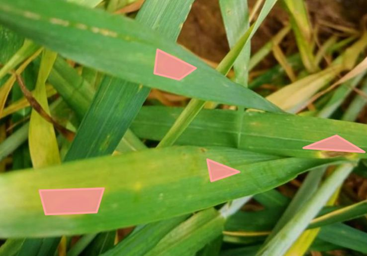
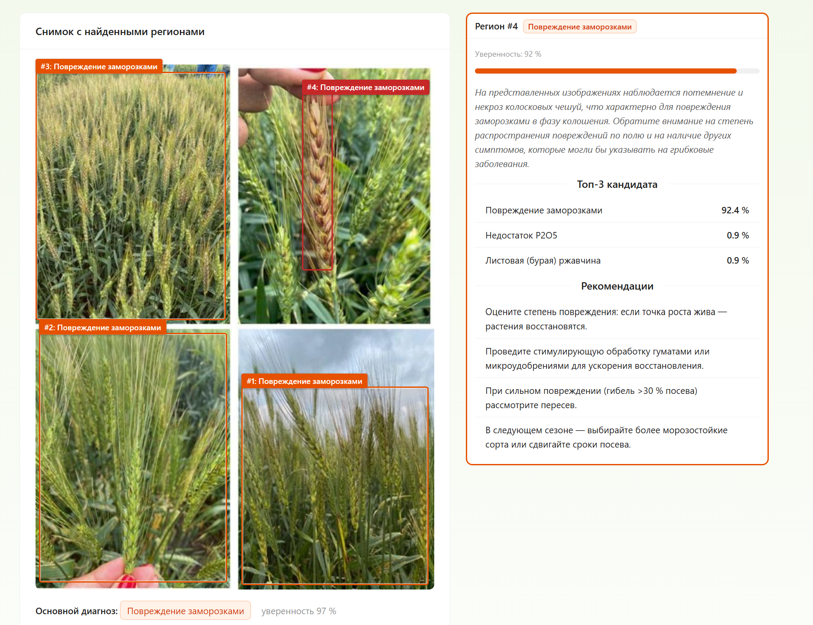
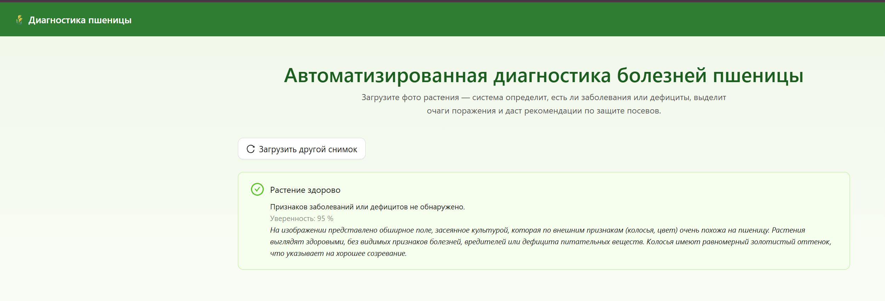

# Реферат

Выпускная квалификационная работа 100 с., 55 рис., 33 табл., 32 источника.

Цель работы — повышение эффективности автоматизированной диагностики заболеваний пшеницы на полевых изображениях относительно базовых архитектур глубокого обучения за счёт применения механизма линейной модуляции признаков внешним контекстным сигналом.

В работе разработана многоэтапная стратегия подготовки данных с генеративным расширением через диффузионные модели, выполнено сравнительное обучение современных детекторов, спроектирован модуль контекстной модуляции признаков CGFM на основе FiLM-модуляции в neck детектора, проведено аблационное исследование и проверена переносимость модуля между архитектурами, реализована клиент-серверная информационная система диагностики с локально развёрнутой языковой моделью.

Эффективность определялась по стандартным метрикам качества детекции. Предложенный модуль обеспечивает прирост относительно базового детектора, переносимость метода подтверждена при интеграции в альтернативную архитектуру. Разработанная система пригодна для практического применения в сельскохозяйственных предприятиях.

## Термины и определения

Глубокое обучение — направление машинного обучения с использованием многослойных нейросетей для автоматического извлечения иерархических признаков из данных.

Детекция объектов — задача компьютерного зрения по локализации и классификации объектов на изображении с использованием ограничивающих рамок.

Ограничивающая рамка — прямоугольник, описывающий объект в координатах изображения и заданный координатами противоположных углов или центром, шириной и высотой.

Классификация изображений — задача компьютерного зрения по отнесению изображения в целом к одной из заранее заданных категорий.

Сегментация — разделение изображения на семантически осмысленные пиксельные области с присвоением каждому пикселю метки класса.

Аугментация — метод расширения обучающего набора данных за счёт синтетических преобразований исходных изображений.

Генеративная аугментация — создание новых обучающих примеров с помощью генеративных моделей (диффузионных, GAN, Neural Style Transfer), а не детерминированных трансформаций существующих.

Oversampling — приём балансировки классов за счёт многократного включения примеров редких классов в обучающую выборку.

Дисбаланс классов — ситуация, когда часть классов представлена существенно меньшим числом обучающих примеров или разметок; приводит к ухудшению качества на редких классах без специальных мер.

Transfer learning — дообучение предварительно обученной модели на целевых данных для решения специфической задачи.

Backbone — часть модели, извлекающая иерархические карты признаков из изображения.

Neck — промежуточный блок детектора, объединяющий признаки разных масштабов для улучшения работы с объектами разных размеров.

Head — выходная часть детектора, предсказывающая координаты рамок, уверенность и классы.

Пирамида признаков — набор карт признаков на нескольких пространственных масштабах, используемый для детекции объектов разных размеров.

Якорь — опорная рамка заданного масштаба и пропорций, относительно которой сеть регрессирует координаты объекта.

Самовнимание — механизм трансформера, позволяющий каждому элементу входа взаимодействовать со всеми остальными и учитывать глобальный контекст.

Механизм внимания — компонент нейросети, адаптивно перераспределяющий «вес» различных признаков в зависимости от текущего входа.

Самореферентное внимание — механизм внимания, в котором модулирующий сигнал вычисляется из тех же карт признаков, которые затем модулируются.

Контекстная модуляция признаков — перенастройка внутренних представлений детектора сигналом от отдельного источника, анализирующего глобальный контекст сцены.

FiLM-модуляция — поканальная аффинная трансформация карт признаков, параметры которой ($\gamma$, $\beta$) генерируются отдельной сетью на основе внешнего входа.

Контекстный энкодер — отдельная нейросеть, формирующая компактное векторное представление глобального контекста изображения.

Late fusion — позднее слияние: подключение внешнего сигнала после основного детектора, на уровне классификатора или постобработки предсказаний.

Венгерский алгоритм — алгоритм оптимального назначения, находящий биективное соответствие между предсказаниями и истинными объектами с минимальной суммарной стоимостью; используется в DETR-подобных моделях.

Запросы объектов — обучаемые векторы в DETR-подобных моделях, сопоставляемые декодером с реальными объектами сцены и соответствующие выходным предсказаниям детекций.

One-stage детектор — архитектура, предсказывающая рамки и классы за один проход по изображению.

Two-stage детектор — архитектура, разделяющая детекцию на генерацию кандидатов областей и последующую классификацию и уточнение.

Foundation model — крупная предобученная модель, решающая разнородные задачи без доменного дообучения или с его минимальным объёмом.

Визуально-языковая модель — мультимодальная модель, совместно обрабатывающая изображения и тексты в общем пространстве представлений.

Zero-shot классификация — классификация объектов по категориям, не представленным в обучающей выборке, за счёт сопоставления визуальных признаков с текстовыми описаниями.

Open-vocabulary детекция — способность обнаруживать объекты произвольных категорий за счёт текстовых описаний вместо фиксированного набора классов.

Диффузионная модель — генеративная модель, обучаемая итеративно обращать процесс добавления шума к данным и способная синтезировать новые изображения из случайного шума с управлением через текстовый промпт.

Neural Style Transfer — метод, разделяющий контент и стиль изображений и рекомбинирующий их на основе минимизации комбинированной функции потерь.

Проблема исчезающих градиентов — эффект, при котором градиенты при обратном распространении через большое число слоёв экспоненциально затухают, что делает обновление весов ранних слоёв практически невозможным.

Коллапс мод — явление, при котором генератор производит изображения только из ограниченного подмножества целевого распределения.

Робастность — устойчивость модели к изменениям условий входных данных и способность сохранять качество работы при вариациях.

Фитопатология — наука о болезнях растений, изучающая причины, механизмы развития и методы борьбы с заболеваниями.

Абиотический стресс — негативное воздействие на растения факторов неживой природы (засуха, заморозки, недостаток питательных веществ).

## Перечень сокращений и обозначений

CV — Computer Vision (компьютерное зрение).

NLP — Natural Language Processing (обработка естественного языка).

CNN — Convolutional Neural Network (свёрточная нейронная сеть).

ViT — Vision Transformer (визуальный трансформер).

R-CNN — Region-based Convolutional Neural Network (регионная свёрточная нейронная сеть).

RPN — Region Proposal Network (сеть генерации предложений областей).

FPN — Feature Pyramid Network (пирамидальная сеть признаков).

PAN — Path Aggregation Network (сеть агрегации путей).

RoI — Region of Interest (область интереса).

NMS — Non-Maximum Suppression (подавление немаксимумов).

IoU — Intersection over Union (пересечение над объединением).

mAP — mean Average Precision (усреднённая средняя точность по классам).

TP / FP / FN — True Positive / False Positive / False Negative (истинно-положительное / ложноположительное / ложноотрицательное срабатывание).

FPS — Frames Per Second (кадров в секунду).

YOLO — You Only Look Once (семейство одноэтапных детекторов).

DETR — DEtection TRansformer (трансформерный детектор).

RT-DETR — Real-Time DETR (детектор реального времени на трансформерах).

SAM — Segment Anything Model (универсальная модель сегментации).

SE — Squeeze-and-Excitation (блок канального самовнимания).

CBAM — Convolutional Block Attention Module (модуль канально-пространственного самовнимания).

ECA — Efficient Channel Attention (облегчённый блок канального внимания).

FiLM — Feature-wise Linear Modulation (поканальная линейная модуляция признаков).

CGFM — Context-Gated Feature Modulation (предложенный модуль контекстной модуляции признаков).

VQA — Visual Question Answering (визуальный вопросно-ответный анализ).

VLM — Vision-Language Model (визуально-языковая модель).

CLIP — Contrastive Language-Image Pre-training (контрастивное предобучение изображений и текста).

GAN — Generative Adversarial Network (генеративно-состязательная сеть).

NST — Neural Style Transfer (нейронный перенос стиля).

OBB — Oriented Bounding Box (ориентированная ограничивающая рамка).

EDA — Exploratory Data Analysis (разведочный анализ данных).

IR — Imbalance Ratio (коэффициент дисбаланса).

CV — Coefficient of Variation (коэффициент вариации).

TAL — Task-Aligned Assigner (блок согласованного назначения объектов).

BCE — Binary Cross-Entropy (бинарная перекрёстная энтропия).

CIoU — Complete IoU loss (функция потерь, расширяющая IoU).

DFL — Distribution Focal Loss (фокальная функция потерь распределения).

AIFI — Attention-based Intra-scale Feature Interaction (внутримасштабное взаимодействие признаков через самовнимание).

CCFM — Cross-scale Feature-fusion Module (модуль межмасштабного слияния признаков).

R-ELAN — Residual Efficient Layer Aggregation Network (остаточная сеть агрегации слоёв).

SGD — Stochastic Gradient Descent (стохастический градиентный спуск).

BN — Batch Normalization (пакетная нормализация).

GPU — Graphics Processing Unit (графический процессор).

API — Application Programming Interface (интерфейс программирования приложений).

ORM — Object-Relational Mapping (объектно-реляционное отображение).

JSON / JSONB — JavaScript Object Notation / Binary JSON (текстовый и бинарный форматы сериализации данных).

ФАО ООН — Продовольственная и сельскохозяйственная организация Объединённых Наций.

---

# Введение

Современное сельское хозяйство работает в условиях климатических изменений, деградации почв и возрастающей фитосанитарной нагрузки. По оценкам ФАО ООН [32], ежегодные потери урожая от болезней растений составляют 20–40% мирового производства и в денежном выражении превышают 220 миллиардов долларов. Пшеница — одна из базовых продовольственных культур, и спектр её поражений широк: грибные инфекции (септориоз, ржавчина, мучнистая роса, фузариоз, пиренофороз), физиологические нарушения от дефицита минерального питания, абиотические повреждения. Традиционная диагностика опирается на визуальный осмотр агрономом и лабораторные исследования: она трудоёмка, субъективна, требует квалифицированного специалиста и плохо масштабируется на большие площади.

Автоматизированный анализ полевых изображений средствами компьютерного зрения и глубокого обучения позволяет снять часть этих ограничений и даёт оперативную поддержку принятию решений. При этом практическое развёртывание таких систем в аграрном домене осложняется прежде всего ограниченным объёмом и несбалансированностью доступных датасетов. Отдельный резерв для повышения качества детекции связан с устройством самих моделей: их признаки формируются преимущественно из локального контекста рецептивных полей, а распространённые механизмы внимания (SE-Net, CBAM) работают в самореферентном режиме и не задействуют внешний контекст сцены, несущий диагностически значимую информацию о масштабе съёмки, освещённости и фазе вегетации.

Настоящая работа посвящена разработке информационной системы автоматизированной диагностики заболеваний пшеницы на полевых изображениях. В рамках работы над системой проведено сравнительное исследование современных архитектур детекции и разработан модуль контекстной модуляции признаков (Context-Gated Feature Modulation, CGFM), повышающий их точность за счёт подмешивания внешнего сигнала от отдельного энкодера сцены.

Актуальность работы определяется значительными экономическими потерями от болезней зерновых культур при слабой масштабируемости традиционной диагностики, а также самореферентностью применяемых в современных детекторах механизмов внимания, ограничивающей их качество на небольших несбалансированных аграрных выборках.

Объектом исследования служит информационная система автоматизированной диагностики заболеваний пшеницы на полевых изображениях средствами компьютерного зрения и глубокого обучения.

Целью работы является повышение эффективности автоматизированной диагностики заболеваний пшеницы на полевых изображениях относительно базовых архитектур глубокого обучения за счёт применения механизма линейной модуляции признаков внешним контекстным сигналом.

Задачи, решаемые в данной работе:

1. Проанализировать современные подходы к диагностике заболеваний растений средствами глубокого обучения и выявить ограничения существующих решений.
2. Разработать многоэтапную стратегию аугментации и балансировки данных, сочетающую классические трансформации, oversampling редких классов и генеративные методы (Stable Diffusion, Neural Style Transfer), и оценить её влияние на качество обучения детектора.
3. Провести сравнительное экспериментальное исследование современных архитектур детекции (YOLOv12, RT-DETR, Faster R-CNN, DETR) на подготовленном датасете.
4. Разработать и реализовать модуль контекстной модуляции признаков на основе FiLM-модуляции от внешнего энкодера сцены в neck детектора; провести его аблационное исследование.
5. Сопоставить CGFM с альтернативными подходами к использованию контекстного сигнала (SE, CBAM, Late Fusion) на единой архитектурной базе и проверить переносимость метода за счёт интеграции модуля в YOLOv12 и RT-DETR.
6. Реализовать клиент-серверную информационную систему диагностики заболеваний пшеницы, интегрирующую лучшую конфигурацию детектора с модулем CGFM и локальную языковую модель для генерации пояснений и рекомендаций.

Научная новизна работы состоит в следующем:

1. Предложен модуль контекстной модуляции признаков на основе FiLM-модуляции от внешнего энкодера сцены в neck объектного детектора, преодолевающий самореферентность существующих механизмов внимания (SE-Net, CBAM).
2. Выполнено сравнение раннего слияния через FiLM, самореферентного внимания и позднего слияния на единой архитектурной базе с количественным обоснованием преимущества внешней модуляции.
3. Показана переносимость модуля контекстной модуляции между свёрточным (YOLOv12) и трансформерным (RT-DETR) детекторами с сопоставимым приростом качества.

Практическая значимость работы заключается в следующем:

1. Реализована клиент-серверная информационная система диагностики заболеваний пшеницы, пригодная к применению в сельскохозяйственных предприятиях.
2. Предложенная стратегия аугментации и балансировки данных применима к другим задачам детекции на ограниченных аграрных выборках с выраженным дисбалансом классов.
3. Разработанный в рамках работы модуль контекстной модуляции признаков применим к задачам детекции, в которых глобальный контекст сцены несёт диагностически значимую информацию, — от медицинской визуализации до промышленного контроля качества.

---

# 1 Методы глубокого обучения для диагностики заболеваний растений

В главе рассматриваются подходы глубокого обучения, применяемые к диагностике заболеваний растений: архитектуры классификации и детекции, методы аугментации, механизмы внимания и контекстной модуляции, визуально-языковые модели.

## 1.1 Архитектуры классификации изображений

Классификация изображений — базовая задача компьютерного зрения, лежащая в основе систем автоматизированной диагностики заболеваний растений. За последние десять лет доминирующая архитектура сменилась дважды: до 2020 года основным инструментом оставались свёрточные нейронные сети (CNN), затем пришли визуальные трансформеры (ViT) со способностью моделировать глобальные зависимости, а в последние годы — гибридные архитектуры, совмещающие оба подхода. Общая хронология представлена на рисунке 1.1.

Рисунок 1.1 — Эволюция архитектур классификации

### 1.1.1 Свёрточные нейронные сети

Свёрточные нейронные сети долгое время оставались доминирующим подходом к распознаванию изображений. Архитектура строится на иерархическом извлечении признаков: свёрточные слои чередуются с операциями субдискретизации и завершаются полносвязной частью; такой дизайн хорошо показал себя в задачах компьютерного зрения, в том числе в диагностике заболеваний растений. Свёрточный слой применяет обучаемое ядро $W$ к входной карте признаков $X$:

$$Y_{i,j} = \sum_{m} \sum_{n} W_{m,n} \cdot X_{i+m, j+n} + b$$

где $Y_{i,j}$ — элемент выходной карты признаков, $W_{m,n}$ — веса ядра свёртки, $b$ — смещение. Последовательное применение свёрточных слоёв с нелинейными функциями активации формирует иерархию признаков возрастающей абстракции: от низкоуровневых (края, текстуры) к высокоуровневым (формы объектов, семантические паттерны). Обобщённая архитектура CNN для задачи классификации показана на рисунке 1.2.

Рисунок 1.2 — Архитектура CNN для классификации

ResNet (Residual Network)[1] — одна из архитектур, сильнее всего повлиявших на дальнейшее развитие глубокого обучения. Её ключевой элемент — остаточные связи, которые позволяют обучать глубокие сети, смягчая проблему исчезающих градиентов. Вместо прямой аппроксимации целевой функции $H(x)$ слои сети обучаются остаточной функции:

$$F(x) = H(x) - x$$

что эквивалентно представлению выходного значения блока как:

$$H(x) = F(x) + x$$

где $x$ — вход блока, передаваемый через остаточную связь напрямую к выходу, а $F(x)$ — остаточное отображение, аппроксимируемое стеком свёрточных слоёв. Принцип работы остаточного блока проиллюстрирован на рисунке 1.3.

Рисунок 1.3 — Остаточный блок ResNet

Варианты ResNet-50 и ResNet-101 применяются как backbone-сети для экстракции признаков — и в классификации, и в детекторах объектов. В задачах диагностики заболеваний растений ResNet обычно берут предобученной на ImageNet и дообучают на целевом домене; этот приём даёт приемлемую точность даже при ограниченном объёме доменных данных.

EfficientNet[2] предлагает систематический подход к масштабированию архитектуры через метод составного масштабирования: вместо увеличения только одного измерения сети — глубины, ширины или разрешения входа — все три варьируются согласованно через единый коэффициент $\phi$. Базовая архитектура EfficientNet-B0 строится на блоках MBConv (mobile inverted bottleneck convolution) с механизмом сжатия и возбуждения; семейство моделей от B0 до B7 обеспечивает гибкий компромисс между точностью и вычислительными затратами. Принцип составного масштабирования показан на рисунке 1.4.

Рисунок 1.4 — Составное масштабирование EfficientNet

ConvNeXt[3] — результат пошаговой модернизации свёрточной архитектуры под дизайн-решения трансформеров (увеличенное ядро свёртки $7 \times 7$, Layer Normalization, активация GELU, инвертированные бутылочные блоки); по точности семейство сопоставимо со Swin Transformer при сравнимых вычислительных затратах.

### 1.1.2 Визуальные трансформеры

Визуальные трансформеры (ViT) переносят механизм самовнимания из задач обработки естественного языка (NLP) в компьютерное зрение. От свёрточных архитектур они отличаются тем, что моделируют зависимости между произвольными элементами входа напрямую — и потому способны учитывать контекст всего изображения целиком, а не только локальную окрестность.

Vision Transformer (ViT)[4] реализует прямое применение трансформерного энкодера к последовательности патчей изображения. Входное изображение размером $H \times W$ разбивается на фиксированные патчи размера $P \times P$ (обычно $16 \times 16$ пикселей), формируя последовательность из $N = HW / P^{2}$ элементов. Каждый патч линейно проецируется в пространство эмбеддингов размерности $D$:

$$\mathbf{z}_{0} = [\mathbf{x}_{\text{cls}}; \; \mathbf{x}_{1}^{p}\mathbf{E}; \; \mathbf{x}_{2}^{p}\mathbf{E}; \; \ldots; \; \mathbf{x}_{N}^{p}\mathbf{E}] + \mathbf{E}_{\text{pos}}$$

где $\mathbf{x}_{i}^{p} \in \mathbb{R}^{P^{2} \cdot C}$ — линеаризованный патч, $\mathbf{E} \in \mathbb{R}^{(P^{2} \cdot C) \times D}$ — матрица проекции, $\mathbf{x}_{\text{cls}}$ — обучаемый токен классификации, $\mathbf{E}_{\text{pos}}$ — позиционные кодировки. Ядром трансформера является механизм масштабированного скалярного произведения:

$$\text{Attention}(Q, K, V) = \text{softmax}\!\left(\frac{QK^{T}}{\sqrt{d_{k}}}\right) V$$

где $Q$, $K$, $V$ — матрицы запросов, ключей и значений, $d_{k}$ — размерность ключей. Механизм вычисляет матрицу попарных взаимодействий между всеми патчами, обеспечивая глобальную рецептивную область. Архитектура ViT представлена на рисунке 1.5.

Рисунок 1.5 — Архитектура Vision Transformer

ViT требователен и к объёму обучающих данных, и к вычислениям. На небольших датасетах он проигрывает CNN; выигрыш проявляется только после предобучения на крупных выборках уровня JFT-300M или ImageNet-21k. Квадратичная сложность самовнимания $O(N^{2})$ делает инференс дорогим и ограничивает применение на мобильных и встраиваемых устройствах. В аграрном домене, где данных мало, эти ограничения существенно сужают область прямого применения ViT.

Swin Transformer (Shifted Window Transformer)[5] решает проблему квадратичной сложности через иерархическую обработку и вычисление внимания в пределах локальных окон фиксированного размера $M \times M$, с последующим смещением окон между слоями. Вычислительная сложность оконного внимания:

$$\Omega(\text{W-MSA}) = 4hwC^{2} + 2M^{2}hwC$$

Иерархическая организация с последовательным объединением патчей строит пирамиду признаков, аналогичную свёрточным сетям, — за счёт этого Swin применим и в классификации, и в детекции, и в сегментации. Механизм смещённых окон показан на рисунке 1.6.

Рисунок 1.6 — Смещённые окна Swin Transformer

### 1.1.3 Сопоставление архитектур классификации

Сводные характеристики рассмотренных архитектур применительно к задаче диагностики заболеваний растений приведены в таблице 1.1.

Таблица 1.1 — Сравнительная характеристика архитектур классификации изображений

| Архитектура | Тип | Рецептивная область | Требования к данным | Вычислительная сложность | Transfer learning |
|-------------|-----|---------------------|---------------------|--------------------------|-------------------|
| ResNet | CNN | Локальная | Умеренные | Умеренная | Отлично |
| EfficientNet | CNN | Локальная | Умеренные | Низкая–умеренная | Отлично |
| ConvNeXt | CNN | Локальная (расширенная) | Умеренные | Умеренная | Отлично |
| ViT | Трансформер | Глобальная | Высокие | Высокая ($O(N^{2})$) | Хорошо (при предобуч.) |
| Swin | Трансформер | Глобальная (иерархич.) | Умеренные | Умеренная ($O(N)$) | Отлично |

CNN (ResNet, EfficientNet, ConvNeXt) несут сильное индуктивное смещение — инвариантность к сдвигу и локальность свёртки — и потому обучаются даже на небольших выборках, что для аграрного домена с его скудной разметкой принципиально. Визуальные трансформеры (ViT, Swin) учитывают глобальные зависимости, но требуют больше данных и вычислений; Swin частично снимает эти ограничения за счёт иерархической структуры.

Выбор архитектуры для классификации определяется ограничениями задачи: при дефиците данных и потребности в мобильном развёртывании предпочтительны CNN, при наличии крупных датасетов и необходимости учёта глобального контекста — трансформерные модели. В настоящей работе свёрточные архитектуры используются прежде всего как backbone-компоненты для экстракции признаков — в детекторах объектов и в роли контекстных энкодеров предлагаемого модуля модуляции (глава 4).

## 1.2 Архитектуры детекции объектов

Для мониторинга здоровья посевов мало констатировать факт заболевания — нужна пространственная локализация очагов: только по ней можно оценить долю поражённой площади, увидеть, как симптомы распределены по снимку, и выработать конкретные рекомендации. Задача детекции объектов формализуется как предсказание для каждого объекта на изображении набора $\{(b_i, c_i, s_i)\}$, где $b_i = (x, y, w, h)$ — координаты ограничивающей рамки, $c_i$ — метка класса, $s_i$ — оценка уверенности. Современные детекторы расходятся в том, как именно они формируют итоговые предсказания, и каждая из таких стратегий по-своему балансирует между точностью локализации и скоростью инференса. Сложившаяся классификация архитектур приведена на рисунке 1.7.

Рисунок 1.7 — Таксономия детекторов

### 1.2.1 Двухэтапные детекторы

Двухэтапные детекторы разбивают обнаружение на два шага: сначала генерируют предложения областей, затем классифицируют и уточняют координаты рамок. За счёт подробного анализа каждого кандидата такая схема даёт высокую точность локализации — но и обходится дороже по вычислениям.

Faster R-CNN[6] — наиболее распространённый двухэтапный детектор. Архитектура включает backbone-сеть для извлечения карт признаков (как правило, ResNet-50 с FPN), сеть генерации предложений областей (RPN) и голову классификации и регрессии (RoI Head). RPN анализирует карты признаков и для каждой позиции генерирует набор якорей различных масштабов и соотношений сторон, предсказывая для каждого якоря вероятность наличия объекта и уточнённые координаты:

$$t_x = \frac{x - x_a}{w_a}, \quad t_y = \frac{y - y_a}{h_a}, \quad t_w = \ln\frac{w}{w_a}, \quad t_h = \ln\frac{h}{h_a}$$

На втором этапе отобранные предложения используются для извлечения признаков фиксированного размера посредством операции RoI Align:

$$f(x, y) = \sum_{i,j} F_{i,j} \cdot \max(0, 1 - |x - i|) \cdot \max(0, 1 - |y - j|)$$

Благодаря отсутствию квантования RoI Align обеспечивает точное выравнивание между пространственными координатами рамки и картой признаков, что критично для задач, требующих точной локализации — таких как детекция мелких очагов поражения. Архитектура Faster R-CNN представлена на рисунке 1.8.

Рисунок 1.8 — Архитектура Faster R-CNN

Cascade R-CNN развивает идею Faster R-CNN, последовательно применяя несколько каскадных стадий детекции с возрастающими порогами IoU. Каждая последующая стадия обучается с более строгим критерием перекрытия, что повышает качество локализации, особенно при высоких порогах IoU (mAP@75, mAP@50-95), ценой пропорционального роста вычислительных затрат.

В контексте фитопатологической диагностики двухэтапные детекторы обеспечивают аккуратную локализацию симптомов, а мультимасштабное представление FPN помогает при высокой вариативности размеров поражений. Однако скорость инференса (порядка 200–300 мс/изображение) ограничивает их применимость в системах реального времени.

### 1.2.2 Одноэтапные детекторы

Одноэтапные детекторы выполняют классификацию и регрессию рамок за один прямой проход, без промежуточного этапа генерации предложений. Наиболее развитая линейка в этом классе — семейство YOLO. От YOLOv1 архитектура прошла через несколько поколений: якорные модели (YOLOv2–v5), безъякорные (YOLOv8, YOLOv10) и, наконец, модели с механизмами внимания в backbone (YOLOv12). Современные версии используют трёхкомпонентную архитектуру: backbone для извлечения признаков, neck с архитектурой PAN — двунаправленной модификацией FPN — для объединения признаков различных масштабов, и head для предсказания рамок и классов. Общая архитектура YOLO показана на рисунке 1.9.

Рисунок 1.9 — Архитектура YOLO

Наиболее современный представитель семейства — YOLOv12 (2025) — вносит принципиальное нововведение: интеграцию механизма внимания (Area Attention) непосредственно в backbone, что ранее считалось несовместимым с требованиями реального времени. Area Attention разбивает карту признаков на прямоугольные области и вычисляет самовнимание внутри каждой:

$$\Omega(\text{Area-Attn}) = 2 \cdot \frac{(hw)^{2}}{n} \cdot C$$

что при $n > 1$ существенно ниже квадратичной сложности полного самовнимания. Архитектура также включает блоки R-ELAN, сочетающие агрегацию признаков с остаточными связями. Механизм Area Attention показан на рисунке 1.10.

Рисунок 1.10 — Area Attention в YOLOv12

Area Attention в YOLOv12 работает в backbone и моделирует внутренние зависимости между частями изображения, тогда как предлагаемый в настоящей работе модуль контекстной модуляции (глава 4) функционирует в neck и привносит внешний сигнал от отдельного энкодера сцены. Эти механизмы комплементарны и могут использоваться совместно.

### 1.2.3 Трансформерные детекторы

Трансформерные детекторы формулируют задачу детекции как предсказание множества объектов, используя самовнимание для моделирования глобального контекста и устраняя необходимость в ручном проектировании якорей и процедуры NMS.

DETR[13] формулирует детекцию как задачу биективного сопоставления между набором обучаемых запросов объектов и множеством объектов на изображении. Архитектура включает CNN-backbone, трансформерный энкодер для обогащения признаков глобальным контекстом и декодер с $N$ обучаемыми запросами. Обучение осуществляется через венгерский алгоритм:

$$\hat{\sigma} = \arg\min_{\sigma \in \mathfrak{S}_N} \sum_{i=1}^{N} \mathcal{L}_{\text{match}}(y_i, \hat{y}_{\sigma(i)})$$

Архитектура DETR показана на рисунке 1.11.

Рисунок 1.11 — Архитектура DETR

У базового DETR три практических проблемы: медленная сходимость, слабая работа с мелкими объектами и высокая стоимость инференса.

RT-DETR[14] направлен на устранение этих ограничений и приближает трансформерную архитектуру к скоростям одноэтапных детекторов при сопоставимом качестве. Ключевые модификации — гибридный энкодер, декомпозирующий внимание на внутримасштабное и межмасштабное, и механизм выбора запросов на основе оценки неопределённости IoU. В результате RT-DETR-L достигает скорости порядка 130–140 мс/изображение.

### 1.2.4 Сопоставление архитектур детекции

Рассмотренные выше архитектуры существенно различаются по вычислительной сложности, точности и пригодности к обнаружению мелких объектов — именно эти характеристики определяют выбор детектора для задачи фитопатологической диагностики. Для системного сопоставления их ключевые свойства сведены в таблицу 1.2, которая служит отправной точкой для выбора кандидатов на экспериментальное сравнение.

Таблица 1.2 — Сравнительная характеристика архитектур детекции объектов

| Архитектура | Тип | Скорость инференса | Точность (mAP) | Мелкие объекты | Необходимость NMS |
|-------------|-----|--------------------|----------------|----------------|-------------------|
| Faster R-CNN | Двухэтапный | Низкая (~200 мс) | Высокая | Хорошо (FPN) | Да |
| Cascade R-CNN | Двухэтапный | Низкая (~250 мс) | Очень высокая | Хорошо | Да |
| YOLOv12 | Одноэтапный | Высокая (~75 мс) | Высокая | Хорошо (Area Attn) | Нет |
| DETR | Трансформер | Низкая (~340 мс) | Умеренная | Слабо | Нет |
| RT-DETR | Трансформер | Средняя (~135 мс) | Высокая | Хорошо | Нет |

Анализ выявляет две основные тенденции. Во-первых, конвергенция одноэтапных и трансформерных подходов: YOLOv12 интегрирует механизмы внимания, тогда как RT-DETR приближается к скорости одноэтапных детекторов. Во-вторых, устранение NMS через end-to-end формулировку, что упрощает пайплайн развёртывания.

Для задачи диагностики заболеваний пшеницы ключевыми требованиями являются высокая точность при вариативности масштаба симптомов, робастность к сложному фону и достаточная скорость инференса. С учётом этого, в главе 3 выполняется детальное экспериментальное сравнение наиболее перспективных архитектур (Faster R-CNN, YOLOv12, DETR, RT-DETR) на собственном датасете.

## 1.3 Аугментация данных

Качество модели, обучаемой на сельскохозяйственных данных, в первую очередь упирается в объём и разнообразие выборки: аграрные датасеты малы, несбалансированы по классам и сильно разнородны по условиям съёмки. Аугментация расширяет обучающую выборку искусственно — и повышает устойчивость модели к вариациям, которые она иначе увидела бы только в полевых условиях. Сложившиеся подходы укладываются в три поколения.

Классические методы — геометрические (отражение, поворот, масштабирование, обрезка) и фотометрические (яркость, контраст, цветовой баланс, размытие) — составляют базовый компонент любого пайплайна обучения. Они имитируют естественные вариации условий съёмки при минимальных вычислительных затратах, однако не создают принципиально новых данных.

Методы смешивания (mix-методы) формируют новые примеры путём комбинирования нескольких изображений. MixUp[24] выполняет линейную интерполяцию пар изображений и меток, CutMix[25] вырезает и вставляет прямоугольные области между изображениями, а Mosaic[9] объединяет четыре изображения в одно. Эти методы расширяют обучающее распределение, но по-прежнему оперируют в пределах наблюдаемых данных.

Генеративные методы работают иначе: они создают изображения, которых не было в обучающей выборке вовсе, а не просто трансформируют существующие. GAN-семейство (StyleGAN, CycleGAN) способно выдавать реалистичные результаты, но страдает от нестабильности обучения и коллапса мод. Наиболее перспективны два направления:

Диффузионные модели[27] дают более высокое качество генерации и управляются текстовым условием. Latent Diffusion Models способны синтезировать изображения конкретных заболеваний с заданными характеристиками — например, «лист пшеницы с начальной стадией септориоза при солнечном освещении», — и потому удобны для расширения редких классов.

Neural Style Transfer (NST) позволяет разделить контент и стиль изображений и рекомбинировать их. В применении к аугментации NST переносит визуальный стиль поражённого листа на здоровый. Подход вычислительно легче диффузионных моделей и не требует масштабного обучения генератора.

Развитие методов аугментации идёт от детерминированных трансформаций к обучаемым генеративным моделям, способным синтезировать новые образцы с заданными семантическими характеристиками. При выраженном дисбалансе классов, характерном для задач фитопатологической диагностики, наибольший потенциал по расширению редких классов имеет именно генеративная аугментация. Конкретная стратегия аугментации и балансировки, применённая в настоящей работе, описана в главе 2.

## 1.4 Внимание и контекстная модуляция

Архитектуры, рассмотренные в предыдущих разделах, извлекают признаки посредством фиксированных операций — свёрток или самовнимания, — применяемых единообразно ко всем каналам и пространственным позициям. Между тем не все каналы одинаково информативны: при диагностике заболеваний пшеницы каналы, кодирующие текстуру поражения, значительно более релевантны, чем каналы, реагирующие на фоновую растительность. Механизмы внимания адаптивно перераспределяют ресурсы сети, усиливая информативные признаки и подавляя нерелевантные. Принципиальный критерий классификации — источник модулирующего сигнала.

Самореферентные методы вычисляют веса внимания из тех же карт признаков, которые затем модулируют. SE-Net[19] реализует канальное внимание: глобальное среднее пулирование сжимает пространственную информацию, после чего два полносвязных слоя формируют вектор канальных весов. SE-блок встраивается в произвольные архитектуры при минимальных затратах, но оперирует исключительно в канальном измерении. CBAM[20] расширяет идею, последовательно применяя канальный и пространственный модули внимания. Оба метода применяются в backbone и neck детекторов, но у них общее ограничение — замкнутость информационного контура: веса вычисляются из тех же признаков, которые модулируются.

Принципиально иную стратегию реализует FiLM[22], где источником модулирующего сигнала выступает внешний вход. FiLM определяет поканальную аффинную трансформацию:

$$F'_l = \gamma_l \odot F_l + \beta_l$$

где $\gamma_l$ — вектор масштабирующих коэффициентов, $\beta_l$ — вектор сдвигов, генерируемые отдельной сетью-кондиционером на основе внешнего сигнала. Общая схема FiLM показана на рисунке 1.12.

Рисунок 1.12 — Механизм FiLM

Изначально FiLM был предложен для задач VQA, где внешним входом является вопрос на естественном языке. Впоследствии принцип нашёл применение в генеративном моделировании (AdaIN в StyleGAN — частный случай FiLM), обработке аудио и обучении с подкреплением.

Сопоставление рассмотренных методов внимания и модуляции по ключевому критерию — источнику сигнала — сведено в таблице 1.3.

Таблица 1.3 — Сравнительная характеристика методов внимания и модуляции

| Метод | Год | Источник сигнала | Модулируемое измерение | Применение в детекторах |
|-------|-----|-----------------|----------------------|------------------------|
| SE-Net | 2018 | Собственные признаки | Каналы | Backbone, neck |
| CBAM | 2018 | Собственные признаки | Каналы + пространство | Backbone, neck |
| FiLM | 2018 | Внешний вход (текст, контекст) | Каналы ($\gamma$, $\beta$) | VQA, генерация, RL |

Из таблицы следует, что все методы, применяемые в детекторах, являются самореферентными. Единственный метод с внешним источником сигнала — FiLM — применялся вне контекста детекции объектов. Перенос FiLM-подобной модуляции в neck детектора, где внешний контекстный энкодер анализирует сцену целиком и генерирует параметры $\gamma$, $\beta$ для перенастройки мультимасштабных признаков, потенциально позволяет преодолеть ограничение замкнутости информационного контура. Проектирование, реализация и экспериментальная валидация этого подхода — модуля CGFM — составляют содержание главы 4.

## 1.5 Визуально-языковые модели в агрономии

Параллельно со специализированными детекторами и классификаторами за последние несколько лет заметно выросли возможности визуально-языковых моделей (VLM). CLIP[18] и его преемники обучены на сотнях миллионов пар «изображение — текстовое описание» и формируют общее мультимодальное пространство эмбеддингов. За счёт этого становится возможной zero-shot классификация заболеваний: достаточно задать список текстовых описаний классов — модель выберет ближайший без доменного дообучения.

Крупные мультимодальные модели (GPT-5, Gemini 3, Qwen3-VL), объединяющие визуальный энкодер с генеративной языковой моделью, открывают возможность перехода от простой детекции к парадигме «обнаружить — объяснить — рекомендовать» (detect — explain — recommend): детектор локализует очаги поражения, а мультимодальная модель интерпретирует результаты, описывает заболевание, оценивает стадию и формирует рекомендации по обработке.

У внедрения VLM в аграрный домен есть три практических ограничения:

1. высокая вычислительная стоимость крупных моделей, затрудняющая развёртывание на типовом оборудовании сельскохозяйственных предприятий;
2. ограниченная точность zero-shot-подходов на узкоспециализированных данных, как правило, уступающая дообученным моделям;
3. склонность генеративных моделей к галлюцинациям — правдоподобным по форме, но фактически неверным описаниям; в агрономическом контексте такие описания напрямую превращаются в ошибочные рекомендации.

На текущем этапе VLM выгоднее использовать не как самостоятельный детектор, а как надстройку над специализированной моделью: VLM берёт на себя интерпретацию результатов и формулировку рекомендаций, а основную задачу локализации решает обычный детектор. В настоящей работе мультимодальная интерпретация встроена в информационную систему (глава 5), тогда как ядром остаётся специализированный детектор с предлагаемым модулем контекстной модуляции.

Ключевой для настоящей работы результат обзора — научная ниша на пересечении двух направлений: применяемые в детекторах механизмы внимания самореферентны, тогда как FiLM-модуляция от внешнего источника в архитектуру объектных детекторов не переносилась.

---

# 2 Набор данных

В главе описан набор данных, использованный для обучения и оценки детекторов: источник изображений, принципы разметки, итоговый перечень целевых классов, стратегия разбиения на обучающую и тестовую выборки, а также последовательно применяемые этапы подготовки данных — классическая аугментация, oversampling редких классов и генеративное расширение средствами Stable Diffusion.

## 2.1 Формирование датасета

### 2.1.1 Источник данных

Исходный материал — собственная коллекция полевых снимков пшеницы, сделанных в разных агроклиматических условиях и на разных стадиях вегетации. В отличие от хрестоматийных наборов для диагностики растений — PlantVillage[29] со студийными снимками отдельных листьев и PlantDoc[30] с небольшим объёмом полевых данных, — используемая коллекция состоит исключительно из полевых фотографий целевой культуры и ориентирована на реалистичные условия съёмки. Всего в коллекции 4475 фотографий, сгруппированных по преобладающему типу патологии. Разметка выполнена в веб-приложении Label Studio.

### 2.1.2 Разметка

Симптомы размечены полигонами — замкнутыми многоугольниками, описывающими контур поражённой области. Такой выбор продиктован формой самих очагов: они произвольные, и прямоугольная рамка на этапе ручной аннотации захватила бы заметный кусок здоровой ткани. Пример размеченного изображения — на рисунке 2.1.

Рисунок 2.1 — Разметка в Label Studio

Поскольку выбранные для дальнейшего исследования детекторы оперируют прямоугольниками, выровненными по осям координат, полигональная разметка преобразуется в описанные прямоугольники по экстремальным координатам вершин.

### 2.1.3 Целевые классы

Целевой перечень включает девять патологий пшеницы, охватывающих грибные инфекции, физиологические нарушения и абиотические повреждения:

- Листовая (бурая) ржавчина (*Puccinia triticina*).
- Мучнистая роса (*Blumeria graminis* f. sp. *tritici*).
- Пиренофороз (*Pyrenophora tritici-repentis*).
- Фузариоз (*Fusarium spp.*).
- Септориоз (*Zymoseptoria tritici*).
- Корневая гниль.
- Недостаток фосфора (P2O5).
- Недостаток азота (N).
- Повреждение заморозками.

Развёрнутые фенологические описания каждого класса — визуальные признаки, характерные стадии проявления и примеры снимков — вынесены в приложение.

### 2.1.4 Итоговый состав

После объединения классов и фильтрации сформирован итоговый набор данных объёмом 4443 изображения и 15 867 аннотаций. Датасет разделён на две непересекающиеся выборки — обучающую и тестовую — в пропорции 70%/30%; для предотвращения «вымывания» редких классов из тестовой выборки применяется стратифицированное разбиение по доминантному классу каждого изображения. Распределение по сплитам train/test приведено в таблице 2.1.

Таблица 2.1 — Итоговый состав датасета по сплитам

| Сплит | Изображений | Аннотаций | Доля изображений | Доля аннотаций |
|-------|------------:|----------:|-----------------:|---------------:|
| train | 3109 | 10 937 | 70.0% | 68.9% |
| test | 1334 | 4930 | 30.0% | 31.1% |
| Итого | 4443 | 15 867 | 100% | 100% |

---

## 2.2 Анализ датасета

Разведочный анализ данных (EDA) — обязательный этап подготовки датасета. Полученные характеристики напрямую обосновывают последующие проектные решения: необходимость балансировки, выбор входного разрешения, параметры NMS и допустимые аугментации.

### 2.2.1 Общая статистика

Количественная сводка датасета — число классов и изображений, общий объём аннотаций, характеристики плотности разметки и типичное разрешение снимков — приведена в таблице 2.2.

Таблица 2.2 — Общая статистика датасета

| Показатель | Значение |
|------------|----------|
| Число классов | 9 |
| Число изображений | 4443 |
| Число аннотаций (bbox) | 15 867 |
| Среднее число bbox на кадр | 3.57 |
| Медианное число bbox на кадр | 2 |
| Минимум / максимум bbox на кадр | 1 / 44 |
| Среднее разрешение | 2543 × 1844 |

### 2.2.2 Дисбаланс классов

Распределение аннотаций по классам представлено на рисунке 2.2 и в таблице 2.3.

Рисунок 2.2 — Распределение аннотаций по классам

Таблица 2.3 — Количественные характеристики дисбаланса классов

| Класс | Аннотаций | Доля, % |
|-------|----------:|--------:|
| Недостаток P2O5 | 4552 | 28.7 |
| Листовая (бурая) ржавчина | 2094 | 13.2 |
| Мучнистая роса | 2001 | 12.6 |
| Пиренофороз | 1984 | 12.5 |
| Фузариоз | 1620 | 10.2 |
| Корневая гниль | 1027 | 6.5 |
| Септориоз | 977 | 6.2 |
| Недостаток N | 875 | 5.5 |
| Повреждение заморозками | 737 | 4.6 |

Для количественной оценки дисбаланса используются три показателя:

$$IR = \frac{\max_c N_c}{\min_c N_c} = \frac{4552}{737} = 6.18$$

$$CV = \frac{\sigma_N}{\mu_N} = \frac{1274}{2030} \approx 0.627$$

$$H_{norm} = \frac{-\sum_c p_c \log p_c}{\log K} \approx 0.93$$

Каждый из трёх показателей характеризует дисбаланс с разной стороны:

1. IR отражает соотношение между крайними классами — насколько самый большой класс превосходит самый маленький. Полученное значение $IR = 6.18\times$ соответствует умеренному дисбалансу: для сравнения, в ряде агрономических датасетов этот показатель достигает 50–100.
2. CV характеризует относительный разброс размеров классов вокруг среднего и в отличие от IR учитывает все классы одновременно. Значение $CV \approx 0.627$ указывает на заметную, но не катастрофическую неоднородность распределения.
3. Нормированная энтропия $H_{norm}$ показывает, насколько распределение классов близко к равномерному: 1 соответствует идеальной сбалансированности, 0 — абсолютному доминированию одного класса. Значение $H_{norm} = 0.93$ близко к единице и подтверждает относительно мягкий характер дисбаланса.

Пропорции классов сохраняются между сплитами train/test (рисунок 2.3) — стратифицированное разбиение отрабатывает корректно.

Рисунок 2.3 — Распределение по сплитам

Важная особенность датасета — расхождение между дисбалансом на уровне аннотаций и на уровне изображений. При соизмеримом числе снимков для каждого класса (440–529) число bbox различается в разы. Объяснение в характере проявлений: физиологические патологии (недостаток фосфора) дают 10–20 bbox на кадр, а локализованные инфекции — 1–3 очага. Поскольку функция потерь детектора оперирует индивидуальными bbox, именно дисбаланс на уровне аннотаций определяет стратегию балансировки.

### 2.2.3 Распределение числа bounding box

Плотность разметки внутри одного кадра определяет параметры постобработки (в частности, порог NMS и верхний предел числа предсказаний) и влияет на выбор стратегии обучения. Гистограмма числа bbox на изображение приведена на рисунке 2.4.

Рисунок 2.4 — Число bbox на изображение

Около 40% кадров содержат одну аннотацию, 70% — не более трёх, однако распределение имеет протяжённый «хвост» до 44 bbox на кадр.

### 2.2.4 Распределение размеров bounding box

Размеры ограничивающих рамок напрямую определяют, какие уровни пирамиды признаков окажутся наиболее нагружены, и задают требования к входному разрешению. Гистограмма относительных площадей bbox представлена на рисунке 2.5.

Рисунок 2.5 — Размеры bounding box

Основной массив аннотаций сосредоточен в диапазоне 0.02–0.3. Выделяется кластер крупных bbox (более 0.5) — преимущественно классы «Недостаток N» и «Повреждение заморозками», где поражение охватывает лист целиком. Мелкие bbox (менее 0.05) характерны для «Фузариоза» и «Корневой гнили». Распределение площадей по каждому из девяти классов показано на рисунке 2.6.

Рисунок 2.6 — Площади bbox по классам

Такая картина по размерам — прямой аргумент в пользу многомасштабной детекции через пирамиду признаков (FPN/PAN): одна карта фиксированного разрешения неминуемо потеряет либо мелкие очаги, либо крупные.

### 2.2.5 Пространственное распределение и разрешение

Наличие выраженных позиционных смещений в расположении объектов — сигнал о потенциальной нежелательности ряда аугментаций (прежде всего кадрирования и горизонтального отражения). Тепловая карта центров всех bbox на рисунке 2.7 позволяет оценить степень пространственного смещения.

Рисунок 2.7 — Тепловая карта центров bbox

Распределение близко к равномерному с лёгким сгущением к центру — естественное следствие центрирования предмета съёмки. Выраженный позиционный сдвиг отсутствует, что обосновывает безопасное применение геометрических аугментаций. Распределение исходных разрешений снимков приведено на рисунке 2.8.

Рисунок 2.8 — Разрешения изображений

Разрешения варьируются от 1–2 МП до 12 МП. При обучении все изображения приводятся к единому входному размеру $640 \times 640$, что позволяет унифицировать пакетную обработку и сохранить совместимость с COCO-предобученными весами.

### 2.2.6 Примеры классов

Для корректной интерпретации последующих количественных результатов необходимо визуальное представление о каждом из девяти целевых классов. Репрезентативные кадры приведены на рисунке 2.9.

Рисунок 2.9 — Примеры девяти классов

---

## 2.3 Классическая аугментация

### 2.3.1 Роль аугментации

Современные детекторы YOLO содержат десятки миллионов обучаемых параметров. Обучающий сплит из 3109 изображений (около 345 на класс) лежит ниже разумного порога для fine-tuning — без дополнительных мер переобучение почти неизбежно. Классическая аугментация закрывает сразу три потребности:

1. Расширение выборки. Каждое исходное изображение превращается в несколько вариантов, увеличивая эффективный объём данных.
2. Регуляризация. Трансформации формируют инвариантность модели к несущественным вариациям (отражение, поворот, сдвиг яркости), уменьшая риск переобучения на случайных особенностях снимков.
3. Приближение к условиям развёртывания. Полевые снимки делаются в разное время суток, с разных дистанций, разными камерами; аугментации воспроизводят эту изменчивость на этапе обучения.

### 2.3.2 Стратегия аугментации

Для каждого изображения обучающей выборки генерируются две независимые аугментированные копии, утраивая объём. Аугментация применяется исключительно к обучающему сплиту — тестовая выборка остаётся без модификаций.

### 2.3.3 Набор трансформаций

Применяемый пайплайн содержит четыре группы трансформаций.

Группа 1 — геометрические трансформации (таблица 2.4).

Таблица 2.4 — Геометрические трансформации

| Трансформация | Параметры | Вероятность | Назначение |
|---------------|-----------|:-----------:|------------|
| HorizontalFlip | — | 0.5 | Инвариантность к отражению |
| VerticalFlip | — | 0.3 | Инвариантность к ориентации |
| RandomRotate90 | — | 0.3 | Инвариантность к повороту планшета |
| Affine | translate 10%, scale 0.85–1.15, rotate ±20° | 0.5 | Имитация дрожи руки, изменений дистанции |
| RandomResizedCrop | size 640×640, scale 0.7–1.0 | 0.4 | Разнообразие масштабов |

Группа 2 — фотометрические трансформации (таблица 2.5).

Таблица 2.5 — Фотометрические трансформации

| Трансформация | Параметры | Вероятность | Назначение |
|---------------|-----------|:-----------:|------------|
| RandomBrightnessContrast | ±0.2 | 0.5 | Различия освещённости |
| HueSaturationValue | h=10, s=20, v=15 | 0.4 | Цветовые профили камер |
| CLAHE | clip_limit=4.0 | 0.3 | Выравнивание локального контраста |

Сдвиг оттенка ограничен 10 единицами из 180 — при более значительном сдвиге зелёный лист может принять неестественный оттенок, искажая цветовые признаки заболеваний.

Группа 3 — шум и размытие (таблица 2.6).

Таблица 2.6 — Трансформации шума и размытия

| Трансформация | Параметры | Вероятность | Назначение |
|---------------|-----------|:-----------:|------------|
| GaussianBlur | kernel 3–7 | 0.3 | Расфокус, дрожание |
| GaussNoise | std 0.04–0.2 | 0.3 | ISO-шум при плохом освещении |

Группа 4 — имитация полевых условий (таблица 2.7).

Таблица 2.7 — Имитация полевых условий

| Трансформация | Параметры | Вероятность | Назначение |
|---------------|-----------|:-----------:|------------|
| RandomShadow | default | 0.2 | Тени от колосьев, облаков |
| RandomFog | default | 0.15 | Утренняя дымка |
| ImageCompression | quality 70–100 | 0.2 | JPEG-артефакты мессенджеров |

Группа 4 — ключевое отличие от типовых наборов: включение ImageCompression обосновано тем, что агрономы обмениваются фотографиями через мессенджеры, применяющие агрессивное сжатие. Сводные визуализации эффекта перечисленных групп трансформаций приведены на рисунке 2.10, а их последовательное применение в рамках единого пайплайна показано на рисунке 2.11.

Рисунок 2.10 — Сводка трансформаций

Рисунок 2.11 — Классический пайплайн

### 2.3.4 Валидация bounding box

При геометрических трансформациях применяются два фильтра: удаление рамок, от которых осталось менее 10% исходной площади, и отсечение рамок с нормированной площадью менее 0.001. Из 6218 потенциальных аугментированных копий итоговую выборку прошли 6214.

### 2.3.5 Результат аугментации

Для оценки эффекта от применённого пайплайна сопоставляется качественное сходство до и после трансформаций, а также количественные характеристики объёма и распределения сплита. Репрезентативные пары «оригинал — аугментированная копия» приведены на рисунке 2.12, изменение распределения размеров bbox — на рисунке 2.13.

Рисунок 2.12 — Оригинал vs аугментация

Рисунок 2.13 — Размеры bbox до и после

Суммарный прирост объёма обучающего сплита приведён в таблице 2.8.

Таблица 2.8 — Объём обучающего сплита до и после классической аугментации

| Показатель | До | После | Кратность |
|------------|---:|------:|:---------:|
| Изображений в train | 3109 | 9323 | 3.0 |
| Аннотаций в train | 10 937 | 31 757 | 2.9 |
| Imbalance ratio | 5.91 | 5.65 | — |

Сопоставление поклассового распределения до и после применения классической аугментации представлено на рисунке 2.14.

Рисунок 2.14 — Классы до и после аугментации

Классическая аугментация расширяет выборку, сохраняя пропорции классов, и не решает задачу балансировки — для этого применяется отдельный механизм.

---

## 2.4 Балансировка редких классов

### 2.4.1 Постановка проблемы

После классической аугментации пропорции классов сохранились: $IR = 5.65\times$. Вклад редких классов в суммарную функцию потерь в несколько раз уступает вкладу доминирующего класса. Негативные последствия:

1. Смещение градиента. Градиент в каждом батче «тянет» модель к улучшению предсказаний доминирующего класса.
2. Снижение recall на редких классах. Модель склонна помечать соответствующие области как фон, минимизируя ожидаемую ошибку.
3. Вырождение. При достаточном дисбалансе классификатор фактически сводится к стратегии априорного предсказания.

### 2.4.2 Стратегия балансировки

Применяется комбинированный подход: 70% дефицита закрывается через augmentation-based oversampling, 30% — через генеративные методы (раздел 2.5). Полный охват только oversampling потребовал бы 10–20 копий каждого редкого снимка, создавая семейство зависимых примеров, на которых модель запоминает артефакты трансформаций. Полный охват только генеративными методами смещает распределение в сторону модели, обученной на разнородных интернет-данных. Соотношение 70/30 — компромисс, согласующийся с рекомендациями для доменов с ограниченными данными.

### 2.4.3 Целевое значение oversampling

$$T_{final} = 0.8 \cdot \text{median}(N_c^{aug})$$

$$\text{gap}_c = \max(0, T_{final} - N_c^{aug})$$

$$T_c^{(05)} = N_c^{aug} + 0.7 \cdot \text{gap}_c$$

Использование 80% медианы вместо полного выравнивания — сознательный отказ от экстремального oversampling. Рассчитанные по описанным формулам целевые объёмы, величины пробелов и фактически достигнутые значения для каждого из редких классов приведены в таблице 2.10.

Таблица 2.10 — Расчёт целей oversampling по классам

| Класс | $N_c^{aug}$ | gap | Цель $T_c^{(05)}$ | Достигнуто |
|-------|-----------:|----:|------------------:|-----------:|
| Недостаток P2O5 | 8864 | 0 | 8864 | 8864 |
| Листовая ржавчина | 4187 | 0 | 4187 | 4187 |
| Мучнистая роса | 4066 | 0 | 4066 | 4066 |
| Пиренофороз | 3912 | 0 | 3912 | 3912 |
| Фузариоз | 3196 | 0 | 3196 | 3196 |
| Корневая гниль | 2089 | 467 | 2416 | 2416 |
| Септориоз | 2073 | 483 | 2411 | 2411 |
| Недостаток N | 1802 | 754 | 2329 | 2329 |
| Повреждение заморозками | 1568 | 988 | 2260 | 2260 |

### 2.4.4 Пайплайн аугментации

Для oversampling используется усиленный набор трансформаций по сравнению с базовым пайплайном (таблица 2.11).

Таблица 2.11 — Параметры классического и агрессивного пайплайнов

| Параметр | Классический | Агрессивный |
|----------|-------------:|------------:|
| Affine rotate | ±20° | ±30° |
| Affine scale | 0.85–1.15 | 0.80–1.20 |
| RandomResizedCrop scale | 0.7–1.0 | 0.6–1.0 |
| Brightness/Contrast | ±0.2 | ±0.3 |
| Дополнительные | — | ElasticTransform, GridDistortion |

Включение нелинейных деформаций (ElasticTransform, GridDistortion) обосновано тем, что реальные листья подвержены изгибу, закручиванию, смятию ветром — явлениям, недоступным линейным трансформациям. Качественное отличие результата агрессивного пайплайна от классического показано на рисунке 2.15.

Рисунок 2.15 — Агрессивные аугментации

### 2.4.5 Распределение после oversampling

Сопоставление распределения классов до и после oversampling приведено на рисунке 2.16, а полная траектория коэффициента дисбаланса вдоль этапов подготовки данных — на рисунке 2.17.

Рисунок 2.16 — Эффект oversampling

Рисунок 2.17 — Динамика IR

Коэффициент дисбаланса снижен с 5.65× до 3.92× (~31% улучшение). Оставшийся дефицит закрывается генеративными методами.

---

## 2.5 Генеративные аугментации

### 2.5.1 Роль генеративного расширения

Завершающий этап преследует две цели: покрытие оставшихся 30% дефицита за счёт семантически новых изображений и экспериментальное сопоставление двух генеративных подходов — латентной диффузии и Neural Style Transfer.

### 2.5.2 Stable Diffusion img2img

Используется Stable Diffusion[28] версии 1.5 — латентная диффузионная модель, работающая в сжатом латентном представлении размерности $64 \times 64 \times 4$. Прямой процесс диффузии:

$$q(x_t | x_{t-1}) = \mathcal{N}(x_t; \sqrt{1 - \beta_t} \, x_{t-1}, \beta_t \mathbf{I})$$

В режиме img2img исходное изображение сжимается в латент, к нему добавляется шум соответственно параметру $\text{strength}$, после чего запускается денойзинг. При $\text{strength} = 0.40$ композиция сохраняется приблизительно на 60%, а модель вносит локальные модификации, обусловленные текстовым промптом. Промпты подобраны индивидуально для каждого класса с фитопатологическими терминами (например, «wheat leaf with septoria leaf spot, necrotic patches, field photograph, natural lighting»). Пример «seed → синтез» для редких классов приведён на рисунке 2.18.

Рисунок 2.18 — Синтез Stable Diffusion

### 2.5.3 Neural Style Transfer

NST в классической формулировке[26] минимизирует комбинированную функцию потерь из двух компонент. Потеря содержания:

$$L_{content} = \sum_{i,j} \left( F^{target}_{i,j} - F^{content}_{i,j} \right)^2$$

Потеря стиля — через расхождение матриц Грама:

$$G^l_{ij} = \sum_k F^l_{ik} F^l_{jk}$$

$$L_{style} = \sum_l w_l \sum_{i,j} \left( G^{target,l}_{ij} - G^{style,l}_{ij} \right)^2$$

Реализованы два варианта: упрощённый (Adam, 250 шагов) и классический (L-BFGS, 300 шагов, сохранение хроматики через YUV). Результат переноса стиля поражённого листа на здоровый показан на рисунке 2.19.

Рисунок 2.19 — Neural Style Transfer

### 2.5.4 Сопоставление SD и NST

Прямое визуальное сопоставление кадров, полученных двумя генеративными подходами для одинаковых целевых классов, приведено на рисунке 2.20.

Рисунок 2.20 — Diffusion vs NST

Качественное сопоставление (рисунок 2.20) показало три характерных сбоя NST. На «Септориозе» диффузионный синтез воспроизводит чёткий локализованный очаг, NST же размазывает симптом по всему листу равномерными штрихами — локальная природа болезни потеряна. На «Недостатке N» второй вариант NST окрашивает лист в сине-бирюзовый — семантический сбой. На «Повреждении заморозками» NST перенёс на синтетический кадр водяной знак исходной style-картинки — характерный артефакт переноса стиля. Систематизированное сопоставление обоих генеративных подходов по ключевым критериям приведено в таблице 2.13.

Таблица 2.13 — Сопоставление Stable Diffusion img2img и Neural Style Transfer

| Критерий | Stable Diffusion img2img | Neural Style Transfer |
|----------|--------------------------|----------------------|
| Реализм | Фотореалистичный | Художественный фильтр |
| Локализация симптомов | Может размещать очаг конкретно | Размазывает по всему изображению |
| Семантическое понимание | Текст → целевой синтез | Только статистика текстуры |
| Цветовая точность | Сохраняет палитру | Утечка цветов из style |
| Устойчивость к артефактам | Не переносит watermark | Переносит все элементы |

Принципиальная причина проигрыша NST — в природе используемого представления. Матрицы Грама описывают статистику текстуры, но лишены пространственной информации. Реальные симптомы, напротив, локальны и структурированы. Stable Diffusion через CLIP-обусловливание имеет доступ к семантике и к пространственному контролю через механизмы внимания.

Качественные наблюдения подкрепляются количественной оценкой через метрику FID (Fréchet Inception Distance) — расстояние между многомерными распределениями признаков, извлечённых предобученной на ImageNet сетью InceptionV3 из реальных и синтетических изображений. Признаки аппроксимируются многомерным нормальным распределением, а FID вычисляется как расстояние Фреше между парой распределений:

$$\text{FID} = \|\mu_r - \mu_g\|^2 + \text{tr}\left(\Sigma_r + \Sigma_g - 2(\Sigma_r \Sigma_g)^{1/2}\right),$$

где $\mu_r, \Sigma_r$ и $\mu_g, \Sigma_g$ — среднее и ковариационная матрица Inception-признаков реального и синтетического наборов соответственно. Меньшее значение FID означает, что синтетика статистически ближе к реальному распределению полевых снимков пшеницы. Одновременно считается KID (Kernel Inception Distance) — несмещённая на малых выборках альтернатива FID, использующая MMD с полиномиальным ядром и устойчивая при ограниченном объёме синтетического набора. Обе метрики считались библиотекой `clean-fid` в режиме «clean»; реальный пул — train-сплит итогового датасета (3919 кадров), синтетические наборы — 450 кадров Stable Diffusion img2img, 60 кадров NST v1 (Adam, 384 px) и 32 кадра NST v2 (LBFGS, YUV-вариант, 512 px). Результаты приведены в таблице 2.14.

Таблица 2.14 — Расстояния FID и KID между синтетическими наборами и реальным train-сплитом

| Метод | N | FID ↓ | KID × 10³ ↓ |
|-------|---:|---:|---:|
| Stable Diffusion img2img | 450 | 63,7 | 19,8 |
| Neural Style Transfer v1 (Adam, 384) | 60 | 244,1 | 70,8 |
| Neural Style Transfer v2 (LBFGS, YUV, 512) | 32 | 231,6 | 45,6 |

Stable Diffusion даёт FID почти в четыре раза меньше обоих вариантов NST (63,7 против 244,1 и 231,6) и KID в 2,3–3,6 раза меньше. Разрыв существенно больше типичной разницы между близкими моделями (десятки процентов) и указывает на качественное различие между двумя подходами: диффузионный синтез попадает в распределение реальных полевых снимков, тогда как стилизация порождает изображения, признаки которых InceptionV3 относит к существенно иному семантическому кластеру. Различие между v1 и v2 NST незначительно по сравнению с разрывом до диффузии, что подтверждает структурный, а не конфигурационный характер ограничений стилизационного подхода. Количественная оценка согласуется с визуальными наблюдениями (рисунок 2.20) и с положительным приростом mAP@50 детектора, полученным при обучении на диффузионной выборке (глава 3); NST-выборки сопоставимого прироста не дают. Этим обоснование выбора диффузии становится двухсоставным: к качественным критериям реализма, локализации и цветовой точности добавляется количественное подтверждение меньшего статистического расстояния до реального распределения.

### 2.5.5 Наследование разметки

При $\text{strength} = 0.40$ пространственная композиция сохраняется с точностью 60–70%, что позволяет переиспользовать bbox-разметку seed-изображения для синтетического результата. Для тренировочной выборки это допустимо, поскольку типовые пороги IoU (0.5) толерантны к небольшим смещениям.

---

## 2.6 Итоговый датасет

По итогам четырёх этапов сформирован итоговый обучающий датасет. Эволюция представлена в таблице 2.15.

Таблица 2.15 — Эволюция обучающего сплита по этапам пайплайна

| Класс | Исходный | Классическая аугм. | Oversampling (70%) | Генеративная аугм. (30%) |
|-------|---------:|-------------------:|-------------------:|-------------------------:|
| Недостаток P2O5 | 3102 | 8864 | 8864 | 8864 |
| Листовая ржавчина | 1446 | 4187 | 4187 | 4187 |
| Мучнистая роса | 1410 | 4066 | 4066 | 4066 |
| Пиренофороз | 1344 | 3912 | 3912 | 3912 |
| Фузариоз | 1089 | 3196 | 3196 | 3196 |
| Корневая гниль | 714 | 2089 | 2416 | 2561 |
| Септориоз | 699 | 2073 | 2411 | 2537 |
| Недостаток N | 608 | 1802 | 2329 | 2558 |
| Повреждение заморозками | 525 | 1568 | 2260 | 2557 |
| Imbalance ratio | 5.91× | 5.65× | 3.92× | 3.49× |
| Изображений | 3109 | 9323 | ~10 405 | 10 855 |
| Аннотаций | 10 937 | 31 757 | 33 170 | 33 967 |

Динамика числа изображений и аннотаций по каждому из четырёх этапов пайплайна наглядно представлена на рисунке 2.21; финальное поклассовое распределение итогового сплита — на рисунке 2.22.

Рисунок 2.21 — Эволюция по этапам

Рисунок 2.22 — Итоговое распределение

Коэффициент дисбаланса снижен с 5.91× до 3.49×. Общий объём вырос с 3109 до 10 855 изображений (в 3.49 раза) и с 10 937 до 33 967 аннотаций (в 3.11 раза). Валидационная и тестовая выборки оставлены в неизменном виде — итоговые метрики отражают поведение модели на реальном распределении данных.

Полученный датасет служит общим входом для следующего этапа — сопоставительного обучения и оценки архитектур детекции в главе 3.

---

# 3 Сравнительное исследование детекторов

В главе проводится сравнительное исследование современных архитектур объектной детекции на подготовленном датасете с целью выбора базовой архитектуры для последующего развития. Рассмотрены свёрточный детектор YOLOv12 и гибридный трансформерный RT-DETR, описан протокол эксперимента, выбранные метрики и условия обучения, затем представлены результаты обеих моделей и проведён их сопоставительный анализ.

## 3.1 Архитектура YOLOv12

YOLOv12[12] — поколение семейства YOLO 2025 года; от предшественников отличается тем, что механизм внимания впервые встроен прямо в backbone. Это позволяет уже на ранних слоях учитывать зависимости между удалёнными областями изображения — свойство, которое оказывается полезным при распознавании заболеваний пшеницы, поскольку симптомы нередко охватывают значительную часть листа.

Архитектура следует трёхкомпонентной схеме: backbone извлекает иерархические карты признаков, neck объединяет признаки разных масштабов, detection head формирует предсказания. Общая структура представлена на рисунке 3.1.

Рисунок 3.1 — Архитектура YOLOv12

### 3.1.1 Backbone: Area Attention и R-ELAN

Backbone построен на основе CSPDarknet, в котором часть свёрточных блоков заменена блоками Area Attention. Классические свёрточные сети обрабатывают изображение через локальные фильтры фиксированного размера ($3 \times 3$), ограничивая рецептивное поле. Полное самовнимание позволяет каждой позиции взаимодействовать со всеми остальными, но его квадратичная сложность делает прямое применение неприемлемым. Area Attention разрешает противоречие: карта разбивается на $n$ непересекающихся областей, и самовнимание вычисляется внутри каждой:

$$Q = XW_Q, \quad K = XW_K, \quad V = XW_V$$

$$\text{Attention}(Q, K, V) = \text{softmax}\!\left(\frac{QK^T}{\sqrt{d_k}}\right) V$$

Суммарная сложность при $n > 1$ в $n$ раз ниже полного самовнимания. YOLOv12 чередует горизонтальные и вертикальные полосы разбиения, покрывая зависимости в обоих направлениях. Принципиальная схема Area Attention представлена на рисунке 3.2.

Рисунок 3.2 — Area Attention

Блоки R-ELAN оборачивают Area Attention в структуру с остаточными связями и агрегацией промежуточных выходов, обеспечивая стабильность обучения и обогащение представления. Структура блока R-ELAN приведена на рисунке 3.3.

Рисунок 3.3 — Блок R-ELAN

### 3.1.2 Neck: Path Aggregation Network

Backbone формирует карты на трёх масштабах: P3 ($80 \times 80$), P4 ($40 \times 40$) и P5 ($20 \times 20$). Мелкомасштабные карты содержат детальную пространственную информацию, но бедны семантически, тогда как крупномасштабные — семантически насыщены, но пространственно размыты. PAN выполняет двунаправленное слияние: нисходящий проход передаёт семантический контекст от P5 к P3, восходящий — пространственную детализацию от P3 к P5. Схема потоков признаков в PAN neck показана на рисунке 3.4.

Рисунок 3.4 — PAN neck

Именно neck является точкой встраивания модуля CGFM (глава 4). Каждый уровень PAN — тензор с фиксированным числом каналов (192, 384, 576 для конфигурации medium), что делает поканальную модуляцию через $\gamma$ и $\beta$ архитектурно прозрачной.

### 3.1.3 Detection Head и функция потерь

Детекционная голова реализует раздельную архитектуру: классификация и регрессия рамок выполняются параллельными ветвями. YOLOv12 использует безъякорный подход: каждая позиция напрямую предсказывает смещения четырёх границ рамки. Присвоение объектов выполняется через Task-Aligned Assigner (TAL). Функция потерь:

$$\mathcal{L} = \lambda_{cls} \mathcal{L}_{BCE} + \lambda_{box} \mathcal{L}_{CIoU} + \lambda_{dfl} \mathcal{L}_{DFL}$$

### 3.1.4 Конфигурация YOLOv12-m

В настоящей работе используется конфигурация medium — сбалансированный вариант по параметрическому бюджету. Ключевые характеристики сведены в таблице 3.1.

Таблица 3.1 — Основные характеристики YOLOv12-m

| Параметр | Значение |
|---|---|
| Число параметров | 20.1 млн |
| Размер входа | 640 × 640 |
| Каналы P3 / P4 / P5 | 192 / 384 / 576 |
| Предобучение | COCO |

Выбор конфигурации medium обусловлен балансом: small (7 млн) недостаточно ёмка для девяти визуально схожих классов, large (40–70 млн) избыточна для датасета порядка 10 тысяч изображений.

---

## 3.2 Архитектура RT-DETR

RT-DETR принадлежит к иной парадигме: задача формулируется как предсказание множества, трансформерный декодер одновременно выдаёт все объекты без NMS. Ключевая проблема базового DETR — медленный инференс — решена через гибридный энкодер. Общая архитектура RT-DETR представлена на рисунке 3.5.

Рисунок 3.5 — Архитектура RT-DETR

### 3.2.1 Гибридный энкодер

Главная архитектурная идея — декомпозиция на два этапа.

Intra-scale Self-Attention (AIFI): самовнимание применяется независимо к каждому масштабу:

$$S'_l = \text{FFN}(\text{MHSA}(S_l + PE_l)) + S_l, \quad l \in \{3, 4, 5\}$$

Масштабы обрабатываются отдельно, а не конкатенируются — это радикально снижает сложность.

Cross-Scale Feature Fusion (CCFM): обмен между масштабами выполняется через свёрточный модуль, что обеспечивает линейную сложность. Взаимодействие компонентов AIFI и CCFM в составе гибридного энкодера показано на рисунке 3.6.

Рисунок 3.6 — Гибридный энкодер RT-DETR

### 3.2.2 IoU-aware Query Selection

RT-DETR формирует начальные запросы декодера из выхода энкодера через оценку позиций по комбинированному скору (классификационная уверенность + ожидаемый IoU), отбор топ-$K$ позиций и инициализацию запросов осмысленными пространственными позициями. Это обеспечивает снижение ложных срабатываний и ускорение сходимости.

### 3.2.3 Сопоставление YOLOv12 и RT-DETR

Архитектурные решения двух детекторов сводятся в единую таблицу для удобства дальнейшего сопоставления с экспериментальными результатами. Ключевые отличия двух архитектур приведены в таблице 3.3.

Таблица 3.3 — Архитектурное сопоставление

| Аспект | YOLOv12 | RT-DETR |
|---|---|---|
| Парадигма | Одноэтапная, anchor-free | Set prediction |
| Backbone | CSPDarknet + Area Attention | HGNetV2 (свёрточный) |
| Слияние масштабов | PAN (свёрточная) | Гибридный энкодер (AIFI + CCFM) |
| Постобработка NMS | Требуется | Не требуется |
| Параметры | 20.1 млн | 32.0 млн |

Принципиальное различие — в том, где применяется внимание. YOLOv12 встраивает его в backbone, но передаёт признаки в чисто свёрточный PAN neck. RT-DETR использует свёрточный backbone, а внимание применяет в энкодере и декодере. Для интеграции CGFM PAN neck YOLOv12 предпочтительнее: три тензора фиксированной размерности модулируются поканально без вмешательства в backbone или head.

---

## 3.3 Протокол эксперимента

### 3.3.1 Задачи эксперимента

Целью является количественное сопоставление четырёх архитектур при решении задачи обнаружения заболеваний пшеницы, а также выяснение того, как каждая стадия подготовки данных (глава 2) влияет на метрики каждого детектора. Экспериментальная матрица: $4 \times 4 = 16$ независимых прогонов.

### 3.3.2 Набор детекторов

Для сравнительного исследования отобраны четыре представителя различных парадигм детекции — от классических двухэтапных до современных трансформерных. Сводная характеристика сравниваемых моделей приведена в таблице 3.4.

Таблица 3.4 — Сравниваемые архитектуры

| Архитектура | Парадигма | Backbone | Параметров, млн |
|-------------|-----------|----------|----------------:|
| YOLOv12-m | Одноэтапная | CSPDarknet + Area Attention | 20.1 |
| RT-DETR-L | Трансформерная | HGNetV2 + hybrid encoder | 32.0 |
| Faster R-CNN | Двухэтапная | ResNet-50 + FPN | 43.3 |
| DETR | Трансформерная | ResNet-50 + transformer decoder | 41.3 |

### 3.3.3 Этапы формирования датасета

Для оценки вклада каждой стадии подготовки данных в итоговую точность детектора каждая архитектура обучается на четырёх последовательных вариантах обучающего сплита. Перечень вариантов с объёмами и значениями коэффициента дисбаланса приведён в таблице 3.5.

Таблица 3.5 — Варианты датасета

| Тег | Описание | Изображений | Аннотаций | IR |
|---|---|---:|---:|---:|
| baseline | Исходный после разбиения | 3 109 | 10 937 | 5.91× |
| aug_geom | + классическая аугментация (×3) | 9 323 | 31 757 | 5.65× |
| aug_oversample | + целевой oversampling (70%) | 10 405 | 33 170 | 3.92× |
| aug_diffusion | + генеративное расширение (30%) | 10 855 | 33 967 | 3.49× |

Все 16 прогонов оцениваются на одних и тех же 1334 тестовых изображениях.

### 3.3.4 Гиперпараметры

Для корректного сравнения детекторов все прогоны выполняются при унифицированных условиях обучения: одинаковое входное разрешение, одинаковый seed, общие критерии ранней остановки и стартовые веса. Единые значения ключевых гиперпараметров приведены в таблице 3.6.

Таблица 3.6 — Единые гиперпараметры

| Параметр | Значение |
|---|---|
| Максимум эпох | 100 |
| Early stopping patience | 15 |
| Входное разрешение | 640 × 640 |
| Seed | 42 |
| Предобучение | COCO |

### 3.3.5 Метрики

Оценка выполняется на тестовой выборке (1334 изображения, 4930 аннотаций). Основные метрики:

- Precision — доля корректных среди положительных предсказаний: $\text{Precision} = \frac{TP}{TP + FP}$.
- Recall — доля обнаруженных среди истинных объектов: $\text{Recall} = \frac{TP}{TP + FN}$.
- mAP@50 — средняя прецизионность при IoU = 0.50, усреднённая по классам.
- mAP@50-95 — средняя прецизионность по порогам IoU от 0.50 до 0.95 с шагом 0.05.
- FPS — скорость инференса (batch=1, 640×640, fp32).

---

## 3.4 Результаты сравнения

### 3.4.1 Сводное сравнение результатов

Все 16 прогонов (четыре детектора × четыре варианта данных) оценены на едином тестовом сплите (1334 изображения, 4930 аннотаций). Полная сводка метрик приведена в таблице 3.8.

Таблица 3.8 — Результаты всех 16 прогонов (тестовая выборка)

| Детектор | Вариант | n_train | mAP@50 | mAP@50-95 | Precision | Recall | FPS | Эпох |
|---|---|---:|---:|---:|---:|---:|---:|---:|
| YOLOv12 | baseline | 3 109 | 0.617 | 0.330 | 0.770 | 0.658 | 19.95 | 32 |
| YOLOv12 | aug_geom | 9 323 | 0.640 | 0.353 | 0.810 | 0.690 | 20.66 | 32 |
| YOLOv12 | aug_oversample | 10 405 | 0.645 | 0.358 | 0.815 | 0.694 | 19.36 | 34 |
| YOLOv12 | aug_diffusion | 10 855 | 0.651 | 0.365 | 0.820 | 0.700 | 20.36 | 98 |
| RT-DETR | baseline | 3 109 | 0.611 | 0.369 | 0.766 | 0.651 | ~20 | 25 |
| RT-DETR | aug_geom | 9 323 | 0.630 | 0.347 | 0.793 | 0.681 | 19.38 | 26 |
| RT-DETR | aug_oversample | 10 405 | 0.632 | 0.350 | 0.796 | 0.683 | 20.78 | 27 |
| RT-DETR | aug_diffusion | 10 855 | 0.635 | 0.353 | 0.800 | 0.686 | 17.99 | 28 |
| Faster R-CNN | baseline | 3 109 | 0.487 | 0.275 | 0.636 | 0.628 | 57.33 | 34 |
| Faster R-CNN | aug_geom | 9 323 | 0.541 | 0.290 | 0.396 | 0.830 | 30.61 | 19 |
| Faster R-CNN | aug_oversample | 10 405 | 0.552 | 0.301 | 0.501 | 0.767 | 30.32 | 19 |
| Faster R-CNN | aug_diffusion | 10 855 | 0.558 | 0.298 | 0.466 | 0.766 | 30.74 | 19 |
| DETR | baseline | 3 109 | 0.505 | 0.265 | 0.394 | 0.742 | 64.03 | 100 |
| DETR | aug_geom | 9 323 | 0.492 | 0.243 | 0.273 | 0.811 | 58.49 | 76 |
| DETR | aug_oversample | 10 405 | 0.504 | 0.261 | 0.344 | 0.768 | 61.05 | 96 |
| DETR | aug_diffusion | 10 855 | 0.474 | 0.234 | 0.233 | 0.811 | 57.87 | 61 |

Устойчивое ранжирование по mAP@50, инвариантное к варианту датасета: YOLOv12 > RT-DETR > Faster R-CNN ≈ DETR. Наилучший результат — mAP@50 = 0.651 — достигнут YOLOv12 на варианте aug_diffusion.

### 3.4.2 Влияние стадий аугментации

Для количественной оценки вклада каждой стадии подготовки данных в итоговую точность рассчитывается прирост метрик при переходе от одного варианта датасета к следующему. Приросты $\Delta$ mAP@50 / $\Delta$ mAP@50-95 для каждого детектора приведены в таблице 3.9.

Таблица 3.9 — Прирост метрик по стадиям (Δ, п.п.)

| Детектор | baseline → aug_geom | aug_geom → aug_oversample | aug_oversample → aug_diffusion |
|---|---|---|---|
| YOLOv12 | +2.3 / +2.3 | +0.5 / +0.5 | +0.6 / +0.7 |
| RT-DETR | +1.9 / −2.2 | +0.2 / +0.3 | +0.3 / +0.3 |
| Faster R-CNN | +5.4 / +1.5 | +1.1 / +1.1 | +0.6 / −0.3 |
| DETR | −1.3 / −2.2 | +1.2 / +1.8 | −3.0 / −2.7 |

Классическая аугментация обеспечивает основной скачок для трёх детекторов. Для YOLOv12 и RT-DETR наблюдается последовательный прирост от стадии к стадии — классическая убывающая отдача при расширении выборки. Траектории приростов по стадиям для всех четырёх детекторов визуализированы на рисунке 3.7.

Рисунок 3.7 — Прирост mAP@50 по стадиям

### 3.4.3 Итоговое ранжирование

Лучшие по mAP@50 результаты для каждого детектора, достигнутые на одном из четырёх вариантов датасета, сводятся в итоговое ранжирование (таблица 3.10).

Таблица 3.10 — Итоговое ранжирование детекторов

| Детектор | Лучший вариант | mAP@50 | mAP@50-95 | Precision | Recall | Параметров, млн |
|---|---|---:|---:|---:|---:|---:|
| YOLOv12 | aug_diffusion | 0.651 | 0.365 | 0.820 | 0.700 | 20.1 |
| RT-DETR | aug_diffusion | 0.635 | 0.353 | 0.800 | 0.686 | 32.0 |
| Faster R-CNN | aug_diffusion | 0.558 | 0.298 | 0.466 | 0.766 | 43.3 |
| DETR | baseline | 0.505 | 0.265 | 0.394 | 0.742 | 41.3 |

Отчётливое разделение на две группы. YOLOv12 и RT-DETR с mAP@50 0.635–0.651 и высоким Precision; Faster R-CNN и DETR с mAP@50 0.505–0.558 и склонностью к ложным срабатываниям. Одновременно сопоставление скорости инференса (FPS) и точности (mAP@50-95) позволяет оценить парето-оптимальный выбор архитектуры (рисунок 3.8).

Рисунок 3.8 — FPS vs mAP@50-95

### 3.4.4 Аномальное поведение DETR

DETR — единственная архитектура, для которой расширение выборки систематически ухудшает метрики. Лучший результат (mAP@50 = 0.505) достигнут на baseline без аугментаций. Три фактора: медленная сходимость (в оригинале обучение длится 300–500 эпох, здесь ограничено 100), избыточность object queries (100 при медиане 3.5 объекта на кадр) и чувствительность глобального внимания к нарушению фоновой статистики аугментациями.

### 3.4.5 Анализ по классам

Усреднённые метрики скрывают существенные различия в распознаваемости отдельных фитопатологий. Разбивка mAP@50 по девяти классам для лучшей конфигурации YOLOv12 приведена в таблице 3.11.

Таблица 3.11 — Per-class mAP@50 для YOLOv12 на aug_diffusion

| Класс | mAP@50 | Характеристика |
|---|---:|---|
| Фузариоз | 0.906 | Характерный розовый налёт |
| Корневая гниль | 0.906 | Выраженное побурение стебля |
| Листовая ржавчина | 0.778 | Чёткие пустулы |
| Септориоз | 0.730 | Некротические пятна с пикнидами |
| Мучнистая роса | 0.604 | Белый налёт |
| Повреждение заморозками | 0.601 | Обесцвечивание краёв |
| Недостаток P2O5 | 0.507 | Диффузные оттенки |
| Пиренофороз | 0.443 | Путается с септориозом |
| Недостаток N | 0.384 | Неспецифичный хлороз |

Тот же порядок классов воспроизводится у всех четырёх детекторов: классы со специфичной морфологией распознаются с mAP@50 > 0.75, диффузные симптомы — ниже 0.55. Упирается это, судя по всему, не в детектор, а в сами снимки. Диаграммы per-class mAP по трём детекторам — YOLOv12, RT-DETR и DETR — приведены на рисунках 3.9, 3.10 и 3.11 соответственно; порядок классов на каждой из диаграмм качественно совпадает.

Рисунок 3.9 — Per-class mAP, YOLOv12

Рисунок 3.10 — Per-class mAP, RT-DETR

Рисунок 3.11 — Per-class mAP, DETR

### 3.4.6 Качественное сравнение

Количественные метрики не отражают типичных режимов ошибок каждого детектора — пропусков мелких очагов, ложных срабатываний на фоне, неверной классификации визуально схожих патологий. Для содержательной интерпретации на рисунке 3.12 приведено сопоставление предсказаний всех четырёх моделей на одних и тех же тестовых изображениях.

Рисунок 3.12 — Сравнение предсказаний

---

По совокупности точности, скорости и архитектурной гибкости лучший результат среди протестированных детекторов показал YOLOv12. Для интеграции модуля контекстной модуляции он и выбран в качестве базовой архитектуры на варианте aug_diffusion: лидерство по mAP@50 (0.651), сбалансированный Precision/Recall, пригодность PAN neck для поканальной FiLM-модуляции и компактность (20.1 млн параметров — в 1.6 раза меньше RT-DETR).

---

# 4 Модуль контекстной модуляции признаков

В главе сформулирована проблема дефицита глобального контекста в современных детекторах, рассмотрены базовые методы подключения контекстного сигнала (самореферентное внимание и позднее слияние), предложен модуль контекстной модуляции признаков CGFM на основе FiLM-модуляции от внешнего энкодера сцены, описан протокол его аблационного исследования и приведены результаты экспериментов — включая сопоставление с альтернативными методами и проверку переносимости модуля между свёрточным и трансформерным детекторами.

## 4.1 Постановка проблемы

В главе 3 получено значение mAP@50 = 0.651 для YOLOv12-m. Ошибки модели при этом неоднородны: заметная часть ложных срабатываний и пропусков связана не с архитектурными ограничениями, а с тем, что свёрточные признаки формируются из локального контекста и глобальная структура сцены до них попросту не доходит. Симптомы многих заболеваний действительно схожи на уровне отдельного листа — пиренофороз и септориоз дают визуально близкие светлые пятна с тёмной каймой — и различимы лишь по признакам сцены: распределению симптомов, фазе вегетации, освещённости, масштабу съёмки. Эта информация есть на изображении, но не доходит до детекционной головы.

В литературе предлагаются два направления. Самореферентное внимание (SE-Net, CBAM) рекалибрует карты признаков весами, вычисленными из тех же карт. Позднее слияние подключает контекст после детекции через отдельный классификатор.

Необходим механизм, обладающий тремя свойствами:

1. Внешний источник сигнала — сигнал от отдельного модуля, анализирующего изображение как сцену, а не как набор локальных паттернов.
2. Точка воздействия до предсказания боксов — модуляция карт признаков внутри детектора, до головы.
3. Минимальное вмешательство — встраивание без структурных изменений backbone и head, с сохранением pretrained-весов.

Предлагаемый подход — модуль CGFM — удовлетворяет всем трём требованиям. В его основе — FiLM, перенесённый из VQA в neck объектного детектора.

---

## 4.2 Базовые методы

### 4.2.1 Feature-wise Linear Modulation (FiLM)

FiLM — способ добавить во внутренние признаки одной сети сигнал, идущий от другой. Изначально метод предложен для задачи VQA: свёрточная сеть, анализировавшая изображение, должна была учитывать текстовый вопрос, но простое «приклеивание» текстового вектора конкатенацией или сложением работало плохо — контекст тонул в визуальном сигнале. FiLM действует иначе: он управляет не самими признаками, а их поканальным масштабом и сдвигом.

Пусть $F \in \mathbb{R}^{B \times C \times H \times W}$ — карта признаков, $c \in \mathbb{R}^d$ — внешний вектор контекста. FiLM-слой порождает из $c$:

$$\gamma = g_\gamma(c) \in \mathbb{R}^C, \qquad \beta = g_\beta(c) \in \mathbb{R}^C$$

где $g_\gamma$ и $g_\beta$ — обучаемые полносвязные слои. Модифицированные признаки:

$$F'_{b, k, i, j} = \gamma_k \cdot F_{b, k, i, j} + \beta_k$$

Каждый $k$-й канал целиком умножается на $\gamma_k$ и сдвигается на $\beta_k$; пространственные позиции получают одно преобразование. Для детекции это свойство важно: глобальная характеристика сцены превращается в единое согласованное преобразование всех локальных признаков. Схема прохождения сигнала через FiLM-слой представлена на рисунке 4.1.

Рисунок 4.1 — Схема FiLM-слоя

### 4.2.2 Squeeze-and-Excitation (SE)

SE-блок — эталон самореферентного канального внимания. Глобальный пулинг по пространству сжимает информацию в поканальный дескриптор:

$$z_k = \frac{1}{H \cdot W} \sum_{i=1}^{H} \sum_{j=1}^{W} F_{k, i, j}$$

Двухслойный полносвязный блок с понижающим соотношением $r$ формирует веса:

$$w = \sigma(W_2 \cdot \text{ReLU}(W_1 \cdot z))$$

$$F' = w \odot F$$

Принципиальное отличие от FiLM: вектор $w$ получается как функция от той же карты $F$. Сигнал замкнут на себе, внешняя информация не поступает. Кроме того, отсутствует аддитивная компонента ($\beta$): преобразования чисто мультипликативные.

### 4.2.3 Convolutional Block Attention Module (CBAM)

CBAM расширяет SE: добавляет пространственную ветвь и комбинирует в канальной ветви средний и максимальный пулинг.

Канальная ветвь:

$$w_c = \sigma\big( \text{MLP}(z^{\text{avg}}) + \text{MLP}(z^{\text{max}}) \big), \qquad F'_c = w_c \odot F$$

Пространственная ветвь:

$$w_s = \sigma\big( \text{Conv}_{7 \times 7}\big( [\text{mean}_c(F'_c), \max_c(F'_c)] \big) \big), \qquad F'' = w_s \odot F'_c$$

CBAM рекалибрует одновременно по каналам и по пространству, но остаётся самореферентным.

### 4.2.4 Late Fusion

Late Fusion — архитектурный антипод CGFM. Контекст подключается после детекции: отдельный классификатор получает на вход RoI-признаки и глобальный дескриптор изображения и переопределяет метку класса. Координаты не изменяются.

Слабость этой схемы принципиальна: Late Fusion не может исправить ложноположительные срабатывания (детектор нашёл регион без объекта) и пропуски (объект не обнаружен — классификатор не получит входа). Классификатор обучается на истинно-положительных боксах и на ложных выдаёт преобладающее решение, ухудшая исходные правильные предсказания.

### 4.2.5 Контекстный энкодер

Эффективность FiLM зависит от информативности вектора $c$. Рассмотрены три кандидата:

- MobileNetV3-Small[23] — ~1.85 млн параметров, ~60 MFLOPs на входе $224 \times 224$.
- EfficientNet-B0 (Tan & Le, 2019) — ~5.3 млн параметров, выше точность на ImageNet.
- ViT-Tiny — ~5.7 млн параметров, трансформерная архитектура с глобальным вниманием.

Поверх backbone: глобальный средний пулинг → нормализация слоя → линейное отображение $\to 256$ → ReLU → линейное $256 \to 256$. Размер $d = 256$ фиксирован и не зависит от backbone.

### 4.2.6 Архитектура CGFM

Модуль объединяет внешний контекстный энкодер и FiLM-модуляцию на уровнях пирамиды признаков neck. Схема на рисунке 4.2.

Рисунок 4.2 — Архитектура CGFM

Основной детектор вычисляет пирамиду:

$$F_{\text{P3}}, F_{\text{P4}}, F_{\text{P5}} = \text{Neck}\big(\text{Backbone}(x)\big)$$

Контекстный энкодер:

$$c = E_{\text{ctx}}(x_{224}) \in \mathbb{R}^{B \times 256}$$

FiLM-слой для каждого уровня:

$$\gamma_l = 1 + 0.5 \cdot \tanh(W_\gamma^l \cdot c + b_\gamma^l)$$

$$\beta_l = W_\beta^l \cdot c + b_\beta^l$$

$$F'_l = \gamma_l \odot F_l + \beta_l$$

Параметризация $\gamma = 1 + 0.5 \cdot \tanh(\cdot)$ обеспечивает диапазон $(0.5, 1.5)$ и стартовое тождественное преобразование при $W_\gamma = 0$. Это критически важно: при инициализации CGFM эффективно отключён, детектор начинает с состояния, идентичного baseline. Ни один канал не может быть «обнулён» ($\gamma \geq 0.5$), но каждый может быть ощутимо усилен или ослаблен.

Параметрический бюджет: MobileNetV3-Small — ~1.85 млн параметров, три FiLM-слоя — ~0.59 млн. Суммарный прирост — ~2.44 млн (~12% к исходным 20.14 млн).

---

## 4.3 Протокол эксперимента

### 4.3.1 Условия обучения

Все конфигурации обучались на итоговом датасете с диффузионной аугментацией (лучший вариант из главы 3). Гиперпараметры: SGD с $\text{lr}_0 = 10^{-2}$, момент 0.937, затухание весов $5 \cdot 10^{-4}$, cosine annealing, вход $640 \times 640$, батч 16, до 100 эпох с early stopping (patience 15), seed 42. Инициализация — COCO-предобученные веса YOLOv12-m, контекстный энкодер — ImageNet-веса.

### 4.3.2 Набор конфигураций

Для проверки гипотезы об эффективности FiLM-модуляции от внешнего энкодера формируется матрица из шести конфигураций — от baseline без модификаций до предлагаемого модуля CGFM и его комбинации с поздним слиянием. Перечень сравниваемых вариантов с указанием источника сигнала и точки применения приведён в таблице 4.1.

Таблица 4.1 — Конфигурации основного сравнения

| № | Конфигурация | Источник сигнала | Точка применения |
|---|---|---|---|
| 1 | Baseline (YOLOv12) | — | — |
| 2 | Late Fusion | Глобальный дескриптор | После детектора |
| 3 | SE-Neck | Сами признаки neck | P3, P4, P5 |
| 4 | CBAM-Neck | Сами признаки neck | P3, P4, P5 |
| 5 | CGFM | Отдельный энкодер | P3, P4, P5 |
| 6 | CGFM + Late | Отдельный энкодер | Neck + классификатор |

Дополнительно: аблация по уровням (P5-only / P3-only / P3+P4+P5) и по энкодеру (MobileNetV3-Small / EfficientNet-B0 / ViT-Tiny). Проверка переносимости на RT-DETR.

---

## 4.4 Результаты экспериментов

### 4.4.1 Сводное сравнение результатов

Все шесть конфигураций из раздела 4.3.2 обучены в унифицированных условиях. Ключевые метрики качества детекции и прирост относительно baseline по mAP@50 сведены в таблице 4.2.

Таблица 4.2 — Сравнение архитектурных подходов

| Конфигурация | Эпох | mAP@50 | mAP@50-95 | Precision | Recall | Δ mAP@50 |
|---|---:|---:|---:|---:|---:|---:|
| Baseline | 98 | 0.651 | 0.365 | 0.820 | 0.700 | 0 |
| Late Fusion | 6 | 0.588 | 0.305 | — | — | −6.3 |
| SE-Neck | 29 | 0.643 | 0.358 | 0.796 | 0.692 | −0.8 |
| CBAM-Neck | 28 | 0.652 | 0.366 | 0.823 | 0.674 | +0.1 |
| CGFM (P3+P4+P5) | 26 | 0.660 | 0.373 | 0.803 | 0.695 | +0.9 |
| CGFM (P5-only) | 21 | 0.678 | 0.390 | 0.777 | 0.697 | +2.7 |

Late Fusion ухудшает baseline на 6.3 п.п. Причина принципиальна: классификатор, обученный на истинно-положительных регионах, на ложноположительных выдаёт произвольное решение, ломая уже правильные предсказания. Динамика обучения (train loss падает, test loss растёт) подтверждает быстрое переобучение.

Самореферентное внимание даёт нулевой прирост. SE проигрывает 0.8 п.п., CBAM практически равен baseline (+0.1 п.п., в пределах шума). Самореферентная атенция не добавляет информации — лишь рекалибрует значимость каналов на основе того же сигнала.

CGFM P5-only — единственная конфигурация со значимым приростом: +2.7 п.п. mAP@50, +2.5 п.п. mAP@50-95. Сходимость быстрее (21 эпоха против 98). Сопоставление всех шести конфигураций по основным метрикам представлено на рисунке 4.3.

Рисунок 4.3 — Сравнение конфигураций

### 4.4.2 Аблационное исследование

Ветвь A — уровни встраивания. Для выбора оптимальных точек встраивания FiLM-модуляции проведён сравнительный запуск трёх вариантов: модуляция только на верхнем уровне пирамиды (P5), только на нижнем (P3) и на всех трёх уровнях одновременно. Метрики по каждой конфигурации приведены в таблице 4.3.

Таблица 4.3 — Аблация по уровням neck

| Конфигурация | Уровни | mAP@50 | mAP@50-95 | Precision | Recall |
|---|---|---:|---:|---:|---:|
| CGFM (P3 only) | P3 | 0.653 | 0.367 | 0.788 | 0.717 |
| CGFM (P3+P4+P5) | все | 0.660 | 0.373 | 0.803 | 0.695 |
| CGFM (P5 only) | P5 | 0.678 | 0.390 | 0.777 | 0.697 |

Результат противоречит наивному ожиданию «больше — лучше». Модуляция только на P5 превосходит модуляцию всех уровней. Объяснение:

1. Семантическая согласованность. P5 имеет наибольшее рецептивное поле, его признаки семантически соответствуют глобальному контексту энкодера. Модуляция на P3 и P4, где признаки локальны, оказывается рассогласованной — «глобальная» поправка к «локальным» признакам вносит шум.
2. Меньше параметров FiLM — снижает риск переобучения.
3. Влияние BatchNorm. На поверхностных уровнях (P3, P4) с большим пространственным разрешением статистика BN устойчиво оценивается и поглощает малые возмущения. На P5 ($20 \times 20$) статистика менее устойчива, возмущения проходят дальше.

Ветвь B — выбор энкодера. Поскольку информативность контекстного вектора $c$ определяется качеством и ёмкостью его генерирующей сети, проведён сравнительный запуск с тремя кандидатами разной парадигмы и размера: лёгкий свёрточный (MobileNetV3-Small), среднебюджетный свёрточный (EfficientNet-B0) и малый трансформер (ViT-Tiny). Результаты сопоставления приведены в таблице 4.4.

Таблица 4.4 — Аблация по контекстному энкодеру (P3+P4+P5)

| Энкодер | Параметров, млн | mAP@50 | mAP@50-95 |
|---|---:|---:|---:|
| MobileNetV3-Small | 1.85 | 0.660 | 0.373 |
| EfficientNet-B0 | 5.3 | 0.658 | 0.371 |
| ViT-Tiny/16 | 5.7 | 0.650 | 0.362 |

Три архитектуры дают практически одинаковый результат. Лёгкий MobileNetV3-Small — Парето-оптимальный выбор. Соотношение «объём энкодера — прирост качества» для всех рассмотренных кандидатов визуализировано на рисунке 4.4.

Рисунок 4.4 — Парето-диаграмма

### 4.4.3 Вариации FiLM

Помимо выбора уровней и энкодера, проведены дополнительные проверки альтернативных параметризаций FiLM-слоя: введение остаточной вентиляции с нулевой инициализацией, расширение допустимого диапазона масштабирующего коэффициента $\gamma$ и замена нулевой инициализации смещения $\beta$ на ненулевую. Результаты приведены в таблице 4.5.

Таблица 4.5 — Вариации FiLM-слоя (P3+P4+P5, MobileNetV3-Small)

| Вариант | mAP@50 | mAP@50-95 |
|---|---:|---:|
| Базовая CGFM | 0.660 | 0.373 |
| Residual gating ($\alpha$ init=0) | 0.650 | 0.362 |
| Широкий $\gamma \in (0.1, 1.9)$ | 0.628 | 0.344 |
| Ненулевая инициализация $\beta$ ($\sigma = 0.1$) | 0.640 | 0.355 |

Ни одна альтернативная параметризация не превосходит конфигурацию P5-only. Широкий диапазон $\gamma$ позволяет подавлять каналы почти до нуля, что ломает pretrained-решение. Ненулевая инициализация $\beta$ вносит сдвиги до стабилизации FiLM-параметров. Базовая параметризация близка к локальному оптимуму.

### 4.4.4 Переносимость на RT-DETR

Для проверки архитектурной независимости метод CGFM перенесён с YOLOv12 на детектор принципиально иной парадигмы — трансформерный RT-DETR с гибридным энкодером AIFI+CCFM. FiLM-модуляция встраивается в выходные признаки CCFM перед подачей в head, внешний контекстный энкодер и правила формирования вектора $c$ сохраняются без изменений. Сопоставление прироста метрик на двух детекторах приведено в таблице 4.6.

Таблица 4.6 — Перенос CGFM на RT-DETR

| Детектор | Конфигурация | mAP@50 | mAP@50-95 | Δ mAP@50 | Δ mAP@50-95 |
|---|---|---:|---:|---:|---:|
| YOLOv12-m | Baseline | 0.651 | 0.365 | 0 | 0 |
| YOLOv12-m | + CGFM (P5-only) | 0.678 | 0.390 | +2.7 | +2.5 |
| RT-DETR (R50-vd) | Baseline | 0.635 | 0.353 | 0 | 0 |
| RT-DETR (R50-vd) | + CGFM | 0.668 | 0.387 | +3.3 | +3.4 |

Прирост +3.3 п.п. mAP@50 и +3.4 п.п. mAP@50-95 показывает, что метод не привязан к конкретному детектору: он одинаково работает и в свёрточном YOLOv12 с PAN neck, и в гибридном трансформерном RT-DETR. Близость приростов наводит на простую мысль: отсутствие внешнего контекста — проблема не архитектуры, а самой постановки задачи, и никакая перестройка backbone или encoder в обход этого дефицита не обходит.

---

В главе спроектирован, реализован и экспериментально проверен модуль CGFM. Сравнение стратегий подключения внешнего контекста показало, что позднее слияние ухудшает baseline, самореферентное внимание не даёт значимого прироста, и только FiLM-модуляция от внешнего энкодера обеспечивает воспроизводимое улучшение. Лучшая конфигурация — FiLM на уровне P5 с MobileNetV3-Small в роли энкодера сцены — даёт +2.7 п.п. mAP@50 ценой ~12% параметров. Перенос модуля на RT-DETR дал сопоставимый прирост, что подтверждает архитектурную независимость метода: эффект объясняется разделением ролей между backbone детектора и внешним контекстным энкодером.

---

# 5 Реализация информационной системы

В главе описана реализация клиент-серверной информационной системы диагностики заболеваний пшеницы, объединяющей разработанный детектор YOLOv12 с модулем CGFM и локальную визуально-языковую модель. Приведена архитектура системы, реализация отдельных компонентов, пайплайн обработки запроса и результаты тестирования сквозной производительности.

## 5.1 Архитектура системы

Информационная система реализована как веб-сервис, рассчитанный на работу агронома прямо в поле: пользователь загружает фотографию, система возвращает список регионов поражения с диагнозами, оценками уверенности и рекомендациями по обработке. Общая схема — на рисунке 5.1.

Рисунок 5.1 — Архитектура системы

Три функциональных уровня:

1. Слой представления — одностраничное веб-приложение в браузере, обеспечивающее загрузку изображения и визуализацию результатов.
2. Слой бизнес-логики — API-сервис, оркестрирующий пайплайн обработки (детектор, языковая модель, рекомендации) и сохраняющий результат в базу.
3. Слой хранения — реляционная база данных с двумя связанными сущностями («снимок» и «регион поражения»).

Обе модели размещаются локально в одном серверном контейнере: веса детектора и языковой модели Qwen-3 8B загружаются при старте и удерживаются на ускорителе. Это исключает сетевые задержки и зависимость от внешних провайдеров. Детектор отвечает за локализацию и классификацию, языковая модель — за генерацию текстовых пояснений и рекомендаций.

---

## 5.2 Реализация компонентов

### 5.2.1 Технологический стек

Подбор инструментов подчинён двум требованиям — воспроизводимости развёртывания и возможности локального запуска на одной рабочей станции с ускорителем потребительского класса. Состав компонентов с краткими обоснованиями выбора представлен в таблице 5.1.

Таблица 5.1 — Технологический стек

| Слой | Компонент | Обоснование |
|------|-----------|--------------------|
| Frontend | Next.js, TypeScript, Ant Design | Серверные компоненты, зрелая UI-библиотека |
| Backend | Python, FastAPI, SQLAlchemy, Ultralytics | Асинхронный фреймворк, ORM, инференс YOLOv12 |
| Детекция | YOLOv12-m с CGFM (P5-only) | Лучшая конфигурация из главы 4 |
| Языковая модель | Qwen-3 8B (локальная, JSON-режим) | Работа на потребительском GPU, структурированный вывод |
| Хранение | PostgreSQL (JSONB) | Полуструктурированные данные |
| Развёртывание | Docker Compose | Воспроизводимая сборка |

### 5.2.2 Слой представления

Клиентская часть — одностраничное приложение на Next.js с Ant Design. Интерфейс русскоязычный, зелёная цветовая схема. Главная страница содержит зону drag-and-drop и блок результатов; после загрузки снимка клиент отправляет файл на серверный эндпоинт и переходит в состояние ожидания с индикатором прогресса, а по получении ответа отображает исходное изображение с наложенными прямоугольниками регионов поражения. Для корректного наложения при изменении размеров окна масштабный коэффициент между экранными пикселями и пикселями исходного изображения пересчитывается при каждом ресайзе.

Внешний вид приложения в типичных состояниях приведён на рисунках 5.2–5.4: стартовый экран с зоной загрузки снимка (рисунок 5.2), результат диагностики с выделенными регионами поражения и карточками пояснений (рисунок 5.3) и сценарий здорового растения, когда детектор не находит патологий (рисунок 5.4).

Рисунок 5.2 — Зона загрузки снимка

Рисунок 5.3 — Результат диагностики

Рисунок 5.4 — Здоровое растение

### 5.2.3 Серверный слой

API-сервис реализован на асинхронном фреймворке FastAPI и предоставляет публичный контракт: приём изображения, возврат результата диагностики, получение истории сканов, доступ к оригинальному снимку и проба работоспособности (таблица 5.2). Перечень эндпоинтов приведён в таблице 5.2.

Таблица 5.2 — Публичные эндпоинты API

| Метод | Путь | Назначение |
|-------|------|------------|
| POST | `/api/scan` | Полный пайплайн диагностики |
| GET | `/api/scan/{id}` | Результат конкретного скана |
| GET | `/api/scans` | История сканов |
| GET | `/api/image/{id}` | Оригинальное изображение |
| GET | `/health` | Liveness-проба |

Серверная часть инкапсулирует три ключевых компонента. Обёртка детектора поверх Ultralytics принимает изображение и возвращает список регионов с координатами и распределениями вероятностей по классам. Клиент языковой модели инициализирует Qwen-3 8B в bfloat16 на ускорителе и сериализует запросы семафором, чтобы исключить конкуренцию за видеопамять; для каждого региона запрос формируется только из текстовых полей — имени класса-победителя, топ-K кандидатов с вероятностями и положения региона, генерация выполняется в режиме структурированного вывода по заданной JSON-схеме. Оркестратор пайплайна последовательно вызывает бинарный фильтр, детектор и языковую модель, собирает результаты и фиксирует их в базе; при неудаче любого этапа скан переводится в состояние `failed` с сохранением сообщения об ошибке.

### 5.2.4 Слой хранения данных

Хранение организовано в PostgreSQL по двум сущностям. Сущность «скан» (`scans`) агрегирует метаданные изображения, результат бинарного фильтра, итоговый диагноз и статус обработки. Сущность «регион» (`regions`) хранит координаты найденного очага, распределение вероятностей от детектора, текстовое описание и список рекомендаций, связан с родительским сканом по внешнему ключу. Для полуструктурированных полей (распределения вероятностей и списки рекомендаций) используется тип JSONB, позволяющий индексировать и запрашивать вложенные атрибуты без отдельных таблиц.

### 5.2.5 Контейнеризация

Развёртывание организовано через Docker Compose и объединяет три сервиса: СУБД PostgreSQL, бэкенд с детектором и языковой моделью (с доступом к GPU) и фронтенд-приложение. Веса моделей и каталог загрузок монтируются в контейнер бэкенда как внешние тома, что отделяет код от данных и позволяет обновлять веса без пересборки образа. Весь стенд поднимается одной командой, что обеспечивает воспроизводимость сборки на любой машине с установленным Docker.

---

## 5.3 Пайплайн диагностики

Обработка запроса в системе организована как последовательный конвейер: быстрая фильтрация некорректных снимков, детекция регионов поражения, генерация текстовых пояснений и сохранение результата. Такая схема экономит вычислительный бюджет на заведомо непригодных входах и изолирует отказы отдельных этапов. Общий пайплайн показан на рисунке 5.5.

Рисунок 5.5 — Пайплайн диагностики

Обработка снимка включает четыре шага:

1. Бинарный фильтр. Лёгкий классификатор проверяет: пшеница ли на снимке и есть ли патология. При отрицательном результате тяжёлый детектор не запускается.

2. Детектор YOLOv12 с CGFM. Модель на входе 640×640, на выходе — список регионов с координатами и распределениями вероятностей по девяти классам.

3. Генерация пояснений. Для каждого региона — один вызов Qwen-3 8B. На вход — только текст: имя класса-победителя, топ-3 кандидаты с вероятностями, положение региона. Никакие пиксели не передаются, классификация не пересматривается. Ответ — JSON с описанием и рекомендациями.

4. Сохранение и формирование ответа. Результат сохраняется в БД и возвращается клиенту.

---

## 5.4 Тестирование и производительность

### 5.4.1 Латентность

Для оценки вклада каждого этапа пайплайна в суммарное время отклика выполнено профилирование полного запроса на типичном снимке с четырьмя регионами поражения, результаты усреднены по двадцати запускам. Распределение времени между этапами приведено в таблице 5.3.

Таблица 5.3 — Время выполнения этапов (среднее по 20 запускам, 4 региона)

| Этап | Время, с | Доля, % |
|------|----------|---------|
| Бинарный фильтр | 0.05 | 1 |
| Детектор YOLOv12 + CGFM | 0.20 | 3 |
| Генерация (Qwen-3 8B, 4 региона) | 6.00 | 91 |
| БД + сериализация + сеть | 0.35 | 5 |
| Итого | 6.60 | 100 |

Для снимков с 1–2 регионами — 2–4 секунды, с 6+ — 10–12 секунд, поскольку вызовы языковой модели сериализуются.

### 5.4.2 Ресурсные требования

Детектор — 2–4 ГБ видеопамяти, Qwen-3 8B в bfloat16 — ~16 ГБ. Вместе укладываются в 24 ГБ потребительского ускорителя. При отсутствии GPU возможна 4-битная квантизация (снижение до 6–8 ГБ).

---

Собрана работающая информационная система диагностики заболеваний пшеницы на основе лучшей конфигурации детектора из главы 4 и локально развёрнутой языковой модели. Измеренная сквозная латентность укладывается в границы целевого сценария работы агронома.

---

# Заключение

Целью работы являлось повышение эффективности автоматизированной диагностики заболеваний пшеницы на полевых изображениях относительно базовых архитектур глубокого обучения за счёт применения механизма линейной модуляции признаков внешним контекстным сигналом. Поставленная цель достигнута, все задачи исследования решены в полном объёме.

Проведён анализ современных подходов к диагностике заболеваний растений средствами глубокого обучения — архитектур классификации и детекции, методов аугментации, механизмов внимания и визуально-языковых моделей. Выявлен ключевой пробел: применяемые в детекторах механизмы внимания (SE-Net, CBAM) самореферентны, а метод FiLM, реализующий внешнюю модуляцию признаков, ранее не использовался в neck объектных детекторов.

Разработана многоэтапная стратегия подготовки данных, сочетающая классическую аугментацию, целевой oversampling редких классов и генеративное расширение через Stable Diffusion в режиме img2img. Применение стратегии заметно снижает дисбаланс классов и расширяет обучающую выборку. Прямое сопоставление Stable Diffusion и Neural Style Transfer показало преимущество диффузионного синтеза по реализму, семантической точности и локализации симптомов. Установлен устойчивый положительный прирост качества обучения детектора от каждой стадии подготовки данных — от классической аугментации к oversampling и далее к генеративному расширению.

Выполнено сравнительное экспериментальное исследование четырёх архитектур детекции (YOLOv12, RT-DETR, Faster R-CNN, DETR) в комбинации с разными вариантами подготовки данных. По итогам сравнения (см. главу 3) архитектура YOLOv12 обоснованно выбрана как базовая для интеграции модуля CGFM.

Спроектирован и реализован модуль CGFM, встраивающий FiLM-модуляцию от внешнего энкодера сцены в neck YOLOv12. По результатам аблационного исследования выбрана оптимальная конфигурация — лёгкий энкодер сцены с FiLM-модуляцией на верхнем уровне пирамиды признаков — обеспечивающая прирост точности при умеренном росте числа параметров. Переносимость метода подтверждена интеграцией как в свёрточный YOLOv12, так и в трансформерный RT-DETR с сопоставимым приростом качества.

Реализована клиент-серверная информационная система диагностики, объединяющая лучшую конфигурацию детектора с локально развёрнутой языковой моделью для генерации пояснений и практических рекомендаций. Система построена на трёхслойной архитектуре (веб-клиент, API-сервис, хранилище) с полностью локальным размещением моделей и контейнеризацией через Docker Compose, что обеспечивает воспроизводимость сборки и независимость от внешних сервисов.

Главный научный результат работы — экспериментально показано, что внешний контекстный сигнал от отдельного энкодера сцены, пропущенный в neck детектора через FiLM-модуляцию, даёт более заметный прирост точности, чем самореферентные механизмы внимания, и переносится со свёрточного детектора на трансформерный без потери эффекта. Механика работы видна из экспериментов: backbone детектора локализует объекты, а внешний энкодер описывает сцену как целое, и именно поэтому их сигналы складываются, а не дублируют друг друга.

Дальнейшее развитие работы видится в переходе от поканальной модуляции к пространственно-зависимой, замене BatchNorm на GroupNorm или LayerNorm в neck, подключении визуально-языковых моделей для семантической интерпретации результатов и оптимизации системы для мобильного развёртывания через дистилляцию знаний и квантизацию.

---

# Список использованных источников

1. He, K., Zhang, X., Ren, S., Sun, J. Deep Residual Learning for Image Recognition. 2016. URL: https://arxiv.org/abs/1512.03385 (дата обращения 14.01.2026).

2. Tan, M., Le, Q. V. EfficientNet: Rethinking Model Scaling for Convolutional Neural Networks. 2019. URL: https://arxiv.org/abs/1905.11946 (дата обращения 22.01.2026).

3. Liu, Z., Mao, H., Wu, C.-Y., Feichtenhofer, C., Darrell, T., Xie, S. A ConvNet for the 2020s. 2022. URL: https://arxiv.org/abs/2201.03545 (дата обращения 03.02.2026).

4. Dosovitskiy, A., Beyer, L., Kolesnikov, A., Weissenborn, D., Zhai, X., Unterthiner, T., Dehghani, M., Minderer, M., Heigold, G., Gelly, S., Uszkoreit, J., Houlsby, N. An Image is Worth 16x16 Words: Transformers for Image Recognition at Scale. 2021. URL: https://arxiv.org/abs/2010.11929 (дата обращения 09.02.2026).

5. Liu, Z., Lin, Y., Cao, Y., Hu, H., Wei, Y., Zhang, Z., Lin, S., Guo, B. Swin Transformer: Hierarchical Vision Transformer using Shifted Windows. 2021. URL: https://arxiv.org/abs/2103.14030 (дата обращения 15.02.2026).

6. Ren, S., He, K., Girshick, R., Sun, J. Faster R-CNN: Towards Real-Time Object Detection with Region Proposal Networks. 2015. URL: https://arxiv.org/abs/1506.01497 (дата обращения 21.01.2026).

7. Cai, Z., Vasconcelos, N. Cascade R-CNN: Delving into High Quality Object Detection. 2018. URL: https://arxiv.org/abs/1712.00726 (дата обращения 27.01.2026).

8. Redmon, J., Farhadi, A. YOLOv3: An Incremental Improvement. 2018. URL: https://arxiv.org/abs/1804.02767 (дата обращения 29.01.2026).

9. Bochkovskiy, A., Wang, C.-Y., Liao, H.-Y. M. YOLOv4: Optimal Speed and Accuracy of Object Detection. 2020. URL: https://arxiv.org/abs/2004.10934 (дата обращения 05.02.2026).

10. Jocher, G., Chaurasia, A., Qiu, J. Ultralytics YOLO (YOLOv8). 2023. URL: https://docs.ultralytics.com (дата обращения 12.02.2026).

11. Wang, C.-Y., Bochkovskiy, A., Liao, H.-Y. M. YOLOv10: Real-Time End-to-End Object Detection. 2024. URL: https://arxiv.org/abs/2405.14458 (дата обращения 17.02.2026).

12. Tian, Y., Ye, Q., Doermann, D. YOLOv12: Attention-Centric Real-Time Object Detectors. 2025. URL: https://arxiv.org/abs/2502.12524 (дата обращения 24.02.2026).

13. Carion, N., Massa, F., Synnaeve, G., Usunier, N., Kirillov, A., Zagoruyko, S. End-to-End Object Detection with Transformers. 2020. URL: https://arxiv.org/abs/2005.12872 (дата обращения 03.03.2026).

14. Zhao, Y., Lv, W., Xu, S., Wei, J., Wang, G., Dang, Q., Liu, Y., Chen, J. DETRs Beat YOLOs on Real-time Object Detection (RT-DETR). 2024. URL: https://arxiv.org/abs/2304.08069 (дата обращения 08.03.2026).

15. Kirillov, A., Mintun, E., Ravi, N., Mao, H., Rolland, C., Gustafson, L., Xiao, T., Whitehead, S., Berg, A. C., Lo, W.-Y., Dollár, P., Girshick, R. Segment Anything. 2023. URL: https://arxiv.org/abs/2304.02643 (дата обращения 13.03.2026).

16. Liu, S., Zeng, Z., Ren, T., Li, F., Zhang, H., Yang, J., Jiang, Q., Li, C., Yang, J., Su, H., Zhu, J., Zhang, L. Grounding DINO: Marrying DINO with Grounded Pre-Training for Open-Set Object Detection. 2024. URL: https://arxiv.org/abs/2303.05499 (дата обращения 19.03.2026).

17. Oquab, M., Darcet, T., Moutakanni, T., Vo, H., Szafraniec, M., Khalidov, V., Fernandez, P., Haziza, D., Massa, F., El-Nouby, A., Assran, M., Ballas, N., Galuba, W., Howes, R., Huang, P.-Y., Li, S.-W., Misra, I., Rabbat, M., Sharma, V., Synnaeve, G., Xu, H., Jegou, H., Mairal, J., Labatut, P., Joulin, A., Bojanowski, P. DINOv2: Learning Robust Visual Features without Supervision. 2024. URL: https://arxiv.org/abs/2304.07193 (дата обращения 25.03.2026).

18. Radford, A., Kim, J. W., Hallacy, C., Ramesh, A., Goh, G., Agarwal, S., Sastry, G., Askell, A., Mishkin, P., Clark, J., Krueger, G., Sutskever, I. Learning Transferable Visual Models From Natural Language Supervision (CLIP). 2021. URL: https://arxiv.org/abs/2103.00020 (дата обращения 30.03.2026).

19. Hu, J., Shen, L., Sun, G. Squeeze-and-Excitation Networks. 2018. URL: https://arxiv.org/abs/1709.01507 (дата обращения 06.01.2026).

20. Woo, S., Park, J., Lee, J.-Y., Kweon, I. S. CBAM: Convolutional Block Attention Module. 2018. URL: https://arxiv.org/abs/1807.06521 (дата обращения 11.01.2026).

21. Wang, Q., Wu, B., Zhu, P., Li, P., Zuo, W., Hu, Q. ECA-Net: Efficient Channel Attention for Deep Convolutional Neural Networks. 2020. URL: https://arxiv.org/abs/1910.03151 (дата обращения 18.01.2026).

22. Perez, E., Strub, F., de Vries, H., Dumoulin, V., Courville, A. FiLM: Visual Reasoning with a General Conditioning Layer. 2018. URL: https://arxiv.org/abs/1709.07871 (дата обращения 26.01.2026).

23. Howard, A., Sandler, M., Chu, G., Chen, L.-C., Chen, B., Tan, M., Wang, W., Zhu, Y., Pang, R., Vasudevan, V., Le, Q. V., Adam, H. Searching for MobileNetV3. 2019. URL: https://arxiv.org/abs/1905.02244 (дата обращения 02.02.2026).

24. Zhang, H., Cisse, M., Dauphin, Y. N., Lopez-Paz, D. mixup: Beyond Empirical Risk Minimization. 2018. URL: https://arxiv.org/abs/1710.09412 (дата обращения 07.02.2026).

25. Yun, S., Han, D., Oh, S. J., Chun, S., Choe, J., Yoo, Y. CutMix: Regularization Strategy to Train Strong Classifiers with Localizable Features. 2019. URL: https://arxiv.org/abs/1905.04899 (дата обращения 14.02.2026).

26. Gatys, L. A., Ecker, A. S., Bethge, M. Image Style Transfer Using Convolutional Neural Networks. 2016. URL: https://openaccess.thecvf.com/content_cvpr_2016/papers/Gatys_Image_Style_Transfer_CVPR_2016_paper.pdf (дата обращения 20.02.2026).

27. Ho, J., Jain, A., Abbeel, P. Denoising Diffusion Probabilistic Models. 2020. URL: https://arxiv.org/abs/2006.11239 (дата обращения 27.02.2026).

28. Rombach, R., Blattmann, A., Lorenz, D., Esser, P., Ommer, B. High-Resolution Image Synthesis with Latent Diffusion Models (Stable Diffusion). 2022. URL: https://arxiv.org/abs/2112.10752 (дата обращения 05.03.2026).

29. Hughes, D. P., Salathé, M. An open access repository of images on plant health to enable the development of mobile disease diagnostics (PlantVillage). 2015. URL: https://arxiv.org/abs/1511.08060 (дата обращения 11.03.2026).

30. Singh, D., Jain, N., Jain, P., Kayal, P., Kumawat, S., Batra, N. PlantDoc: A Dataset for Visual Plant Disease Detection. 2020. URL: https://arxiv.org/abs/1911.10317 (дата обращения 17.03.2026).

31. Paçal, İ., Verim, D., Amasyali, M. F. A systematic review of deep learning techniques for plant diseases. 2024. URL: https://link.springer.com/article/10.1007/s10462-024-10758-y (дата обращения 02.04.2026).

32. Food and Agriculture Organization of the United Nations. The impact of disasters and crises on agriculture and food security. 2023. URL: https://www.fao.org/publications/home/fao-flagship-publications/the-impact-of-disasters-and-crises-on-agriculture-and-food-security (дата обращения 15.04.2026).
