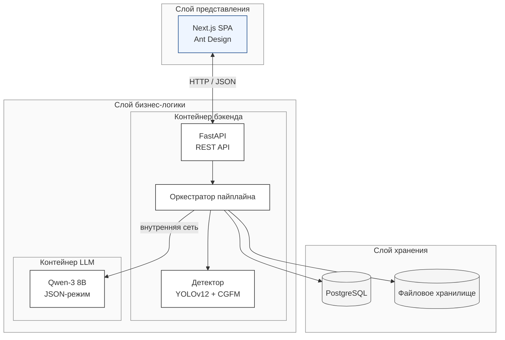

```mermaid
flowchart TD
    subgraph P["Слой представления"]
        UI[Next.js SPA<br/>Ant Design]
    end

    subgraph B["Слой бизнес-логики"]
        subgraph BE["Контейнер бэкенда"]
            API[FastAPI<br/>REST API]
            ORCH[Оркестратор пайплайна]
            DET[Детектор<br/>YOLOv12 + CGFM]
            API --> ORCH
            ORCH --> DET
        end
        subgraph LC["Контейнер LLM"]
            LLM[Qwen-3 8B<br/>JSON-режим]
        end
        ORCH -->|внутренняя сеть| LLM
    end

    subgraph S["Слой хранения"]
        DB[(PostgreSQL)]
        FS[(Файловое хранилище)]
    end

    UI <-->|HTTP / JSON| API
    ORCH --> DB
    ORCH --> FS

    classDef layer fill:#fafafa,stroke:#888,stroke-width:1px,color:#333;
    classDef ui    fill:#eef5ff,stroke:#1f4e8c,stroke-width:1.2px;
    classDef proc  fill:#ffffff,stroke:#333,stroke-width:1.2px;
    classDef store fill:#f5f5f5,stroke:#555,stroke-width:1px;

    class UI ui;
    class API,ORCH,DET,LLM proc;
    class DB,FS store;
    class P,B,S,BE,LC layer;
```
