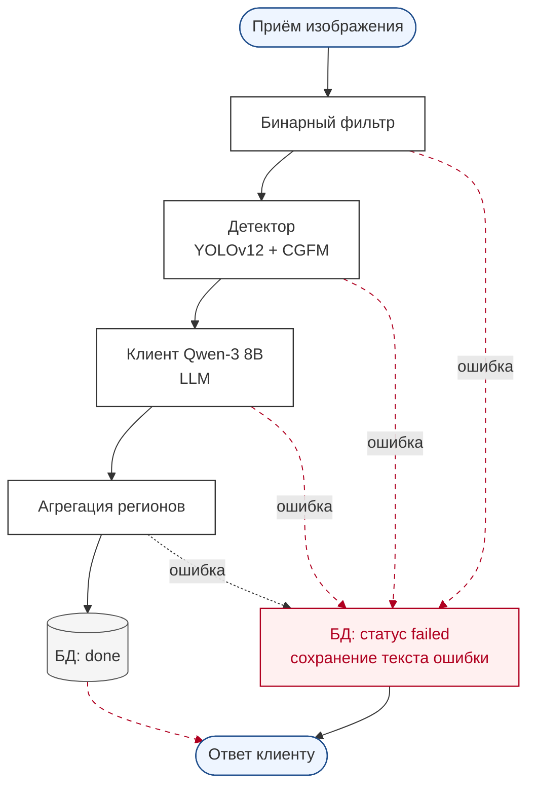

```mermaid
flowchart TD
    A([Приём изображения]) --> D[Бинарный фильтр]
    D --> E[Детектор<br/>YOLOv12 + CGFM]
    E --> F[Клиент Qwen-3 8B<br/>LLM]
    F --> G[Агрегация регионов]
    G --> H[(БД: done)]
    H --> I([Ответ клиенту])

    D -. ошибка .-> X[БД: статус failed<br/>сохранение текста ошибки]
    E -. ошибка .-> X
    F -. ошибка .-> X
    G -. ошибка .-> X
    X --> I

    classDef store fill:#f5f5f5,stroke:#555,stroke-width:1px;
    classDef proc  fill:#ffffff,stroke:#333,stroke-width:1.2px;
    classDef fail  fill:#fff0f0,stroke:#b00020,stroke-width:1.2px,color:#b00020;
    classDef io    fill:#eef5ff,stroke:#1f4e8c,stroke-width:1.2px;

    class A,I io;
    class H store;
    class D,E,F,G proc;
    class X fail;

    linkStyle 5,6,7,8 stroke:#b00020,stroke-dasharray:5 5;
```
