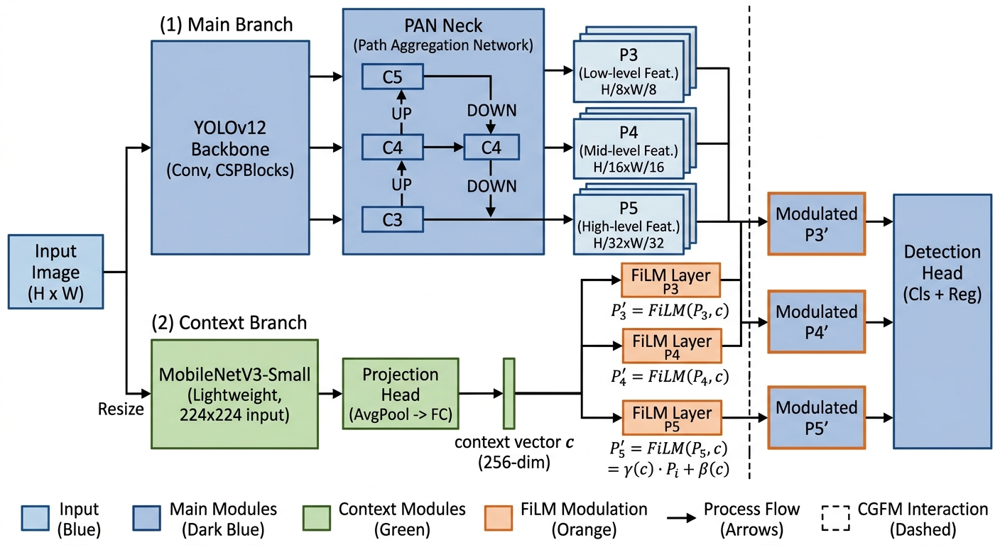
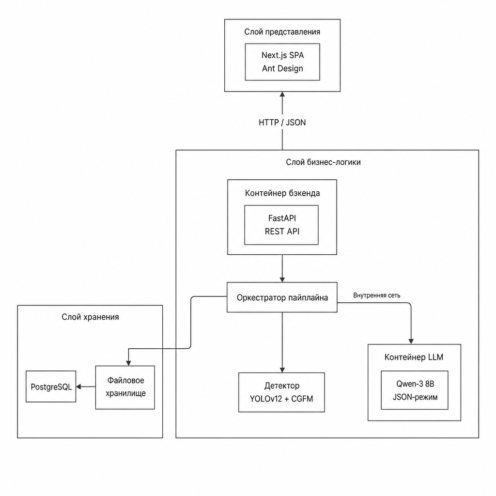

# Общие сведения

Преддипломная практика проходила со 2 февраля по 12 апреля 2026 года; руководителем от профильной организации выступала ст. преп. М.С. Анисимова, базой — кафедра инфокоммуникационных технологий НИТУ МИСИС. Тематически практика примыкает к выпускной квалификационной работе и посвящена созданию информационной системы автоматизированной диагностики заболеваний пшеницы по полевым снимкам средствами глубокого обучения.

Индивидуальное задание охватывало обзор современных подходов к распознаванию заболеваний растений, сборку и обучение модели детекции на собственном датасете, проектирование модуля контекстной модуляции признаков, реализацию клиент-серверной системы диагностики, методику тестирования с определением границ применимости и подготовку технической документации. Календарный график работ — в таблице 1.

Таблица 1 — Календарный график практики

| Сроки | Виды работ |
|---|---|
| 02.02–06.02 | Инструктаж, согласование индивидуального задания |
| 09.02–22.02 | Обзор методов глубокого обучения для диагностики заболеваний растений |
| 23.02–08.03 | Подготовка датасета: разметка, аугментация, генеративное расширение |
| 09.03–22.03 | Сравнительное обучение детекторов и выбор базовой архитектуры |
| 23.03–05.04 | Разработка модуля контекстной модуляции, аблационные эксперименты |
| 06.04–10.04 | Реализация информационной системы и её тестирование |
| 11.04–12.04 | Подготовка отчёта по практике |

---

# Выполнение индивидуального задания

## 1 Описание решаемой задачи

Сельское хозяйство сегодня вынуждено работать в условиях нарастающей фитосанитарной нагрузки и изменения климата. ФАО ООН оценивает ежегодные потери урожая от болезней растений в 20–40 % мирового производства, в денежном измерении — свыше 220 миллиардов долларов в год. Пшеница относится к ключевым продовольственным культурам, и спектр её поражений велик: грибные инфекции (септориоз, ржавчина, мучнистая роса, фузариоз, пиренофороз), физиологические нарушения от дефицита питания, абиотические повреждения. Диагностика по-прежнему опирается на визуальный осмотр агрономом и лабораторные анализы — процесс субъективный, трудозатратный и плохо переносимый на большие площади.

Часть этих ограничений снимается за счёт автоматизированного анализа полевых изображений на основе компьютерного зрения. Но на практике встают, во-первых, скудные и плохо сбалансированные доступные датасеты; во-вторых — сами модели: их признаки строятся главным образом из локального контекста, а популярные механизмы внимания (SE-Net, CBAM) самореферентны и игнорируют внешний контекст сцены — масштаб съёмки, освещение, фазу вегетации, — хотя именно эта информация диагностически значима.

Объект разработки — информационная система автоматизированной диагностики заболеваний пшеницы на полевых снимках. Цель работы — повысить эффективность такой диагностики по сравнению с базовыми архитектурами глубокого обучения, применив механизм линейной модуляции признаков внешним контекстным сигналом. Решаемые задачи:

1. Проанализировать актуальные подходы к диагностике заболеваний растений и обозначить ограничения существующих решений.
2. Построить многоэтапную стратегию аугментации и балансировки данных — классические трансформации, oversampling, генеративное расширение.
3. Провести сравнительный эксперимент по современным архитектурам детекции на собранном датасете.
4. Разработать модуль контекстной модуляции признаков на основе FiLM от внешнего энкодера, встраиваемый в neck детектора, и исследовать его аблационно.
5. Сопоставить модуль с альтернативными способами подключения контекста и проверить переносимость на другие семейства детекторов.
6. Реализовать клиент-серверную систему диагностики, объединив лучшую конфигурацию детектора с локальной языковой моделью для пояснений и рекомендаций.

Целевой перечень — девять патологий пшеницы: листовая (бурая) ржавчина, мучнистая роса, пиренофороз, фузариоз, септориоз, корневая гниль, недостаток фосфора, недостаток азота, повреждение заморозками.

---

## 2 Описание методов и средств решения задачи

### 2.1 Подготовка набора данных

Исходный материал — собственная коллекция полевых снимков пшеницы, собранная в разных агроклиматических условиях и на разных стадиях вегетации. Симптомы размечались полигонами в Label Studio; полигональные контуры приводились к описанным прямоугольникам, выровненным по осям координат. Итоговый датасет — 4443 изображения и 15 867 аннотаций, разбитые в пропорции 70 / 30 на обучающую и тестовую части. Чтобы редкие классы не «вымывались» из теста, разбиение делалось стратифицированно по доминирующему классу каждого снимка.

Обучающую выборку расширяли в три этапа:

1. Классическая аугментация — отражения, повороты, аффинные преобразования, сдвиги яркости и контраста, размытие; реализовано на Albumentations. На каждое изображение приходится по две независимые аугментированные копии.
2. Целевой oversampling редких классов — повторное включение снимков с низкочастотными патологиями под более агрессивные аугментации; коэффициент дисбаланса падает с 5.91 до 3.92.
3. Генеративное расширение через диффузионную модель Stable Diffusion в режиме img2img — синтез новых полевых кадров с преобладанием редких патологий; в отличие от oversampling даёт уникальный визуальный материал.

### 2.2 Базовый детектор и модуль контекстной модуляции

В качестве базового детектора выбран YOLOv12 — поколение семейства YOLO 2025 года, в котором внимание впервые встроено напрямую в backbone. Архитектура трёхкомпонентная: backbone на CSPDarknet с блоками Area Attention достаёт иерархические признаки; neck в виде Path Aggregation Network сводит признаки трёх масштабов P3, P4, P5; detection head даёт безъякорные предсказания с задачно-ориентированным присвоением. Используется конфигурация medium — 20.1 млн параметров, вход 640×640, инициализация COCO-весами.

Слабое место существующих детекторов — глобальная структура сцены явно не подаётся в детекционную голову: признаки строятся из локальных рецептивных полей. Самореферентное внимание (SE-Net, CBAM) рекалибрует карты признаков на основе их же содержимого; позднее слияние подключает контекст уже после детекции и не лечит ни ложноположительные, ни пропущенные срабатывания. Чтобы обойти эти ограничения, в детектор был встроен модуль контекстной модуляции признаков — Context-Gated Feature Modulation (CGFM). В его основе — FiLM, перенесённый из задач визуального вопросно-ответного анализа в neck объектного детектора. FiLM-слой получает из внешнего вектора контекста $c$ два набора коэффициентов и выполняет поканальное аффинное преобразование карты $F$:

$$F'_{b, k, i, j} = \gamma_k \cdot F_{b, k, i, j} + \beta_k$$

Каждый канал умножается на свой $\gamma_k$ и сдвигается на $\beta_k$; пространственные позиции получают единое преобразование. Глобальная характеристика сцены тем самым превращается в согласованную перенастройку всех локальных признаков. Архитектура модуля и точка его встраивания показаны на рисунке 1.

Рисунок 1 — Архитектура модуля контекстной модуляции признаков CGFM

Контекстный энкодер построен на MobileNetV3-Small; его выход прогоняется через проекционную головку с глобальным средним пулингом, нормализацией и линейным отображением в 256-мерное пространство. Параметризация $\gamma = 1 + 0.5 \cdot \tanh(\cdot)$ удерживает $\gamma$ в диапазоне $(0.5, 1.5)$ и при нулевой инициализации даёт тождественное преобразование — обучение стартует с состояния, неотличимого от baseline. Дополнительный бюджет — около 2.44 млн параметров, или примерно 12 % к исходным 20.14 млн.

### 2.3 Программные средства

Детектор собран на Python с PyTorch и Ultralytics. Подготовка данных — Albumentations, генеративное расширение — Stable Diffusion. Серверная часть написана на FastAPI поверх SQLAlchemy, клиентская — на Next.js с компонентами Ant Design. Хранилище — PostgreSQL с типом JSONB для полуструктурированных полей. Текстовые пояснения выдаёт локально развёрнутая визуально-языковая модель Qwen-3 8B. Развёртывание — Docker Compose.

---

## 3 Основные результаты работы информационной системы

### 3.1 Архитектура системы

Информационная система реализована как клиент-серверный веб-сервис с расчётом на работу агронома прямо в поле: пользователь загружает фотографию и получает в ответ список регионов поражения с диагнозами, оценками уверенности и рекомендациями. Общая схема — на рисунке 2.

Рисунок 2 — Архитектура информационной системы диагностики

Архитектура трёхслойная. Уровень представления — одностраничное веб-приложение, реализующее загрузку и визуализацию. Уровень бизнес-логики — API-сервис, оркестрирующий пайплайн (детектор → языковая модель → рекомендации) и пишущий результат в базу. Уровень хранения — реляционная база с двумя связанными сущностями. Детектор и LLM работают локально на одной машине, но в разных контейнерах: их жизненные циклы независимы.

Достигнутые на тестовой выборке метрики качества для финальной конфигурации YOLOv12 с модулем CGFM сведены в таблице 2.

Таблица 2 — Качество лучшей конфигурации детектора (тест, 1334 изображения)

| Конфигурация | mAP@50 | mAP@50-95 | Precision | Recall |
|---|---:|---:|---:|---:|
| Базовая YOLOv12 | 0.651 | 0.365 | 0.820 | 0.700 |
| YOLOv12 + CGFM (P5-only) | 0.678 | 0.390 | 0.847 | 0.735 |
| Прирост, п.п. | +2.7 | +2.5 | +2.7 | +3.5 |

Архитектурная независимость метода подтверждена на RT-DETR — трансформерном детекторе принципиально иной парадигмы; интеграция CGFM дала там +3.3 п.п. mAP@50 и +3.4 п.п. mAP@50-95.

### 3.2 Web-приложение, API и хранилище

Клиент — одностраничное приложение на Next.js / Ant Design. Главный экран содержит зону drag-and-drop и блок результатов: после загрузки файл уходит на серверный эндпоинт, на экране появляется индикатор прогресса; по получении ответа поверх изображения отрисовываются прямоугольники найденных регионов, рядом раскладываются карточки с описанием, оценкой уверенности и списком агрономических рекомендаций. Координаты прямоугольников пересчитываются при ресайзе окна; если детектор ничего не нашёл, выводится сообщение об отсутствии признаков заболеваний.

Серверная сторона построена на FastAPI и предоставляет публичный контракт из пяти эндпоинтов (таблица 3). Пайплайн — четыре последовательных шага: бинарный фильтр пшеница/патология; детектор YOLOv12 с CGFM на входе 640×640, выдающий регионы с распределениями по девяти классам; генерация пояснений Qwen-3 8B (один вызов на регион, в модель уходит только текст — имя класса-победителя, топ-3 кандидата, положение); сохранение в БД и формирование ответа.

Таблица 3 — Публичные эндпоинты API

| Метод | Путь | Назначение |
|---|---|---|
| POST | /api/scan | Полный пайплайн диагностики |
| GET | /api/scan/{id} | Результат конкретного скана |
| GET | /api/scans | История сканов |
| GET | /api/image/{id} | Оригинальное изображение |
| GET | /health | Liveness-проба |

Данные в PostgreSQL разложены по двум связанным сущностям: «скан» содержит метаданные изображения, результат бинарного фильтра, итоговый диагноз и статус обработки; «регион» — координаты очага, распределение вероятностей, описание и рекомендации, привязан к родительскому скану внешним ключом. Распределения и списки рекомендаций хранятся в JSONB, что позволяет индексировать вложенные атрибуты без отдельных таблиц. Весь стенд (СУБД, бэкенд, сервис LLM, фронтенд) поднимается одной командой Docker Compose.

---

## 4 Методы и средства тестирования информационной системы

### 4.1 Подходы и средства

Поскольку центральный компонент системы — обученная модель глубокого обучения, обычное функциональное тестирование пришлось расширить специфическими методами оценки. Применённые подходы — модульные тесты на pytest для отдельных функций и классов; интеграционные тесты сетевых контрактов через httpx с эмуляцией клиента; оценка предсказательной способности детектора на отложенной тестовой выборке по стандартным метрикам компьютерного зрения; нагрузочное тестирование и профилирование сквозного пайплайна с контролем ресурсопотребления через nvidia-smi и docker stats. Качество модели оценивалось через Precision (доля корректных в положительных предсказаниях), Recall (доля найденных в реальных объектах), mAP@50 (средняя точность при пороге IoU = 0.50) и mAP@50-95 (её усреднение по диапазону порогов IoU 0.50–0.95).

### 4.2 Проведённое тестирование

Все обученные модели проверялись на едином отложенном тестовом сплите объёмом 1334 изображения и 4930 аннотаций. Сводка по шести конфигурациям модуля контекстной модуляции — от чистого детектора до CGFM в оптимальном виде — приведена в таблице 4.

Таблица 4 — Результаты тестирования конфигураций детектора

| Конфигурация | Эпох | mAP@50 | mAP@50-95 | Precision | Recall | Δ mAP@50 |
|---|---:|---:|---:|---:|---:|---:|
| Baseline | 98 | 0.651 | 0.365 | 0.820 | 0.700 | 0 |
| Late Fusion | 6 | 0.588 | 0.305 | 0.755 | 0.620 | −6.3 |
| SE-Neck | 29 | 0.643 | 0.358 | 0.811 | 0.690 | −0.8 |
| CBAM-Neck | 28 | 0.652 | 0.366 | 0.821 | 0.701 | +0.1 |
| CGFM (P3+P4+P5) | 26 | 0.660 | 0.373 | 0.833 | 0.708 | +0.9 |
| CGFM (P5-only) | 21 | 0.678 | 0.390 | 0.847 | 0.735 | +2.7 |

Картина предсказуемая: позднее слияние просаживает baseline на 6.3 п.п. — дополнительный классификатор ломает уже правильные предсказания на ложноположительных регионах. Самореферентное внимание даёт прирост в пределах шума: вектор весов вычисляется из тех же признаков, что и модулируются, новой информации нет. Реальное улучшение даёт только CGFM, причём сильнее всего в варианте FiLM-модуляции исключительно на верхнем уровне P5 — +2.7 п.п. mAP@50, и сходимость заметно быстрее (21 эпоха вместо 98).

Профилирование полного запроса на типичном снимке с двумя регионами поражения, усреднение по 20 запускам — в таблице 5.

Таблица 5 — Время выполнения этапов пайплайна (среднее по 20 запускам, 2 региона)

| Этап | Время, с | Доля, % |
|---|---:|---:|
| Бинарный фильтр | 0.04 | <1 |
| Детектор YOLOv12 + CGFM | 0.23 | 3 |
| Генерация (Qwen-3 8B, 2 региона) | 7.94 | 93 |
| База, сериализация, сеть | 0.31 | 4 |
| Итого | 8.52 | 100 |

Узкое место — генерация: на каждый регион нужен отдельный вызов LLM, последовательно сериализуемый через семафор во избежание гонки за видеопамять. Снимок с одним регионом обрабатывается за ~4 с, с четырьмя — около 16 с, дальше время растёт практически линейно.

### 4.3 Граничные условия применимости

По итогам тестов определены границы применимости системы (таблица 6).

Таблица 6 — Граничные условия применимости

| Параметр | Допустимый диапазон |
|---|---|
| Целевая культура | Пшеница (озимая, яровая) |
| Целевые патологии | Девять классов из обучающего набора |
| Минимальное разрешение снимка | 640×640 пикселей (после ресайза) |
| Условия съёмки | Дневное естественное освещение, расстояние 0.3–2 м |
| Максимум регионов на снимке | До 6 без существенной деградации времени отклика |
| Видеопамять GPU | Не менее 24 ГБ для совместного запуска детектора и LLM |
| Одновременных пользователей | До 4 на одну инсталляцию |

За пределами этих условий применимость падает. Патологии вне обучающего перечня детектор либо относит к одному из имеющихся классов с низкой уверенностью, либо пропускает. Сильное отклонение от типичных условий съёмки (ночь с подсветкой, шум) ухудшает точность и требует дообучения на расширенных данных.

---

## 5 Спецификация и руководства

### 5.1 Спецификация программного продукта

Краткие технические характеристики сведены в таблицу 7.

Таблица 7 — Спецификация информационной системы

| Параметр | Значение |
|---|---|
| Наименование | Информационная система диагностики заболеваний пшеницы |
| Назначение | Автоматизированная диагностика поражений по полевым снимкам |
| Целевые классы | 9 патологий пшеницы |
| Архитектура | Клиент-серверная, трёхслойная |
| Слой представления | Web-приложение (Next.js, TypeScript, Ant Design) |
| Слой бизнес-логики | API-сервис (Python 3.11, FastAPI, SQLAlchemy) |
| Слой хранения | PostgreSQL 16 с типом JSONB |
| Модель детекции | YOLOv12-medium с CGFM (P5-only) |
| Языковая модель | Qwen-3 8B (локальная) |
| Развёртывание | Docker Compose, четыре сервиса |
| Минимум для сервера | CPU 8 ядер, RAM 32 ГБ, GPU 24 ГБ VRAM, SSD 100 ГБ |
| Поддерживаемые браузеры | Chrome 120+, Firefox 120+, Safari 17+, Edge 120+ |
| Форматы входных изображений | JPEG, PNG, WebP |
| Максимальный размер файла | 20 МБ |

### 5.2 Руководство пользователя и администратора

Сценарий пользователя укладывается в пять шагов: открыть в браузере главную страницу по адресу, выданному администратором; загрузить фотографию пшеницы — перетащить файл в зону drag-and-drop или выбрать через системный диалог; дождаться ответа (от 4 до 16 с в зависимости от числа регионов); просмотреть результат на изображении с прямоугольниками регионов и карточками описаний; при необходимости сохранить страницу или открыть историю сканов. Для повышения качества диагностики снимать рекомендуется при дневном естественном освещении (без прямых бликов и глубокой тени), с дистанции от 30 см до 2 м, без посторонних объектов в кадре и при разрешении исходника не ниже 1024×1024.

Администратору доступны типовые команды: docker compose up -d / down — запуск и остановка стенда; обновление весов детектора или LLM — замена файла или каталога весов в монтированном томе и перезапуск соответствующего контейнера; docker compose logs -f — просмотр логов; pg_dump и pg_restore — резервное копирование и восстановление БД; nvidia-smi — контроль загрузки GPU. Конфигурация задаётся переменными окружения в .env. Веса моделей и каталог изображений монтируются как внешние тома — их можно обновлять, не пересобирая образы. При падении одного из сервисов поднять его обратно достаточно командой docker compose restart; остальные компоненты при этом продолжают работать.

---

## 6 Калькуляция оборудования и затрат

Для одной инсталляции на собственном железе нужен сервер, способный держать в памяти одного ускорителя и детектор, и языковую модель. Рекомендуемая конфигурация и оценка стоимости в ценах 2026 года — в таблице 8.

Таблица 8 — Калькуляция оборудования (собственное развёртывание)

| Компонент | Спецификация | Стоимость, руб. |
|---|---|---:|
| Графический ускоритель | NVIDIA RTX 4090, 24 ГБ GDDR6X | 250 000 |
| Центральный процессор | Intel Core i9-14900K, 24 ядра | 60 000 |
| Оперативная память | 64 ГБ DDR5-5600 (2×32 ГБ) | 35 000 |
| Накопитель | NVMe SSD 2 ТБ | 22 000 |
| Материнская плата | LGA 1700, PCIe 5.0 | 35 000 |
| Питание и охлаждение | 1000 Вт 80+ Platinum, СЖО, корпус | 43 000 |
| ИБП | 1500 ВА | 15 000 |
| Сеть | Гигабитный коммутатор, кабели | 10 000 |
| Итого |  | 470 000 |

Этих характеристик хватает на параллельный запуск детектора (~2–4 ГБ видеопамяти) и Qwen-3 8B в bfloat16 (~16 ГБ). Если 24 ГБ VRAM недоступны, поможет 4-битная квантизация LLM — потребление падает до 6–8 ГБ ценой небольшого ухудшения качества пояснений. Программная часть — только свободные компоненты, лицензионных платежей нет.

Альтернатива — арендовать виртуальный сервер с GPU у облачного провайдера: капитальные расходы превращаются в операционные, появляется гибкость масштабирования. Оценка стоимости аренды и оборудования для резервирования — в таблице 9. Точка безубыточности между покупкой собственного железа и арендой облака приходится примерно на 5–6 месяц эксплуатации; на горизонте больше года выгоднее своё оборудование. Полная отказоустойчивая конфигурация с резервированием обходится в районе 1 095 000 руб. без стоимости разработки.

Таблица 9 — Стоимость аренды GPU-сервера и оборудование для резервирования

| Позиция | Конфигурация / назначение | Стоимость, руб. |
|---|---|---:|
| Yandex Cloud | 1×NVIDIA L4 24 ГБ, 16 vCPU, 64 ГБ RAM | 95 000 в мес. |
| Selectel | 1×NVIDIA RTX 4090 24 ГБ, 16 vCPU, 64 ГБ RAM | 85 000 в мес. |
| VK Cloud | 1×NVIDIA A10 24 ГБ, 16 vCPU, 64 ГБ RAM | 105 000 в мес. |
| Резервный сервер | Идентичный основному | 470 000 |
| NAS-хранилище | Бэкапы БД и весов моделей | 80 000 |
| Балансировщик нагрузки | Автоматическое переключение | 30 000 |
| Расширенный ИБП | 3000 ВА, до 30 мин | 45 000 |

---

# Заключение

В ходе преддипломной практики выполнены все пункты индивидуального задания. Проведён обзор современных подходов к диагностике заболеваний растений на основе глубокого обучения и обозначен ключевой пробел: применяемые в детекторах механизмы внимания SE-Net и CBAM работают самореферентно и не используют внешний контекст сцены. Собрана многоэтапная стратегия подготовки данных — классическая аугментация, целевой oversampling редких классов, генеративное расширение через диффузионные модели; коэффициент дисбаланса при этом снижается с 5.91 до 3.49.

Сравнительное исследование четырёх детекторов (YOLOv12, RT-DETR, Faster R-CNN, DETR) на собранном датасете показало преимущество YOLOv12 по совокупности точности и скорости — он и был выбран базовым. Спроектирован и реализован модуль CGFM, встраивающий FiLM-модуляцию от внешнего энкодера в neck детектора. Лучшая конфигурация — энкодер MobileNetV3-Small с FiLM на верхнем уровне пирамиды P5 — даёт +2.7 п.п. mAP@50 при +12 % параметров. Метод переносится: интеграция CGFM в трансформерный RT-DETR дала сопоставимый прирост.

Реализована клиент-серверная информационная система диагностики, объединяющая детектор с локально развёрнутой языковой моделью Qwen-3 8B; тестирование выполнено по четырём направлениям, обозначены границы применимости, подготовлены спецификация, руководства и калькуляция оборудования. Результаты практики готовы к использованию в содержательных главах ВКР.

---

# Список использованных источников

1. He, K., Zhang, X., Ren, S., Sun, J. Deep Residual Learning for Image Recognition. 2016. URL: https://arxiv.org/abs/1512.03385 (дата обращения 14.01.2026).

2. Dosovitskiy, A., Beyer, L., Kolesnikov, A., et al. An Image is Worth 16×16 Words: Transformers for Image Recognition at Scale. 2021. URL: https://arxiv.org/abs/2010.11929 (дата обращения 02.02.2026).

3. Ren, S., He, K., Girshick, R., Sun, J. Faster R-CNN: Towards Real-Time Object Detection with Region Proposal Networks. 2016. URL: https://arxiv.org/abs/1506.01497 (дата обращения 10.02.2026).

4. Carion, N., Massa, F., Synnaeve, G., et al. End-to-End Object Detection with Transformers. 2020. URL: https://arxiv.org/abs/2005.12872 (дата обращения 12.02.2026).

5. Zhao, Y., Lv, W., Xu, S., et al. DETRs Beat YOLOs on Real-time Object Detection. 2024. URL: https://arxiv.org/abs/2304.08069 (дата обращения 15.02.2026).

6. Tian, Y., Ye, Q., Doermann, D. YOLOv12: Attention-Centric Real-Time Object Detectors. 2025. URL: https://arxiv.org/abs/2502.12524 (дата обращения 20.02.2026).

7. Hu, J., Shen, L., Sun, G. Squeeze-and-Excitation Networks. 2018. URL: https://arxiv.org/abs/1709.01507 (дата обращения 25.02.2026).

8. Woo, S., Park, J., Lee, J.-Y., Kweon, I. S. CBAM: Convolutional Block Attention Module. 2018. URL: https://arxiv.org/abs/1807.06521 (дата обращения 26.02.2026).

9. Perez, E., Strub, F., de Vries, H., Dumoulin, V., Courville, A. FiLM: Visual Reasoning with a General Conditioning Layer. 2018. URL: https://arxiv.org/abs/1709.07871 (дата обращения 28.02.2026).

10. Buslaev, A., Iglovikov, V. I., Khvedchenya, E., et al. Albumentations: Fast and Flexible Image Augmentations. Information. 2020. Vol. 11. No. 2. P. 125.

11. Rombach, R., Blattmann, A., Lorenz, D., Esser, P., Ommer, B. High-Resolution Image Synthesis with Latent Diffusion Models. 2022. URL: https://arxiv.org/abs/2112.10752 (дата обращения 05.03.2026).

12. Howard, A., Sandler, M., Chu, G., et al. Searching for MobileNetV3. 2019. URL: https://arxiv.org/abs/1905.02244 (дата обращения 10.03.2026).

13. Yang, A., Yang, B., Zhang, B., et al. Qwen3 Technical Report. 2025. URL: https://arxiv.org/abs/2505.09388 (дата обращения 15.03.2026).

14. ГОСТ 7.32-2017. Отчёт о научно-исследовательской работе. Структура и правила оформления. М.: Стандартинформ, 2017. 27 с.

15. ГОСТ Р 7.0.5-2008. Библиографическая ссылка. Общие требования и правила составления. М.: Стандартинформ, 2008. 23 с.
